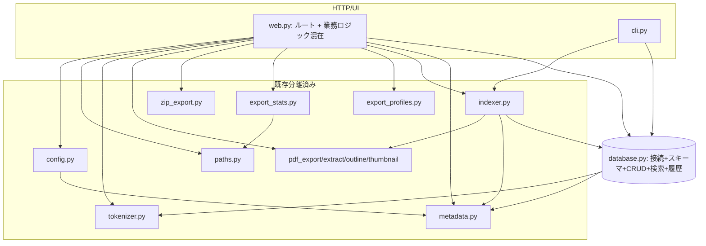
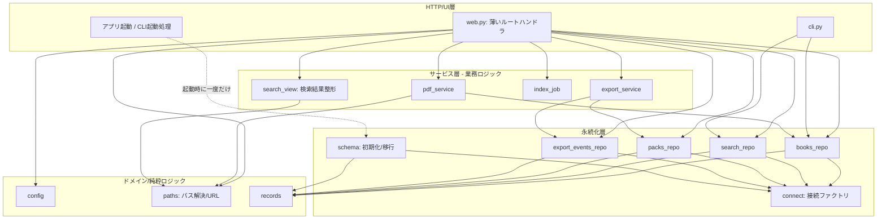

# 中心ファイルの責務棚卸しと段階的分割設計

対象: `src/tsundokensaku/web.py`（1994行、`paths.py`・`config.py`分離後）・`src/tsundokensaku/database.py`（1922行、未着手）
位置づけ: ROADMAP「Phase 5着手前: 構造改善と回帰保証」の「構造と依存関係の棚卸し」の成果物
状態: 段階0（パス解決の一元化、0a・0bとも）・段階2（設定・環境変数解決、R2）は実装済み（コミット `7f7e6ddaa9089b75f0c07a2b11f92abcd9a55b3f`・`20a04417b8c58b4a828964e3199e9d51d4dd3643`・R2マージコミット `590c96a01dd12c70e2248c5e54dac6d6fddd2be9`）。段階1・段階3以降は未着手・本体コード未変更。本文書は段階0・R2完了を踏まえ、次に着手する責務（R4：検索結果整形）を選定するための再調査版（2026-07-29時点）。

---

## 1. 目的と非目的

### 目的

- `web.py`・`database.py` に集中している責務を、変更理由の単位で一覧化する。
- 既存の振る舞い（公開URL・HTTP API・画面表示・DBスキーマ）を変えずに、段階的・可逆的に分割するための移行順を決める。
- 分割後の候補モジュールと依存方向を、現在の実装から無理なく到達できる形で示す。

### 非目的

- 一般的なレイヤードアーキテクチャの理想形を新規設計すること。
- ファイルの行数削減そのもの。行数は分割の動機ではなく、責務の混在が動機。
- この文書の時点でコードを分割・変更すること。
- 個人開発の規模に対して過剰な抽象化（リポジトリパターン・DIコンテナ・完全なドメイン層など）を導入すること。

### 前提（確認済み）

- 個人開発・ローカル利用が中心。SQLite単一ファイル、追加サーバープロセスなし。
- すでに多くの処理が専用モジュールへ分離済み: `export_profiles` / `export_stats` / `pdf_export` / `pdf_extract` / `pdf_outline` / `pdf_thumbnail` / `markdown_export` / `metadata` / `tokenizer` / `token_estimate` / `zip_export` / `indexer` / `paths`（段階0で新設）/ `config`（段階2で新設）。残る大物が `web.py` と `database.py` の2つ。
- 回帰の安全網は厚い: `tests/test_web.py`（3647行、FastAPI TestClient 経由。段階0でパス関連23件・R2で設定関連15件を追加）・`tests/test_database.py`（1236行）。Playwright は5 spec・29テスト。
- CI（`.github/workflows/ci.yml`）は Python unittest と Playwright の両方を別jobで実行済み（ROADMAP Must「Playwright テストの CI 実行」は2026-07-26完了）。

---

## 2. 現在の構造

```
web.py (1994)  ── database から27個の関数/定数をimport
   │            ── metadata / export_profiles / export_stats / indexer
   │            ── markdown_export / pdf_export / pdf_outline / pdf_thumbnail
   │            ── token_estimate / tokenizer / zip_export / paths / config
   │
   ├─ FastAPI app 初期化・テンプレート・静的配信
   ├─ 環境変数/設定の解決（books_dir, db_path, demo_mode ...）── 段階2で `config.py` へ実体移動済み。
   │  web.py側は `config.xxx()` を呼ぶだけの薄い委譲ラッパー（既存133箇所超のmonkeypatch互換のため関数として残置）
   ├─ 純粋な整形ロジック（検索結果行, ハイライト, scrapbox本文組立）
   ├─ ファイル操作（アップロード保存, env書き込み, PDFエクスポート保存）
   ├─ 生SQL集計（get_db_stats, get_library_items 内で connection.execute）★
   ├─ インデックスジョブ（threading + 進捗状態のグローバル辞書）
   ├─ エクスポートのプレビュー/アーカイブ組立（業務ロジック）
   └─ 約40本のルートハンドラ（HTTP層）

database.py (1922)
   ├─ dataclass レコード定義（BookRecord, PackRecord, ExportEventRecord ...）
   ├─ 接続（connect）
   ├─ スキーマ初期化 + 保証/移行（initialize, _ensure_*_schema, _migrate_*）★
   ├─ 書籍/ページ/メモ/ノート CRUD（upsert_book, replace_pages ...）
   ├─ 検索（search + FTS/trigram/like の内部関数群）
   ├─ 資料（pack）CRUD + アクティブpack管理
   ├─ 資料項目（pack items）の変換・置換・正規化
   └─ エクスポート履歴（record_export_event, list_export_events ...）

★ = 責務が混在している主要な箇所
```

ARCHITECTURE.md には `database.py` を「資料棚の永続化」と記載しているが、実際にはエクスポート履歴・移行処理まで抱えており、記述より責務が増えている。分割完了時に ARCHITECTURE.md も更新する。

---

## 3. web.py の責務一覧

行番号は特記のない限り2026-07-29時点（develop / `590c96a`、R2完了後）のもの。R2・R3・R7・R8・R9は今回の再調査で現在の行番号に更新済み。分類は変更理由（＝いつ書き換わるか）で行う。

### R1. アプリ初期化・静的資産（HTTP層に残す）

- 主な定義: `app = FastAPI(...)`（126）、`templates`、`STATIC_DIR` マウント、`_find_project_root`（92）。
- 依存: FastAPI, Jinja2。
- 判断: HTTP層に残す。分離不要。

### R2. 設定・環境変数の解決 — 完了（コミット `590c96a01dd12c70e2248c5e54dac6d6fddd2be9`、PR #12）

- 移動前の主な定義: `get_books_dir`（旧133）、`get_db_path`（旧137）、`get_pdf_export_save_dir`（旧142）、`is_demo_mode`（旧155）、`update_env_setting`（旧656）、定数群（`DEFAULT_BOOKS_DIR`・`DEFAULT_DB_PATH`・`PDF_EXPORT_SAVE_DIR_ENV`）。
- 依存: `os.environ`、ファイルシステム（`.env` 書き込み）、`tsundokensaku.metadata.ENV_FILE`。DB呼び出しなし。
- 実装内容: 上記5関数・3定数をロジック無変更のまま新規 `src/tsundokensaku/config.py`（52行）へ移動した。`config.py` は標準ライブラリと `metadata.ENV_FILE` のみに依存し、`web.py`・FastAPI・router・UI関連・index job・pdf_service・export_serviceのいずれもimportしない。
- 互換性維持: `web.py`（現在135・139・143・155・655行）には同名の薄い委譲関数（`return config.xxx(...)`）を残した。単純な `from ... import` エイリアスではなく明示的な関数定義にしたのは、既存の `patch("tsundokensaku.web.get_books_dir", ...)` 等133箇所超のmonkeypatchを維持するため（段階0bの`paths.py`と同じ理由）。`templates.env.globals["pdf_export_save_dir"]`・`["is_pdf_export_save_dir_configured"]`・`["is_demo_mode"]` の登録は元の位置のまま`web.py`に残置。`web.py`内部の各ルートハンドラ等の呼び出しは、今回`config.xxx()`へ直接置き換えず、従来通り`web.py`内のラッパー名経由のまま維持した（範囲を広げすぎない判断）。
- 追加したcharacterization test: `tests/test_web.py` の `ConfigResolutionTest`（15件）。`get_books_dir`/`get_db_path`の環境変数あり（絶対・相対）／デフォルト値、`get_pdf_export_save_dir`の未設定・空白・`~`展開・絶対パス、`update_env_setting`の既存キー更新・新規追記・ファイル新規作成・コメント化キー無視・値の空白/記号保持を固定した。`is_demo_mode`は既存の`DemoModeUploadTest`で大文字小文字・未設定判定が固定済みだったため重複追加していない。
- 結果: Python全件が396件→411件（新規15件）。全件成功。循環importなし（`python -c "import tsundokensaku.config; import tsundokensaku.web"`で確認）。**訂正**: 旧記述の「394件→411件」は誤り。394件は段階0a（コミット`7f7e6dd`）時点の件数であり、段階0bで`export_stats`重複解消テスト2件が加わった結果396件（コミット`20a0441`時点）がR2着手前の正しい基準値。396+15=411で一致する（`git worktree`で段階0bマージコミット`6965899`を検証し、当時`tests/test_web.py`が3531行・Python全件396件成功であることを再確認した）。

### R3. パス解決・URL生成 — 完了（段階0a・0b、§8参照。以下は分離当時の記述を歴史的記録として維持）

- 主な定義: `resolve_pdf_path`（472）、`pdf_url`（501）、`raw_pdf_url`（511）、`_resolve_pdf_file_or_404`（757）、`_unique_destination_path`（688）、`_unique_export_destination_path`（701）。
- 依存: ファイルシステム、`CONTAINER_BOOKS_DIRS`。
- 判断: `resolve_pdf_path` は `export_stats._resolve_pdf_path` と意図的に複製されている（web.py 469-471 の TODO(phase3b-path-resolution-dedup) が明記。循環import回避のため）。**この重複解消がパス層を切り出す主目的**。`paths.py`（仮）へ集約すれば export_stats からも参照でき、循環importも起きない。**リスク: 中**（パストラバーサル検証を含むため、切り出し時にセキュリティ回帰テストで固定する）。

### R4. 表示整形中心の責務（分離候補・次に選定。§8参照）

- 主な定義（現在の行番号、2026-07-29時点）: `highlight_query`（166）、`format_indexed_at`（189）、`_now_jst`（198、複数責務から参照される横断的ユーティリティ。下記参照）、`_sanitize_scrapbox_title`（202、内部補助）、`build_scrapbox_page_url`（209）、`_scrapbox_page_label`（216、内部補助）、`build_search_result_rows`（223）、`finalize_search_result_rows`（269）、`normalize_search_group`（291）、`normalize_search_match`（309）、`build_search_result_rows_context`（326）、`build_search_scrapbox_body`（380）、`sort_results`（485）、`group_pdf_results`（495）。
- 依存: `tokenizer`（`query_highlight_terms`）、`metadata`（`get_scrapbox_project_url`・`metadata_for_pdf`・`BookMetadata`）、`paths`（`raw_pdf_url`経由。内部で`resolve_pdf_path`→ファイルの実存確認 `is_file()` を行う）、`datetime`/`zoneinfo`（`_now_jst`経由の現在時刻）。
- **訂正（旧記述の誤り、2回目の再調査で判明）**:
  1. `_page_snippet`（772）は本節の対象ではない。PDF内テキスト検索のスニペット生成専用で、`search_book_pages`（R7）からのみ呼ばれる。
  2. 「DB呼び出しなし」というR4全体の記述は不正確だった: `build_search_result_rows_context` のみ `database.connect`/`database.search`/`metadata.find_export_json`/`metadata.load_metadata_by_pdf_stem` を呼び、DB接続を伴う「検索実行のオーケストレーション」関数である。他の関数は真にDB非依存。
  3. **「純粋関数」「外部状態に依存しない」という記述はさらに不正確だった**。以下の依存が実装本文の精読で判明している。
     - `build_search_result_rows`・`finalize_search_result_rows`は`raw_pdf_url`経由で`paths.resolve_pdf_path`を呼び、`Path.is_file()`によるファイル実存確認を行う（filesystem読み込みではないが、filesystem結合度は「なし」ではなく「低〜中」）。
     - `build_scrapbox_page_url`は`metadata.get_scrapbox_project_url()`経由で`SCRAPBOX_BASE_URL`環境変数を参照する。「入力だけを処理する」という記述は誤りで、環境変数依存がある。
     - `build_search_scrapbox_body`は`_now_jst()`（現在時刻取得）に依存し、同じ入力でも実行時刻によって出力（`作成日時`行・ページタイトルの日時部分）が変わる。
     - `finalize_search_result_rows`は入力の`rendered_results`内の各dict要素を**破壊的に更新**する（`result["page_urls"] = [...]`で同一オブジェクトを書き換える。新しいリスト/辞書を作って返すわけではない）。
     - `group_pdf_results`はPDF種別の結果を新しい辞書（`{**result, ...}`）へまとめる一方、非PDF種別の結果は`grouped.append(result)`で**元のdictオブジェクト参照をそのまま保持**する。
     - `sort_results`は未知の`sort`値（`title`/`page`/`scrapbox`のいずれでもない場合、`None`や空文字も含む）では**入力リストをそのままidentity維持で返す**（`sorted()`を呼ばず、新しいリストを作らない）。
  - 上記の性質から、R4は「純粋関数群」ではなく「**DB更新・ファイル書込みは行わないが、環境変数参照・現在時刻・PDFファイル存在確認・入力辞書の破壊的更新を含む、副作用が比較的小さい表示整形中心の責務**」と再定義する。移動時はこれらの現在挙動をcharacterization testで固定したうえで行う（「純粋移動」「影響なし」と断定しない）。
- **依存クロージャの追加調査**: `build_search_scrapbox_body`は`_now_jst`と`_sanitize_scrapbox_title`（既存対象の`_scrapbox_page_label`とは別）にも依存しており、旧文書のR4対象11関数だけでは依存が閉じていなかった。
  - `_sanitize_scrapbox_title`（202行目）: `build_search_scrapbox_body`からのみ呼ばれるR4専用の内部補助関数（他の呼び出し元なし、grep確認済み）。実装は「連続空白を1個へ正規化→前後空白除去→改行(`\n`/`\r`)を半角空白へ置換→`/`を全角`／`へ置換→`max_length`（既定80文字）で切り詰め→結果が空文字なら`"検索結果"`を返す」。**`search_view.py`へ完全移動する対象に含める**。
  - `_now_jst`（198行目）: `build_search_scrapbox_body`（380行目）だけでなく、`render_markdown_export`（R7、835行目）、`_export_pack_json`（R8、1414行目）、`_export_pack_archive`（R8、1453行目）からも呼ばれる**横断的ユーティリティ**（JST基準の現在時刻取得）。R4専用に`search_view.py`へ完全移動すると、R7/R8が`search_view.py`に依存することになり、責務のまとまりを新たに壊す。**`web.py`に残し、`search_view.py`側には同一実装（`datetime.now(ZoneInfo("Asia/Tokyo"))`、1行）を複製する**方針とする（詳細は§8「段階3」）。将来的にR7/R8も含めた日時ユーティリティの一本化は今回の対象外とし、必要になった段階で別PRとして検討する。
- 判断: 上記の発見を踏まえ、`search_view.py`（仮）へ移す対象は**DB非依存の12関数**（旧11関数＋`_sanitize_scrapbox_title`、`_now_jst`は複製）に絞り、`build_search_result_rows_context`は`web.py`側に残す（§8「段階3」で詳細化）。**リスク: 低〜中**（副作用が完全にゼロではないため、characterization testでの固定が前提）。
- テスト状況（現在の実態）: 直接単体テストがある関数は `highlight_query`（5件）、`group_pdf_results`（1件）、`format_indexed_at`（1件）、`build_scrapbox_page_url`（1件）、`normalize_search_match`（3件）、`normalize_search_group`（2件）、`build_search_scrapbox_body`（3件）の**7関数**。`_now_jst`も`tests/test_web.py`から直接importされているが専用テストはなく、他関数のテスト内で暗黙に使われる程度。**直接単体テストがない関数**: `build_search_result_rows`、`finalize_search_result_rows`、`sort_results`、`_sanitize_scrapbox_title`、`_scrapbox_page_label`（いずれもHTTP経由の統合テストでのみ間接的に検証）。既存テストはいずれも`tests/test_web.py`の`HighlightQueryTest`クラス（75〜920行、PDF関連・ルートハンドラ系テストも同居する大きめのクラス）内に存在する。monkeypatch対象は0件（直接importして呼ぶため）。

### R5. ライブラリ/統計の集計（分離候補・生SQL漏れ）★

- 主な定義（現在の行番号）: `get_pdf_stats`（480）、`get_db_stats`（541）、`get_library_items`（563）。
- 依存: `connect`、**web.py 内で生SQL `connection.execute("SELECT COUNT(*) ...")` を直接実行**、`metadata`。
- 判断: 集計SQLが HTTP 層に漏れている。生SQLは `database.py`（またはその後継の書籍ドメインモジュール）へ移し、web.py は集計済み値を受け取る形にする。**リスク: 中**（`get_library_items` は metadata と URL 生成も混ぜており、DB集計部分だけを先に押し出す）。

### R6. インデックスジョブ（分離候補・状態を持つ）

- 主な定義（現在の行番号）: `_set_index_progress`（423）、`_get_index_progress`（436）、`_run_index_job`（441）、`INDEX_PROGRESS`/`INDEX_PROGRESS_LOCK`（モジュール変数、117-125）。
- 依存: `threading`、`indexer.index_books`、`config.get_books_dir`/`config.get_db_path`（`web.py`のラッパー経由）。
- テスト状況（現在の実態）: `_run_index_job`・`_set_index_progress`・`_get_index_progress`・`/settings/index`・`/settings/progress`いずれも`tests/test_web.py`に直接テストなし（今回の再調査でも変化なし）。
- 判断: バックグラウンド実行の進捗をグローバル辞書＋ロックで保持。HTTP層から切り離して `index_job.py`（仮）へ。**リスク: 中**（グローバル状態のライフサイクル。プロセス内シングルトン前提を崩さないこと）。テストがゼロからの追加になるため、R4より着手コストが高い（§8参照）。

### R7. ファイル入出力・取り込み（分離候補）

- 主な定義（現在の行番号）: `import_pdfs_from_directory`（619）、`save_uploaded_pdf`（659）、`_resolve_pdf_file_or_404`（679）、`render_pdf_export`（687）、`save_pdf_export_to_configured_dir`（701）、`_get_indexed_book`（724）、`load_pages_text`（743）、`_page_snippet`（772、内部補助。旧記述ではR4に誤分類していたが本節が正しい所属）、`search_book_pages`（784）、`render_markdown_export`（815）、`resolve_pdf_scrapbox_url`（840）、`import_scrapbox_export_bytes`（863）。
- 依存: ファイルシステム、`pdf_export` / `markdown_export` / `pdf_extract`、`database`（`connect`・`get_book`・`sync_memos`・`sync_kindle_books`・`initialize`）、`config`（`web.py`のラッパー経由）。
- テスト状況: `save_uploaded_pdf`・`import_pdfs_from_directory`・`save_pdf_export_to_configured_dir`・`render_markdown_export`・`resolve_pdf_scrapbox_url`・`import_scrapbox_export_bytes`はHTTP経由の統合テストで間接的に参照されるが、`render_pdf_export`・`load_pages_text`・`search_book_pages`・`_get_indexed_book`は直接参照なし。monkeypatch対象は0件。
- 判断: 「PDFファイルに対する業務操作」。R3のパス層に依存する。`pdf_service.py`（仮）へ集約候補だが、粒度が大きいので後半の段階に回す。**リスク: 中〜高**（アップロード・保存の副作用。デモモード制御と絡む）。

### R8. エクスポート業務ロジック（分離候補）

- 主な定義（現在の行番号）: `_export_preview_warning`（1229）、`build_export_preview_warnings`（1233）、`_preview_base_stats`（1272）、`build_export_preview_payload`（1291）、`build_export_preview_payload_for_profile`（1300）、`_export_pack_json`（1396）、`_placeholder_item_stats_for_export`（1422）、`_export_pack_archive`（1442）、`_resolve_export_profile_or_400`（1539）。
- 依存: `export_profiles`, `export_stats`, `zip_export`, `database`（pack取得）。
- テスト状況: `build_export_preview_warnings`・`build_export_preview_payload`・`build_export_preview_payload_for_profile`は`BuildExportPreviewPayloadTest`等の専用クラスで直接検証されている（非常に厚い）。`_preview_base_stats`・`_export_pack_json`・`_export_pack_archive`・`_placeholder_item_stats_for_export`・`_resolve_export_profile_or_400`は直接単体テストがなく、`PackExportPreviewTest`等HTTP経由の統合テストでのみ検証される。monkeypatch対象は0件。
- 判断: HTTP層とプレゼンテーションの中間にある業務ロジック。`export_service.py`（仮）へ。ただし `_resolve_export_profile_or_400` は HTTPException を投げるため HTTP寄り。**リスク: 中**。

### R9. ルートハンドラ（HTTP層に残す）

- 主な定義: 約40本の `@app.get/post/put/patch/delete`（886〜1993、現在の行番号）。ページ表示（`home`, `search_page`, `workspace_page`, `pack_list_page`, `settings_page` ...）、pack API（`api_*`）、PDF系（`open_pdf`, `pdf_outline`, `pdf_thumbnails`, `export_pdf`, `export_markdown`, `view_pdf` ...）、設定系（`upload_pdf`, `run_index`, `settings_progress` ...）。
- 判断: ルーティング・入力検証・レスポンス生成は HTTP層に残す。ただし body に混ざった業務処理を R4〜R8 の各サービスへ委譲し、ハンドラを薄くする。将来的に `APIRouter` で機能別分割も可能だが、**今回の対象外**（後回し可）。

### 補助（デモモード制御）

- `is_demo_mode`（R2）を各書き込み系ハンドラが参照。横断的関心事。専用モジュール化はしない（設定R2の一部として扱う）。

---

## 4. database.py の責務一覧

### D1. レコード定義（dataclass）

- 主な定義: `BookRecord`（31）、`PdfTitleRefreshTarget`、`PageRecord`、`BookNoteRecord`、`PackRecord`（70）、`PackItemRecord`、`ExportEventRecord`（93）、`ExportEventItemRecord`、`SearchResult`（112）。
- 判断: 純粋なデータ構造。分割するなら `records.py`（仮）に集約でき、循環importの起点になりにくい。**リスク: 低**。ただし多くのモジュールが import するため、移すなら再エクスポートを残す。

### D2. 接続管理

- 主な定義: `connect`（127）。
- 判断: 単一の接続ファクトリ。`row_factory` 等の設定を含む。永続化層の基点。分離しても薄い。**リスク: 低**。

### D3. スキーマ初期化・保証・移行★

- 主な定義: `initialize`（148）、`ensure_pack_schema`（1443）、`_ensure_pack_schema`（1557）、`_ensure_books_schema`（1686）、`_ensure_pages_schema`（1760）、`_ensure_memo_schema`（1788）、`_ensure_book_notes_schema`（1816）、`_ensure_search_schema`（1839）、`_remove_empty_artifact_tables`（1600）、`_migrate_pack_items_drop_pdf_path_unique`（1629）、`_backfill_pages_trigram`（1875）、`_backfill_book_filenames`（1890）、`_replace_book_search_index`（1864）、`_table_columns`（1681）。
- 判断: 冪等な `CREATE TABLE IF NOT EXISTS` ＋ 列追加・データ移行相当。**これが CRUD と最も強く混ざっている**。`schema.py`（仮）へ切り出すのが database.py 分割の中核。**リスク: 中〜高**（スキーマ変更を伴う可能性があるものは、ROADMAP Must「データ保全とスキーマ管理の方針決定」の手順を前提とする。ただし「移動するだけ・SQL不変」なら Git＋回帰テストで可逆）。

### D4. 書籍・ページ・メモ・ノートの永続化

- 主な定義: `upsert_book`（161）、`get_book`（228）、`list_books`（257）、`delete_book`（286）、`replace_pages`（297）、`replace_book_notes`（346）、`replace_memos`（389）、`sync_memos`（420）、`sync_kindle_books`（450）、`list_pdf_title_refresh_targets`（467）、`refresh_pdf_titles`（514）。
- 呼び出し元: `indexer`, `cli`, `web`。
- 判断: 書籍ドメインの CRUD。`books_repo.py`（仮）候補。**リスク: 中**（`indexer` と `web` 両方が使う。互換のため公開名を維持）。

### D5. 検索

- 主な定義: 公開 `search`（549）、内部 `_search_title/_body/_memo/_book_notes` とその `_fts/_trigram/_like` 変種、`_build_fts_query` ほかクエリ組立、`_dedupe_rows`、`_build_search_snippet`。
- 判断: 検索は独立性が高く、内部関数が多い。`search_repo.py`（仮）候補。**リスク: 中**（FTS/trigram のSQLが密。挙動固定の回帰テストが既にある）。

### D6. 資料（pack）と資料項目

- 主な定義: `create_pack`/`get_pack`/`list_packs`/`update_pack`/`delete_pack`、アクティブpack（`get_active_pack_id`/`set_active_pack`/`clear_active_pack`/`resolve_active_pack_id`）、項目（`get_pack_items`/`replace_pack_item_entries`/`replace_pack_items`/`pack_items_as_items`/`pack_items_as_cart`/`normalize_pack_payload_to_items`/`import_cart_as_pack`/`validate_pages_syntax`）。
- 呼び出し元: 主に `web`（pack API）。
- 判断: 資料ドメインの CRUD ＋ ペイロード正規化。`packs_repo.py`（仮）候補。**リスク: 中**。`normalize_pack_payload_to_items`・`validate_pages_syntax` は純粋寄りで先に切り出しやすい。

### D7. エクスポート履歴

- 主な定義: `record_export_event`（1450）、`list_export_events`（1491）、`get_export_event`（1509）、`_export_event_record_from_row`、`_parse_export_event_items`。
- 判断: 独立性が高い小さめのドメイン。`export_events_repo.py`（仮）候補。**リスク: 低**。

### トランザクション境界（横断確認事項）

- 現状、多くの公開関数が内部で `connection.commit()` を呼ぶ（呼び出し側で connect → 関数実行 → 関数内 commit）。web.py 側は `_pack_connection()`（1092）で接続を作り、複数操作をまとめる箇所がある。
- **分割時の鉄則**: 「同一接続・同一トランザクションで実行する必要がある処理」を別モジュールへ散らさない。特に `replace_pack_item_entries` と関連する pack 更新は同一接続前提。切り出し単位はドメイン境界＝トランザクション境界に合わせる。

---

## 5. 現在の依存関係



確認済みの問題点:
- web.py が「HTTP層」でありながら、生SQL集計・インデックスジョブ・エクスポート業務ロジックまで抱える（パス解決は段階0で `paths.py` へ、設定解決は段階2で `config.py` へ分離済み）。
- ~~`export_stats` が `web.resolve_pdf_path` 相当を複製している~~ → 段階0bで解消済み。`export_stats.py` は `web.py` をimportせず `paths.py` を参照する形になり、循環import経路も発生していない。
- `database.py` が「接続＋スキーマ＋4ドメインCRUD＋検索＋履歴」を1ファイルに集約。

---

## 6. 目標とする依存方向

過剰な層を作らず、**現状から到達可能な最小限の層**にとどめる。参照は上から下への一方向のみ。



原則:
- L1（HTTP）は L2〜L4 を参照してよい。逆向き禁止。
- **通常の CRUD（books/search/packs/events）は `connect`（接続ファクトリ）と `records` にだけ依存する。`schema` は参照しない。** CRUD 側は「スキーマは既に初期化済み」を前提に動く。
- **`schema.initialize`（スキーマ作成・保証・移行）は、アプリ起動時や CLI 起動処理から一度だけ呼び出される、CRUD とは並列の責務。** CRUD リポジトリの各関数が毎回スキーマ保証を呼ぶ構造にはしない（＝ CRUD → schema の依存辺を作らない）。これにより「データ構造をどう作るか」と「データをどう読み書きするか」の変更理由が分離する。
- L4（永続化）内では、各リポジトリ同士の相互参照は避ける（トランザクション共有が必要な場合は同一モジュールに置く）。
- `paths`（L3）を独立させることで `export_stats` の複製を解消し、循環importを断つ。

補足（現状との差分・要確認）: 現在の `database.py` は起動時に `initialize` を呼ぶ経路のほか、一部の公開関数が内部で `ensure_pack_schema` 相当を呼んでいる箇所がある（例: `ensure_pack_schema`（1443）が pack 系から参照されうる）。目標構造では、この「関数内スキーマ保証」を起動時の一度きりの初期化へ寄せる。ただし呼び出し実態の確認と、寄せることによる副作用（新規DBに対する遅延初期化の可否）は段階4（schema分離）で個別に検証し、必要なら現状維持とする。**この点は推測を含む未決事項**（§10へ）。

**これは到達目標であり、一度に到達しない。** §8の移行順で段階的に近づける。実際にはL2/L3の一部だけ切り出した時点で十分な効果が出るため、L4の完全分割は費用対効果を見て判断する（後回し可）。

---

## 7. 分割候補モジュール

「同じ理由で変更される処理」を1単位にまとめる。ファイル数を増やしすぎない。★=効果が大きく先行すべきもの。

| 候補モジュール | 担当責務 | 移動元 | 主な対象 | 依存先 | 呼び出し元 | 先行/後回し |
|---|---|---|---|---|---|---|
| `paths.py` ★ | パス解決・PDF URL生成・一意保存先 | web R3 | `resolve_pdf_path`, `pdf_url`, `raw_pdf_url`, `_unique_*` | fs, config | web, export_stats | **完了**（コミット `7f7e6dd` ・ `20a0441`） |
| `config.py` | 環境変数・設定解決・.env書込 | web R2 | `get_books_dir`, `get_db_path`, `get_pdf_export_save_dir`, `is_demo_mode`, `update_env_setting` | os, fs, metadata | web | **完了**（コミット `590c96a`） |
| `search_view.py` | 検索結果の整形・ハイライト・並替 | web R4 | `build_search_result_rows*`, `highlight_query`, `group_pdf_results`, `normalize_*` | tokenizer, metadata, paths | web | **次に選定**（段階3、§8参照） |
| `index_job.py` | インデックスのバックグラウンド実行と進捗 | web R6 | `_run_index_job`, `_*_index_progress`, 進捗グローバル | threading, indexer, config | web | 中盤 |
| `export_service.py` | エクスポートのプレビュー/アーカイブ組立 | web R8 | `build_export_preview_*`, `_export_pack_archive`, `_export_pack_json` | export_profiles, export_stats, zip_export, packs_repo | web | 中盤 |
| `pdf_service.py` | PDFファイルに対する業務操作・取り込み | web R7 | `save_uploaded_pdf`, `render_pdf_export`, `load_pages_text`, `search_book_pages` ほか | paths, pdf_*, books_repo, config | web | 後半（副作用大） |
| `schema.py` ★ | スキーマ初期化・保証・移行 | db D3 | `initialize`, `_ensure_*_schema`, `_migrate_*`, `_backfill_*` | sqlite3, records | 各repo, cli | **中核**（DB分割の起点） |
| `records.py` | dataclass レコード定義 | db D1 | `BookRecord` ほか9個 | dataclasses | 全域 | 早期（低リスク、再エクスポート必須） |
| `books_repo.py` | 書籍・ページ・メモ・ノート CRUD | db D4 | `upsert_book`, `list_books`, `replace_pages` ほか | schema, records | web, cli, indexer | 後半 |
| `search_repo.py` | 検索クエリ組立・FTS/trigram/like | db D5 | `search` + 内部群 | schema, tokenizer | web, cli | 後半 |
| `packs_repo.py` | 資料・資料項目 CRUD・正規化 | db D6 | `*_pack*`, `*_items*`, `normalize_pack_payload_to_items` | schema, records | web | 後半 |
| `export_events_repo.py` | エクスポート履歴 | db D7 | `record_export_event`, `list_export_events` | schema, records | web | 後半（小さく独立、先行も可） |

補足:
- `database.py` は分割後も**互換の集約モジュールとして残す**（各repoを re-export）。既存の `from tsundokensaku.database import ...`（web.py の27個importなど）を壊さないため。呼び出し先の書き換えは段階的に。
- L4の完全分割（books/search/packs/events）は行数の割に呼び出し元が多く、リスクとコストが高い。**`schema.py` と `records.py` の切り出しだけでも「スキーマ関心事とCRUD/レコードの分離」という主目的は達成できる**。repo群への分割は効果を見て判断（後回し可）。

---

## 8. 段階的な移行順

前提: 1 PR = 1 責務の移動。既存の公開URL・HTTP API・画面表示・DBスキーマは不変。移動元には**委譲ラッパーを残し**、`from tsundokensaku.database import X` 等の既存importを壊さない。各段階でロールバックは「その PR を revert」で完結する（スキーマ不変のため）。

**着手前提（ROADMAP Must）**: Playwright の CI 実行・テスト戦略明文化を先に整える。ただし本移行の各段階は Python の TestClient テストが主な安全網であり、UI変更を伴わないため Playwright は「無変更の確認」用途。

### 段階0: パス解決の一元化 ★（完了）

**この段階は2つの PR に分けた。** テスト追加（挙動を固定するだけでコードは動かさない）と、責務移動（コードを動かすが挙動は変えない）を混在させないため。順序は 0a → 0b。

#### 段階0a: 既存挙動を固定する回帰テストの追加（コード移動なし）— 完了（コミット `7f7e6ddaa9089b75f0c07a2b11f92abcd9a55b3f`）

- 目的: パス解決・パストラバーサル検証の現在の挙動を、移動前にテストで固定する。
- 変更対象: `tests/test_web.py` のみ（`ResolvePdfPathTest`・`PdfUrlTest`・`UniqueDestinationPathTest`・`UniqueExportDestinationPathTest` の計23件）。`web.py`・`export_stats.py` の本体は変更していない。
- 追加したテスト: `resolve_pdf_path` の正常系（相対・絶対・コンテナパス・ファイル名フォールバック）と、境界外（`..` によるトラバーサル、books_dir 外の絶対パス、books_dir 外を指すsymlink）が `None` になること。`pdf_url`/`raw_pdf_url` のURL形式・ページ番号・特殊文字エンコード。保存先の一意化（`_unique_*`）の命名規則。
- 結果: Python全件（当時394件）成功。

#### 段階0b: paths.py への純粋移動と複製解消（挙動不変）— 完了（コミット `20a04417b8c58b4a828964e3199e9d51d4dd3643`）

- 移動した責務: R3（`resolve_pdf_path`, `pdf_url`, `raw_pdf_url`, `unique_destination_path`, `unique_export_destination_path`）→ 新規 `paths.py`。
- 変更対象: 新規 `paths.py`、`web.py`（同名の薄い委譲ラッパーに変更。`CONTAINER_BOOKS_DIRS` は `paths.CONTAINER_BOOKS_DIRS` への単純エイリアス）、`export_stats.py`（`_resolve_pdf_path`・`_CONTAINER_BOOKS_DIRS` と付随する重複説明コメントを削除し `paths.resolve_pdf_path` を参照）。
- 公開関数: web.py に同名ラッパー（`resolve_pdf_path` / `pdf_url` / `raw_pdf_url` / `_unique_destination_path` / `_unique_export_destination_path`）を維持。単純代入ではなくラッパー関数にした理由: `pdf_url`/`raw_pdf_url` が内部で `resolve_pdf_path` を呼ぶため、将来 `patch("tsundokensaku.web.resolve_pdf_path")` のようなpatchをしても意図通り効くようにするため（`paths.py` 内部の相互呼び出しに引きずられない）。
- 回帰テスト: 段階0aで追加したパス検証23件＋既存のPDF URL/thumbnail/export系TestClientテスト＋`export_stats`の重複解消を確認する新規2件（`tests/test_export_stats.py` の `ExportStatsUsesSharedPathsModuleTest`）。
- 結果: Python全件396件成功。循環importなし（`paths.py` は他のtsundokensakuモジュールに依存しない。`export_stats.py` は `web.py` をimportしない）。
- 次段階条件（達成済み）: `export_stats` のTODO(phase3b-path-resolution-dedup)が解消し、全テストが緑。

### 次に切り出す責務の比較（R2完了時点での再評価、2026-07-29）

段階0・R2完了後、`web.py` に残る主要候補（R4・R6・R7・R8）を、現在のコード・テストの実態に基づいて再比較した。R2は完了済みのため比較対象から外す（実績は§8「段階2」参照）。R3も完了済み（段階0）。R5・R9は独立性が低い（R5はDB集計の切り出し先がdatabase.py寄りでweb.py側の切り出し効果が薄い、R9はHTTP層そのもので分離候補ではない）ため、現実的な次の候補として比較を広げすぎず、R4・R6・R7・R8の4件に絞った。

R4は当初「純粋関数群」と評価していたが、依存クロージャの再調査で環境変数・現在時刻・filesystem存在確認・入力辞書の破壊的更新への依存が判明したため（§3参照）、以下の比較表はその実態を反映して修正済み（過小評価しない）。

| 観点 | R4 search_view | R6 index_job | R7 pdf_service | R8 export_service |
|---|---|---|---|---|
| 責務の独立性 | 高（tokenizer/metadata/pathsのみ、DB非依存の12関数＋複製1関数） | 中（`INDEX_PROGRESS`グローバル辞書＋ロックのライフサイクルに注意） | 低（paths/pdf_*/database/configに複数依存） | 中（export_profiles/export_stats/zip_export/database packに依存） |
| FastAPI結合度 | 低（`templates.env.filters`登録2件をweb.py側に残すのみ） | 低（ルートから参照されるが自身はFastAPI非依存） | 中（`render_pdf_export`等がHTTPExceptionを直接投げる） | 中（`_resolve_export_profile_or_400`がHTTPExceptionを直接投げる） |
| DB結合度 | 低（対象12関数はDB非依存。ただし同じR4内の`build_search_result_rows_context`のみDB接続あり、§3参照） | 低（indexer経由の間接依存のみ） | 高（`connect`/`get_book`/`sync_memos`等を直接呼ぶ） | 中（pack取得でDB依存） |
| filesystem結合度 | **低〜中**（`build_search_result_rows`・`finalize_search_result_rows`が`raw_pdf_url`経由で`paths.resolve_pdf_path`の`is_file()`によるファイル実存確認を行う。読み込みではなく存在確認） | indexer経由で間接依存 | 高（アップロード保存・PDF書き出しの副作用大） | 中 |
| 環境変数依存 | **あり**（`build_scrapbox_page_url`が`metadata.get_scrapbox_project_url()`経由で`SCRAPBOX_BASE_URL`を参照） | なし（`config`経由の`web.py`ラッパーはR6自身の対象外） | なし直接ではない（`config`経由） | なし |
| 現在時刻依存 | **あり**（`build_search_scrapbox_body`が`_now_jst()`に依存。同一入力でも実行時刻で出力が変わるためテストで時刻固定が必要） | なし | なし直接ではない | あり（`_now_jst`をR4と共有。§3参照） |
| 入力の破壊的更新 | **あり**（`finalize_search_result_rows`が入力dictの`page_urls`を直接書き換える。`group_pdf_results`は非pdf結果の元オブジェクト参照を保持） | なし | 不明（未調査、次の段階で確認） | 不明（未調査、次の段階で確認） |
| template/UI結合度 | **中**（filter登録2件に加え、検索結果の表示内容そのものを整形するため画面表示への影響範囲は無視できない） | なし | なし | なし |
| monkeypatch影響 | なし（直接patchは0箇所） | なし（直接patchは0箇所） | なし（直接patchは0箇所） | なし（直接patchは0箇所） |
| 外部仕様変更リスク | 低 | 中（グローバル状態の前提を崩すと進捗表示が壊れる） | 中〜高（デモモード制御・副作用と絡む） | 中（HTTP例外とビジネスロジックの分担が未確定、§10参照） |
| characterization test追加難易度 | **中**（`build_search_result_rows`・`finalize_search_result_rows`・`sort_results`・`group_pdf_results`のidentity/破壊的更新の検証、`_scrapbox_page_label`・`_sanitize_scrapbox_title`の新規追加、`build_search_scrapbox_body`の時刻固定の確認が必要。他7関数は既存テストで充足） | 高（`_run_index_job`等・`/settings/index`・`/settings/progress`いずれも直接テストがゼロからの追加） | 中（一部関数は既存の統合テストで間接カバーあり、直接単体は薄い） | 低（`BuildExportPreviewPayloadTest`等の専用クラスが既に厚い。ただし`_export_pack_archive`等5関数は直接テストなし） |
| PRの小ささ | 中（移動対象12関数＋複製1関数。R2の5関数より多いが1関数あたりは小さい） | 小（3関数＋グローバル変数）だがテスト新規追加の労力が大きい | 大（対象12関数、依存モジュールも多い） | 中〜大（対象9関数、HTTP例外の扱い判断を要する） |
| レビューしやすさ | 高（副作用は小さいが明示的なため、差分と挙動の対応関係が追いやすい） | 中（グローバル状態の移動は読み手の注意力を要する） | 低（副作用・依存が多く差分が大きくなりがち） | 中 |
| revertしやすさ | 高（ラッパー方式・DB非依存で即座に可逆） | 中（グローバル状態の前提が絡む） | 中〜低（副作用が大きい） | 中 |
| 循環importリスク | **依存クロージャ（`_sanitize_scrapbox_title`・`_scrapbox_page_label`・`_now_jst`複製）を閉じれば低**（`build_search_result_rows_context`を含めるとdatabase依存が入るため対象から除外する設計とする） | 低 | 中（複数モジュールを跨ぐ） | 低〜中 |
| 将来の分離を容易にする効果 | 高（R5の生SQL集計切り出し時、整形と集計の境界が明確になる） | 中 | 中 | 中 |

**選定: R4（検索結果整形）を次の実装PRで `search_view.py` へ切り出す。**

選定理由:

1. **R2完了によって何が簡単になったか**: R2で「web.py側に薄い委譲ラッパーを残し、`config.xxx()`へ内部呼び出しは置き換えない」という移行パターンが実績化された。R4でも同じパターン（`web.py`に同名ラッパーを残す）がそのまま適用でき、設計判断のコストが下がっている。
2. 外部仕様を変えずに移動できる: 対象12関数（`build_search_result_rows_context`除く、`_now_jst`は複製）はDBに依存しない。ただし「純粋関数」ではなく、環境変数参照・現在時刻・filesystem存在確認・入力辞書の破壊的更新を含む（§3参照）。これらの現在挙動をcharacterization testで固定したうえで単純な移動で完結する。
3. 既存テストで守れる: `highlight_query`・`group_pdf_results`・`format_indexed_at`・`build_scrapbox_page_url`・`normalize_search_match`・`normalize_search_group`・`build_search_scrapbox_body`の7関数はすでに直接単体テストがある。不足は`build_search_result_rows`・`finalize_search_result_rows`・`sort_results`・`_scrapbox_page_label`・`_sanitize_scrapbox_title`の5関数と、`build_search_scrapbox_body`の時刻固定確認で、追加量は中程度。
4. FastAPIルートの大規模分割を伴わない: `templates.env.filters`登録2件をweb.py側に残すだけで済む（R2の`templates.env.globals`と同型）。
5. DBスキーマ変更を伴わない: 対象12関数はDBに一切依存しない。
6. UI変更を伴わない: 検索結果の内容・順序・表示は不変。
7. 1PRに収まる: 対象12関数＋複製1関数は規模として中程度だが、依存が少ないため差分は追いやすい。
8. 容易にrevertできる: ラッパー方式・DB非依存のため、問題があれば`search_view.py`とweb.py側の変更をまとめてrevertするだけで済む。

**他候補を見送る理由**:

- **R6（index_job）**: 独立性・循環importリスクは低いが、`_run_index_job`等への直接テストが現状ゼロで、グローバル状態（`INDEX_PROGRESS`辞書＋ロック）のライフサイクルというR4にはない固有の複雑さを抱える。characterization testをゼロから設計する必要があり、次善とする。
- **R7（pdf_service）**: DB結合度・filesystem結合度が高く、副作用（アップロード保存・PDF書き出し）が大きい。デモモード制御とも絡み、1PRの変更量が大きくなる。inventory自身が「副作用大」「後半」と位置づけている通り、今回の「安全に独立して実施できるか」という基準には合わない。
- **R8（export_service）**: 既存テストは非常に厚いが、`_resolve_export_profile_or_400`のHTTPException直接送出など「業務ロジックとHTTP関心事の混在」が未解決（§10未決事項）。この分担方針を決めてから着手する方が安全なため、方針確定を待つ。

「一番価値が高そう」ではなく「現在の段階で一番安全に独立したPRとして実施できるもの」という基準で選ぶと、DB非依存・FastAPI非依存・monkeypatch影響ゼロ・既存テスト充実度が高いR4が最も安全である。

### 段階1: レコード定義の切り出し（低リスク）

- 責務: D1 → `records.py`。`database.py` は re-export。
- 回帰テスト: 全 Python（import経路の確認）。
- ロールバック: PR revert。
- 次段階条件: 全テスト緑、`from tsundokensaku.database import BookRecord` 等が従来通り動く。

### 段階2: 設定の切り出し — 完了（コミット `9bff8a0`・`7f72076`、マージコミット `590c96a01dd12c70e2248c5e54dac6d6fddd2be9`、PR #12）

- 目的: `web.py` に残る「環境変数・設定解決」責務を独立した `config.py` へ移動し、`web.py` を薄くする。`cli.py` 側の変更は今回のPRでは行わなかった（対象外のまま）。
- 移動した責務: R2（`get_books_dir` / `get_db_path` / `get_pdf_export_save_dir` / `is_demo_mode` / `update_env_setting` / `DEFAULT_BOOKS_DIR` / `DEFAULT_DB_PATH` / `PDF_EXPORT_SAVE_DIR_ENV`）→ 新規 `config.py`（52行）。`ENV_FILE` は当初計画通り `metadata.py` 由来のまま移動せず、`config.py` からは `tsundokensaku.metadata.ENV_FILE` を参照する。
- 変更対象: 新規 `config.py`、`web.py`（同名の薄い委譲ラッパーに変更）、`tests/test_web.py`（`ConfigResolutionTest`15件を追加）。
- 互換ラッパー: `web.py` に `get_books_dir` / `get_db_path` / `get_pdf_export_save_dir` / `is_demo_mode` / `update_env_setting` を同名の関数として残した（`return config.xxx(...)`）。単純な `from import` エイリアスにしなかった理由は段階0bと同じで、既存133箇所超のmonkeypatchを維持するため。`DEFAULT_BOOKS_DIR` / `DEFAULT_DB_PATH` / `PDF_EXPORT_SAVE_DIR_ENV` は `config.py` の値への単純代入。`templates.env.globals["pdf_export_save_dir"]` / `["is_pdf_export_save_dir_configured"]` / `["is_demo_mode"]` の登録は `web.py` 側にそのまま残した。
- 事前に追加したcharacterization test: `get_books_dir`（`BOOKS_DIR`環境変数の絶対・相対パス／デフォルト`data/books`）、`get_db_path`（`DB_DIR`環境変数の絶対・相対パス／デフォルト`data/index.db`）、`get_pdf_export_save_dir`（未設定・空白で`None`、`~`展開、絶対パスそのまま）、`update_env_setting`（既存キー更新・他行保持、新規キー追記、ファイル非存在時の新規作成、コメント化キーの無視、値の空白/記号保持）。`is_demo_mode`は既存の`DemoModeUploadTest`で固定済みのため重複追加しなかった。
- 結果: Python全件が396件→411件（新規15件）成功。循環importなし。既存133箇所超のmonkeypatchは無修正で成功。（旧記述の「394件→411件」は誤り。394件は段階0a時点、396件が段階0b完了＝R2着手前の正しい基準値。詳細は§3 R2参照）
- ロールバック: PR revert（ラッパー方式のため即座に可逆）。実際には未実施。
- 次段階条件（達成済み）: `tsundokensaku.web`から`get_books_dir`等が引き続きimportできる、`config.py`が`web.py`を含む他モジュールをimportしない。

### 段階3: 検索結果整形の切り出し（次の実装PRとして選定・設計のみ）

上記比較で選定した、次に着手すべき責務。**このセクションは設計であり、本体コードは未変更。**

- **PRの目的**: `web.py` に残る「検索結果の整形・ハイライト・並替」責務を独立した `search_view.py` へ移動し、`web.py` を薄くする。ただしR4は純粋関数群ではなく副作用が比較的小さい表示整形中心の責務であるため（§3参照）、依存と現在挙動をcharacterization testで固定したうえで移動する。
- **対象責務**: R4のうち、DB非依存の12関数（旧11関数＋依存クロージャを閉じるための`_sanitize_scrapbox_title`）。`_now_jst`は複製、`build_search_result_rows_context`は対象外（いずれも下記参照）。
- **新しく作る予定のモジュール**: `src/tsundokensaku/search_view.py`
- **移動する関数・定数（12関数、完全移動）**:
  - `highlight_query()`
  - `format_indexed_at()`
  - `_sanitize_scrapbox_title()`（内部補助。旧文書は対象から漏れていた。`build_search_scrapbox_body`専用のため今回追加）
  - `build_scrapbox_page_url()`
  - `_scrapbox_page_label()`（内部補助）
  - `build_search_result_rows()`
  - `finalize_search_result_rows()`
  - `normalize_search_group()`
  - `normalize_search_match()`
  - `build_search_scrapbox_body()`
  - `sort_results()`
  - `group_pdf_results()`
- **複製する関数（1関数、`web.py`からは移動しない）**:
  - `_now_jst()`: R7（`render_markdown_export`）・R8（`_export_pack_json`・`_export_pack_archive`）からも呼ばれる横断的ユーティリティのため、`web.py`側は変更せずそのまま残す。`search_view.py`側には同一の1行実装（`datetime.now(ZoneInfo("Asia/Tokyo"))`）を複製し、`build_search_scrapbox_body`から参照する。将来的な一本化（`config.py`や新設の時刻ユーティリティへの統合）は今回のPRの対象外とし、必要になった段階で別途検討する。
- **対象外（`build_search_result_rows_context()`は移動しない）**: DB接続を伴うため、下記「`web.py`に残すもの」参照。
- **`web.py`に残すもの**:
  - `build_search_result_rows_context()` はそのまま`web.py`に残す。**内部の呼び出し経路はR2と同じ方針を踏襲し、`search_view.build_search_result_rows()`のような直接呼び出しへは変更しない**。`build_search_result_rows_context`内部の`build_search_result_rows(...)`・`finalize_search_result_rows(...)`という既存の呼び出しは、`web.py`内に残す同名の委譲ラッパー（下記）をそのまま呼び続ける形にする（関数本体は無変更）。これにより、将来`patch("tsundokensaku.web.build_search_result_rows", ...)`のようなmonkeypatchを行っても、`build_search_result_rows_context`経由の呼び出しに対して意図通り効く（`search_view`側を直接呼ぶ実装だとpatchが効かない可能性があるため、安全側に倒す）。
  - 上記12関数の同名の薄い委譲ラッパー（`return search_view.xxx(...)`）。R2・段階0bと同じ理由（monkeypatch互換。現状直接patchは0箇所だが、他候補との一貫した移行パターンを保つため踏襲する）。
  - `_now_jst()`（複製元。`web.py`側は無変更）。
  - `templates.env.filters["highlight_query"]`・`["format_indexed_at"]`の登録はそのまま`web.py`に残す。
- **`search_view.py`の依存関係**: `tokenizer`（`query_highlight_terms`）、`metadata`（`get_scrapbox_project_url`・`metadata_for_pdf`・`BookMetadata`）、`paths`（`raw_pdf_url`）、`datetime`/`zoneinfo`（`_now_jst`複製分）のみ。`database`・FastAPI・`web.py`はimportしない。
- **直接importしている既存テストとの互換性**: `tests/test_web.py`は`build_scrapbox_page_url`・`build_search_scrapbox_body`・`group_pdf_results`・`highlight_query`・`format_indexed_at`・`normalize_search_group`・`normalize_search_match`の**7関数**と`_now_jst`を`from tsundokensaku.web import (...)`で直接importしている（`_now_jst`はR4以外のテストからも参照される）。移動後もこれらは`web.py`側の委譲ラッパー（`_now_jst`は無変更の実体）経由で同じimport文が動作する。既存テストを一括で`search_view`直接importへ書き換えることはしない。新規に追加するcharacterization testは、`search_view.py`を直接テストしてよい範囲（新モジュールの単体テストとして`tests/test_search_view.py`等に置く案、または`tests/test_web.py`に`web.py`経由で追加する案のいずれか。次の実装PR着手時に既存ファイル構成を見て判断する）と、`web.py`側の互換入口が壊れていないことを確認する範囲を分けて考える。
- **事前に追加すべきcharacterization test**（コード移動前に追加。関数単位で既存テストの有無を整理）:
  - `highlight_query`（既存5件で充足。追加不要）: 日本語、複数語、HTML特殊文字のエスケープ、空文字、除外語・フレーズのtokenizer境界、`Markup`型での戻り値、をすでにカバー。
  - `format_indexed_at`（既存1件で充足。追加不要）: JST変換の正常系はカバー済み。`None`・不正値・timezoneなし文字列のケースが薄ければ追加を検討。
  - `build_scrapbox_page_url`（既存1件で充足。追加不要）: project URLありのケースはカバー済み。project URLなし（`None`）のケースが既存になければ追加する。
  - `_scrapbox_page_label`（**新規**）: 正常なscrapbox URLからのページ名抽出、`None`/空文字時のfallback、日本語ページ名のURLデコード。
  - `build_search_result_rows`（**新規**）: pdf種別・非pdf種別それぞれの辞書変換、`raw_pdf_url`あり＋実ファイルありのケース、`raw_pdf_url`あり＋実ファイルなし（`resolve_pdf_path`が`None`を返し`page_urls`が空になるケース）、欠落キー、日本語タイトル、同一PDFの重複結果。
  - `finalize_search_result_rows`（**新規**）: 戻り値の内容に加え、**入力辞書`page_urls`が破壊的に更新されること**（同じdictオブジェクトの`id()`が呼び出し前後で変わらないことを確認）、pdf結果と非pdf結果で更新有無が異なること、`sort`/`group`指定による`sort_results`・`group_pdf_results`の呼び出し、空入力（空リスト）での挙動。
  - `normalize_search_group`（既存2件で充足。追加不要）: 対応値・チェックボックス状態はカバー済み。
  - `normalize_search_match`（既存3件で充足。追加不要）。
  - `build_search_scrapbox_body`（既存3件で充足。ただし**時刻固定の方法を明記**）: 既存3件は`_now_jst`をmonkeypatchせず実行時刻に依存したまま検証している可能性があるため、実装時に`patch("tsundokensaku.web._now_jst", return_value=<固定datetime>)`（移動後は`patch("tsundokensaku.search_view._now_jst", ...)`）で時刻を固定しているか確認し、固定されていなければ追加する。タイトルsanitize・空結果・日本語結果・改行を含むsnippetの扱いは既存3件でカバーされているか個別確認する。
  - `_sanitize_scrapbox_title`（**新規**）: 空文字、空白のみ、改行を含む文字列、`/`を含む文字列、80文字超の長い文字列、通常の日本語タイトル。`None`や非文字列は現在の型ヒント上想定されていないため、現在のエラー挙動（`AttributeError`等）を無理に固定しない。
  - `sort_results`（**新規**）: `title`/`page`/`scrapbox`の対応済みsort値、未知のsort値（`None`・空文字・任意の文字列）で**入力リストがidentity維持（同一オブジェクト）のまま返ること**、同値要素の順序（安定ソートであること）。
  - `group_pdf_results`（**新規**）: pdf結果の新規辞書へのまとめ、非pdf結果は**元のdictオブジェクト参照が保持されること**（`id()`比較）、入力リスト自体は変更されないこと、重複pdfの集約、page情報の欠落、空入力。
  - `_now_jst`（複製のみ。テスト追加は不要。`web.py`側の既存挙動は無変更のため）。
- **変更してはいけない外部契約**:
  - 検索結果のJSON/HTML表示内容・順序・ハイライト規則
  - `sort`/`group`/`match`パラメータの正規化規則
  - scrapbox書き出し本文の形式・日時フォーマット・タイムゾーン（JST基準を維持）
  - `finalize_search_result_rows`の入力辞書破壊的更新という現在挙動（良し悪しに関わらず、今回のPRで非破壊化しない。改善は別PR）
  - `sort_results`の未知sort値でのidentity維持という現在挙動
  - HTTP API・URL・画面表示
- **対象外**（このPRではやらない）:
  - `build_search_result_rows_context()`本体の移動（DB接続を伴うため対象外。内部呼び出しは`web.py`の委譲ラッパー経由のまま）
  - `_page_snippet()`（R7所属。誤ってR4と混同しない）
  - `finalize_search_result_rows`の非破壊化、`sort_results`の未知sort値挙動の変更など、現在挙動の改善
  - 他の分割候補（R5生SQL集計・R6 index_job・R7 pdf_service・R8 export_service）
- **完了条件**:
  - Python全件テストが成功する
  - `tsundokensaku.web`から移動対象12関数（委譲ラッパー経由）と複製元の`_now_jst`（無変更のまま）が引き続きimportできる
  - `search_view.py`が`web.py`を含む他のtsundokensakuモジュールをimportしない
- **推奨ブランチ名**: `refactor/extract-search-view-module`
- **推奨コミット分割**:
  1. `test: 検索結果整形の回帰挙動を固定`（`build_search_result_rows`・`finalize_search_result_rows`・`sort_results`・`group_pdf_results`・`_scrapbox_page_label`・`_sanitize_scrapbox_title`のcharacterization test、および`build_search_scrapbox_body`の時刻固定テストを`tests/test_web.py`に追加するのみ。本体コード無変更）
  2. `refactor: 検索結果整形をsearch_viewモジュールへ分離`（`search_view.py`新設＋`web.py`の委譲ラッパー化。`build_search_result_rows_context`本体は無変更）
- **想定リスクと確認方法**:
  - `finalize_search_result_rows`の破壊的更新・`sort_results`のidentity維持・`group_pdf_results`の参照関係を、移動時にうっかり新しいオブジェクトを返す実装へ書き換えてしまうリスク。→ characterization testの`id()`比較アサーションが成功することで確認する。
  - `build_search_scrapbox_body`の時刻依存により、テストが実行時刻でflakyになるリスク。→ `_now_jst`をmonkeypatchして固定時刻で検証する。
  - `_scrapbox_page_label`・`_sanitize_scrapbox_title`が`build_search_scrapbox_body`以外から呼ばれていないことを実装時に再確認する（呼ばれていれば移動先で参照が壊れないよう合わせて確認する）。
  - `search_view.py`が`database`をimportしないことをコード上確認し、循環importが生じないことを`python -c "import tsundokensaku.search_view; import tsundokensaku.web"`で確認する。
  - `build_search_result_rows_context`が`web.py`の委譲ラッパー経由で呼ぶことを維持し、`search_view`を直接importして直呼びしないことをコードレビューで確認する。
- ロールバック: PR revert（ラッパー方式のため即座に可逆）。

#### 段階3の停止条件（次の実装PR担当者向け）

次の場合は実装を止め、設計を再検討してから進める。

- 対象関数と補助関数（`_sanitize_scrapbox_title`・`_scrapbox_page_label`・`_now_jst`）の依存クロージャが閉じない（新たな未列挙の依存が見つかった場合）
- `search_view.py`から`web.py`をimportする必要が生じる（循環importが発生する）
- `raw_pdf_url`のfilesystem挙動（実ファイルあり／なしでの`page_urls`生成結果）をcharacterization testで固定できない
- `build_search_scrapbox_body`の時刻依存をテストで固定できない（`_now_jst`のmonkeypatchが効かない等）
- `finalize_search_result_rows`の入力辞書identity、`group_pdf_results`の非pdf結果の参照関係、`sort_results`の未知sort値でのidentityのいずれかが移動前後で変わる
- `web.py`互換ラッパー経由の既存importが壊れる、または既存の直接importテスト（7関数＋`_now_jst`）が失敗する
- 既存133箇所超のmonkeypatchのうち、R4対象関数へのpatchが新たに見つかり、かつラッパー方式では維持できない
- `search_view.py`がFastAPIオブジェクト（`Request`・`Response`・`Jinja2Templates`等）を必要とする、あるいは`database`への依存なしに実装できない
- 検索結果の表示内容・URL・HTTP APIの仕様変更が必要になる
- 対象12関数の移動が1PRに収まらない（依存関係の見落としで対象が想定より大きく広がった場合）
- Python全件またはPlaywright全件が失敗する（Playwrightの`.ws-book`関連flaky testについては下記「Playwright flaky testとの関係」を参照し、同一パターンの一度きりの失敗で即座に回帰と断定しない）

### 段階4: スキーマ関心事の切り出し ★（DB分割の中核）

- 責務: D3 → `schema.py`。`initialize` などは `database.py` から re-export。
- 変更対象: `schema.py`、`database.py`（移動＋re-export）。**SQLは1文字も変えない（純粋な移動）**。
- 回帰テスト: `test_database.py` 全件（スキーマ初期化・移行の冪等性を含む）、`test_web.py`（新規DB起点のフロー）。
- スキーマ変更を伴うか: **伴わない**。よって Git＋回帰テストで可逆。Must「データ保全」の完了は待たない。
- ロールバック: PR revert。
- 次段階条件: 新規DB作成・既存DB起動の双方でスキーマ保証が従来通り。

### 段階5: エクスポート履歴 repo の切り出し（小さく独立）

- 責務: D7 → `export_events_repo.py`。database.py は re-export。
- 回帰テスト: エクスポート履歴の TestClient / DB テスト。
- ロールバック: PR revert。

### 段階6: インデックスジョブの切り出し

- 責務: R6 → `index_job.py`。
- 回帰テスト: `/settings/index` `/settings/progress` の TestClient テスト。グローバル状態のライフサイクルに注意。
- ロールバック: PR revert。

### 段階7: エクスポート業務ロジックの切り出し

- 責務: R8 → `export_service.py`。`_resolve_export_profile_or_400` の HTTPException はハンドラ側に残す（HTTP関心事）。
- 回帰テスト: pack export preview / zip / markdown の TestClient テスト（既存が厚い）。
- ロールバック: PR revert。

### 段階8以降（後回し可・効果を見て判断）

- R5（生SQL集計）→ 集計SQLを `books_repo` へ寄せ、web.py は値を受け取る。
- R7（`pdf_service`）→ 副作用が大きいので最後。
- D4/D5/D6（books/search/packs repo）→ 完全分割はコスト高。`schema`＋`records` 分離で主目的達成済みなら、必要になるまで保留。

各段階の完了条件は共通: **Python 全件緑＋（CI化後は）Playwright 全件緑＋主要フロー手動確認**。1段階ずつマージし、次に進む。

---

## 9. テスト戦略との関係

- 本移行は「振る舞いを変えずに移動する」ため、**新規テストより既存回帰テストの通過が主目的**。`test_web.py`（TestClient）が公開HTTP契約を、`test_database.py` がDB挙動を固定している。
- 段階0（paths）だけは、パストラバーサル検証を明示的に固定する単体テストがあると安全。ROADMAP Must「テスト戦略の明文化」「セキュリティ検証の体系化」と接続する。
- Playwright は本移行では「UI無変更の確認」用途。CI化（ROADMAP Must）が済んでいれば各段階で自動確認できる。未了なら段階ごとにローカル実行。
- テストコードの移動・改名は本移行に含めない（挙動を変えない移動に集中）。

### Playwright flaky testに関する注意事項

`.ws-book`セレクタの表示待機（`toHaveCount`）と`pack-store.js`の非同期保存処理（`pushToServer`）が競合する既存のflaky挙動が確認されている（R2のPR #12で`ai_export_flow.spec.js`が1件timeout、developの過去コミットでも`search_multiple_adds.spec.js`が同一のエラーシグネチャ・同一の「28 passed / 1 failed」で失敗した実績があり、次のpushでは成功に戻っている）。これは資料机（workspace）画面のクライアント側状態管理に起因し、段階3（検索結果整形）を含むいずれの`web.py`責務分離作業とも直接の関係はない。

- 段階3（検索結果整形）のPlaywright依存specは`ai_export_flow.spec.js`・`pdf_modal_overlay.spec.js`・`workspace_add_pdf.spec.js`・`search_multiple_adds.spec.js`が検索画面を経由するが、これらは検索結果の内容そのものではなく`.ws-book`表示待機・PDFモーダル・保存競合を検証するテストであり、R4の整形ロジック移動とは独立している。
- 次の実装PR（段階3）では、このflaky testの修正を同時に行わない。修正は別PRで扱う。
- 次の実装PRでPlaywrightが`.ws-book`関連の同一パターンで一度だけ失敗した場合、即座に回帰と断定せず、develop上の過去の同型失敗（同一セレクタ・同一`toHaveCount`タイムアウト・異なるテストファイル間での再現）を踏まえてログを調査すること。

---

## 10. リスクと未決事項

### リスク（確認済み事実に基づく）

- **R3/段階0**: パストラバーサル対策のコードを移動するため、切り出しミスがセキュリティ回帰に直結。単体テストで固定してから移動する。
- **R4/段階3**: `build_search_result_rows_context`のみR4の他12関数と異なりDB接続（`database.connect`/`database.search`）を伴う。「R4はDB非依存」という前提のまま`search_view.py`へ丸ごと移すと、`search_view.py`が`database`に依存し、目標依存図（§6、`searchv --> paths`のみ）と矛盾する。この関数は`web.py`側に残し、内部呼び出しは`search_view`を直接importせず`web.py`内の委譲ラッパー経由のまま維持する設計にすることで、循環importと将来のmonkeypatch非互換の両方のリスクを避ける（§8「段階3」に反映済み）。
- **R4/段階3（依存クロージャ）**: `build_search_scrapbox_body`が`_now_jst`（R7/R8からも呼ばれる横断的ユーティリティ）と`_sanitize_scrapbox_title`（R4専用の内部補助）に依存しており、独立レビューの指摘まで対象関数リストから漏れていた。`_sanitize_scrapbox_title`は`search_view.py`へ完全移動、`_now_jst`は`web.py`に残し`search_view.py`側に複製する方針とした（§3・§8参照）。次の実装PRでは、この依存クロージャがこれ以外に漏れていないかを実装本文の精読で再確認すること。
- **R6/段階6**: インデックス進捗はグローバル辞書＋ロック。プロセス内シングルトン前提を崩すと進捗表示が壊れる。
- **D3/段階4**: スキーマ保証・移行は起動時に毎回走る冪等処理。移動時にSQLや実行順を変えないこと。実行順を変えると既存DBの移行が壊れる恐れ。
- **D4-D6/後半**: 同一トランザクションで実行される pack 操作を別モジュールへ散らすと、部分コミットのリスク。トランザクション境界＝モジュール境界を守る。
- **委譲ラッパーの残存**: 互換のため各所にラッパーを残すと、一時的にファイル数と間接層が増える。移行完了後にラッパー撤去の掃除PRを1本入れる想定。

### 未決事項（推測を含む・要判断）

- L4の repo 群（books/search/packs）を最後まで分割するか、`schema`＋`records` の分離で止めるか。**推測**: 個人開発の規模では後者で十分な可能性が高い。段階4完了後に再評価する。
- 「関数内スキーマ保証」（`ensure_pack_schema` 相当）を起動時の一度きり初期化へ寄せられるか。**推測・要確認**: 目標構造では CRUD → schema の依存を作らないため寄せたいが、新規DBに対する遅延初期化の挙動を壊さないか、呼び出し実態を段階4で確認してから判断する。寄せられない場合は現状維持（CRUD 側からの保証呼び出しを残す）。
- ルートハンドラを `APIRouter` で機能別ファイルに分けるか。今回は対象外。web.py が薄くなった後に判断。
- `_resolve_export_profile_or_400` のような「業務＋HTTP例外」関数の置き場所。**方針案**: 業務判定は service、HTTPException 変換はハンドラ、という分担。段階7で確定する。
- ARCHITECTURE.md の更新タイミング。各段階では追記程度にとどめ、段階4（schema分離）と最終段階でまとめて反映するのが現実的。

---

## 付録: 確認済み事実と推測の区別

- **確認済み**（コード・grep・テスト実行・git で確認、2026-07-29の独立レビュー指摘を受けた再々調査分を含む）: 行番号と定義の所在、web.py の27 database import、生SQLの web.py 内実行（`get_db_stats`/`get_library_items`）、`_ensure_*`/`_migrate_*` の存在、test_web.py **3647行**（実測。段階0時点3531行から段階2で`ConfigResolutionTest`15件分増加）・test_database.py 1236行、Playwright 5spec・29テスト、CI が Python unittest と Playwright の両方を別jobで実行済み、段階0完了後は `paths.py` が新設され `export_stats` の path解決複製TODOは解消済み（段階0bマージコミット`6965899`時点でtest_web.py 3531行・Python全件**396件**成功をgit worktreeで再検証済み）、R2完了後は `config.py`（52行）が新設され `web.py` は1994行、Pythonテストは**396件→411件（新規15件）**成功（旧文書の「394件→411件」は誤りで訂正済み。394件は段階0a時点の件数）、`tsundokensaku.web.`へのmonkeypatch総数140箇所、R4〜R8対象関数への直接patchはいずれも0箇所、R4対象のうち直接単体テストがあるのは`highlight_query`/`group_pdf_results`/`format_indexed_at`/`build_scrapbox_page_url`/`normalize_search_match`/`normalize_search_group`/`build_search_scrapbox_body`の7関数（`tests/test_web.py`が`_now_jst`も含め直接importしている）で`build_search_result_rows`/`finalize_search_result_rows`/`sort_results`/`_scrapbox_page_label`/`_sanitize_scrapbox_title`は直接テストなし、`build_search_result_rows_context`のみR4内で唯一DB接続（`connect`/`search`）を伴うこと、`build_search_scrapbox_body`が`_now_jst`（R7/R8からも呼ばれる横断的ユーティリティ）と`_sanitize_scrapbox_title`（R4専用の内部補助）に依存し旧文書の対象11関数だけでは依存クロージャが閉じていなかったこと、`build_search_result_rows`/`finalize_search_result_rows`が`raw_pdf_url`経由で`paths.resolve_pdf_path`の`is_file()`によるファイル実存確認を行うこと（filesystem依存が「なし」ではなかったこと）、`build_scrapbox_page_url`が`metadata.get_scrapbox_project_url()`経由で`SCRAPBOX_BASE_URL`環境変数に依存すること、`finalize_search_result_rows`が入力dictの`page_urls`を破壊的に更新すること、`group_pdf_results`が非pdf結果の元dictオブジェクト参照を保持すること、`sort_results`が未知sort値で入力リストをidentity維持のまま返すこと、`_page_snippet`は旧記述のR4分類が誤りでR7所属が正しいこと、`test_web.py`に`/settings/index`・`/settings/progress`・`_run_index_job`への直接テストが存在しないこと、`database.py`は1922行のまま変化なし、Playwrightは5spec・29件（`grep test(`で件数確認）でCI実測と一致、R2のPR #12で`ai_export_flow.spec.js`が`.ws-book`関連のflaky failureを1件起こし、developの過去コミットでも`search_multiple_adds.spec.js`が同一エラーシグネチャで失敗後、次のpushで成功に戻った実績があること。
- **推測**（設計判断・要レビュー）: 各モジュールの最終的な粒度、L4を完全分割すべきか、移行順の細部（段階5〜8の順序は入れ替え可能）、ラッパー撤去のタイミング、`build_search_result_rows_context`を`web.py`に残す設計が段階5（R5生SQL集計）以降の切り出しでも一貫して踏襲できるか、`_now_jst`をR4/R7/R8で複製したまま進めるか将来一本化するかの判断時期。
