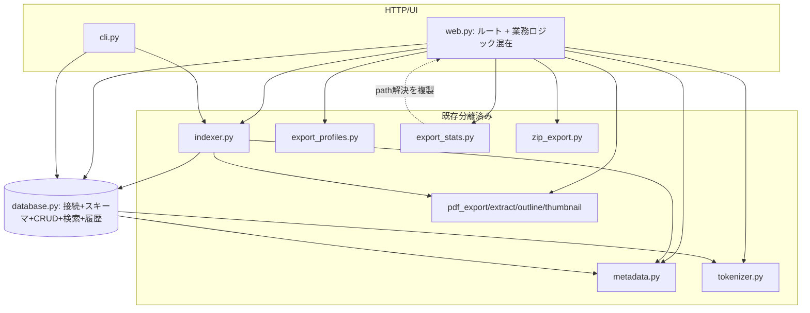
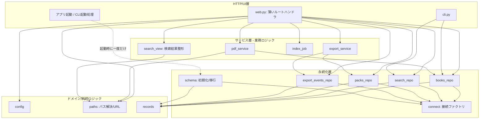

# 中心ファイルの責務棚卸しと段階的分割設計

対象: `src/tsundokensaku/web.py`（2072行）・`src/tsundokensaku/database.py`（1922行）
位置づけ: ROADMAP「Phase 5着手前: 構造改善と回帰保証」の「構造と依存関係の棚卸し」の成果物
状態: 調査・設計のみ。本体コードは分割していない。

---

## 1. 目的と非目的

### 目的

- `web.py`・`database.py` に集中している責務を、変更理由の単位で一覧化する。
- 既存の振る舞い（公開URL・HTTP API・画面表示・DBスキーマ）を変えずに、段階的・可逆的に分割するための移行順を決める。
- 分割後の候補モジュールと依存方向を、現在の実装から無理なく到達できる形で示す。

### 非目的

- 一般的なレイヤードアーキテクチャの理想形を新規設計すること。
- ファイルの行数削減そのもの。行数は分割の動機ではなく、責務の混在が動機。
- この文書の時点でコードを分割・変更すること。
- 個人開発の規模に対して過剰な抽象化（リポジトリパターン・DIコンテナ・完全なドメイン層など）を導入すること。

### 前提（確認済み）

- 個人開発・ローカル利用が中心。SQLite単一ファイル、追加サーバープロセスなし。
- すでに多くの処理が専用モジュールへ分離済み: `export_profiles` / `export_stats` / `pdf_export` / `pdf_extract` / `pdf_outline` / `pdf_thumbnail` / `markdown_export` / `metadata` / `tokenizer` / `token_estimate` / `zip_export` / `indexer`。残る大物が `web.py` と `database.py` の2つ。
- 回帰の安全網は厚い: `tests/test_web.py`（3350行、FastAPI TestClient 経由）・`tests/test_database.py`（1236行）。Playwright は5 spec・29テスト。
- CI（`.github/workflows/ci.yml`）は現在 Python unittest のみ実行。Playwright は未搭載（ROADMAP の Must で CI 化予定）。

---

## 2. 現在の構造

```
web.py (2072)  ── database から27個の関数/定数をimport
   │            ── metadata / export_profiles / export_stats / indexer
   │            ── markdown_export / pdf_export / pdf_outline / pdf_thumbnail
   │            ── token_estimate / tokenizer / zip_export
   │
   ├─ FastAPI app 初期化・テンプレート・静的配信
   ├─ 環境変数/設定の解決（books_dir, db_path, demo_mode ...）
   ├─ 純粋な整形ロジック（検索結果行, ハイライト, scrapbox本文組立）
   ├─ ファイル操作（アップロード保存, env書き込み, PDFエクスポート保存）
   ├─ 生SQL集計（get_db_stats, get_library_items 内で connection.execute）★
   ├─ インデックスジョブ（threading + 進捗状態のグローバル辞書）
   ├─ エクスポートのプレビュー/アーカイブ組立（業務ロジック）
   └─ 約40本のルートハンドラ（HTTP層）

database.py (1922)
   ├─ dataclass レコード定義（BookRecord, PackRecord, ExportEventRecord ...）
   ├─ 接続（connect）
   ├─ スキーマ初期化 + 保証/移行（initialize, _ensure_*_schema, _migrate_*）★
   ├─ 書籍/ページ/メモ/ノート CRUD（upsert_book, replace_pages ...）
   ├─ 検索（search + FTS/trigram/like の内部関数群）
   ├─ 資料（pack）CRUD + アクティブpack管理
   ├─ 資料項目（pack items）の変換・置換・正規化
   └─ エクスポート履歴（record_export_event, list_export_events ...）

★ = 責務が混在している主要な箇所
```

ARCHITECTURE.md には `database.py` を「資料棚の永続化」と記載しているが、実際にはエクスポート履歴・移行処理まで抱えており、記述より責務が増えている。分割完了時に ARCHITECTURE.md も更新する。

---

## 3. web.py の責務一覧

行番号は調査時点（develop / `48165ba`）のもの。分類は変更理由（＝いつ書き換わるか）で行う。

### R1. アプリ初期化・静的資産（HTTP層に残す）

- 主な定義: `app = FastAPI(...)`（126）、`templates`、`STATIC_DIR` マウント、`_find_project_root`（92）。
- 依存: FastAPI, Jinja2。
- 判断: HTTP層に残す。分離不要。

### R2. 設定・環境変数の解決（分離候補）

- 主な定義: `get_books_dir`（133）、`get_db_path`（137）、`get_pdf_export_save_dir`（142）、`is_demo_mode`（155）、`_resolve_env_path`、`update_env_setting`（714）、定数群（`BOOKS_DIR_ENV` ほか、`CONTAINER_BOOKS_DIRS`）。
- 依存: `os.environ`、ファイルシステム（.env 書き込み）。
- DB呼び出し: なし。
- 判断: 設定解決は純粋。`update_env_setting` はファイル書き込みを伴うが同じ「設定」責務。`config.py`（仮）へ集約候補。**リスク: 低**（呼び出し元が多いので委譲ラッパーを残す）。

### R3. パス解決・URL生成（分離候補・既知の重複あり）

- 主な定義: `resolve_pdf_path`（472）、`pdf_url`（501）、`raw_pdf_url`（511）、`_resolve_pdf_file_or_404`（757）、`_unique_destination_path`（688）、`_unique_export_destination_path`（701）。
- 依存: ファイルシステム、`CONTAINER_BOOKS_DIRS`。
- 判断: `resolve_pdf_path` は `export_stats._resolve_pdf_path` と意図的に複製されている（web.py 469-471 の TODO(phase3b-path-resolution-dedup) が明記。循環import回避のため）。**この重複解消がパス層を切り出す主目的**。`paths.py`（仮）へ集約すれば export_stats からも参照でき、循環importも起きない。**リスク: 中**（パストラバーサル検証を含むため、切り出し時にセキュリティ回帰テストで固定する）。

### R4. 純粋な整形・レンダリング補助（分離候補）

- 主な定義: `highlight_query`（166）、`build_search_result_rows`（223）、`finalize_search_result_rows`（269）、`build_search_result_rows_context`（326）、`normalize_search_group`（291）、`normalize_search_match`（309）、`group_pdf_results`（536）、`sort_results`（526）、`build_search_scrapbox_body`（380）、`build_scrapbox_page_url`（209）、`format_indexed_at`（189）、`_page_snippet`（850）。
- 依存: `tokenizer`, `metadata`。DB呼び出しなし（引数で受け取る）。
- 判断: DOM/HTTPに依存しない純粋関数。すでに単体テストが厚い（`test_web.py` の Highlight/Group/Normalize 系）。`search_view.py`（仮：検索結果の整形）へ集約候補。**リスク: 低**。

### R5. ライブラリ/統計の集計（分離候補・生SQL漏れ）★

- 主な定義: `get_db_stats`（582）、`get_library_items`（604）、`get_pdf_stats`（521）。
- 依存: `connect`、**web.py 内で生SQL `connection.execute("SELECT COUNT(*) ...")` を直接実行**、`metadata`。
- 判断: 集計SQLが HTTP 層に漏れている。生SQLは `database.py`（またはその後継の書籍ドメインモジュール）へ移し、web.py は集計済み値を受け取る形にする。**リスク: 中**（`get_library_items` は metadata と URL 生成も混ぜており、DB集計部分だけを先に押し出す）。

### R6. インデックスジョブ（分離候補・状態を持つ）

- 主な定義: `_run_index_job`（441）、`_set_index_progress`（423）、`_get_index_progress`（436）、`INDEX_PROGRESS`/`INDEX_PROGRESS_LOCK`（モジュール変数）。
- 依存: `threading`、`indexer.index_books`。
- 判断: バックグラウンド実行の進捗をグローバル辞書＋ロックで保持。HTTP層から切り離して `index_job.py`（仮）へ。**リスク: 中**（グローバル状態のライフサイクル。プロセス内シングルトン前提を崩さないこと）。

### R7. ファイル入出力・取り込み（分離候補）

- 主な定義: `save_uploaded_pdf`（737）、`import_pdfs_from_directory`（660）、`import_scrapbox_export_bytes`（941）、`render_pdf_export`（765）、`save_pdf_export_to_configured_dir`（779）、`render_markdown_export`（893）、`load_pages_text`（821）、`search_book_pages`（862）、`resolve_pdf_scrapbox_url`（918）、`_get_indexed_book`（802）。
- 依存: ファイルシステム、`pdf_export` / `markdown_export` / `pdf_extract`、`database`。
- 判断: 「PDFファイルに対する業務操作」。R3のパス層に依存する。`pdf_service.py`（仮）へ集約候補だが、粒度が大きいので後半の段階に回す。**リスク: 中〜高**（アップロード・保存の副作用。デモモード制御と絡む）。

### R8. エクスポート業務ロジック（分離候補）

- 主な定義: `build_export_preview_warnings`（1311）、`build_export_preview_payload`（1369）、`build_export_preview_payload_for_profile`（1378）、`_preview_base_stats`（1350）、`_export_pack_json`（1474）、`_export_pack_archive`（1520）、`_placeholder_item_stats_for_export`（1500）、`_resolve_export_profile_or_400`（1617）、`_export_preview_warning`（1307）。
- 依存: `export_profiles`, `export_stats`, `zip_export`, `database`（pack取得）。
- 判断: HTTP層とプレゼンテーションの中間にある業務ロジック。`export_service.py`（仮）へ。ただし `_resolve_export_profile_or_400` は HTTPException を投げるため HTTP寄り。**リスク: 中**。

### R9. ルートハンドラ（HTTP層に残す）

- 主な定義: 約40本の `@app.get/post/put/patch/delete`（964〜2071）。ページ表示（`home`, `search_page`, `workspace_page`, `pack_list_page`, `settings_page` ...）、pack API（`api_*`）、PDF系（`open_pdf`, `pdf_outline`, `pdf_thumbnails`, `export_pdf`, `export_markdown`, `view_pdf` ...）、設定系（`upload_pdf`, `run_index`, `settings_progress` ...）。
- 判断: ルーティング・入力検証・レスポンス生成は HTTP層に残す。ただし body に混ざった業務処理を R4〜R8 の各サービスへ委譲し、ハンドラを薄くする。将来的に `APIRouter` で機能別分割も可能だが、**今回の対象外**（後回し可）。

### 補助（デモモード制御）

- `is_demo_mode`（R2）を各書き込み系ハンドラが参照。横断的関心事。専用モジュール化はしない（設定R2の一部として扱う）。

---

## 4. database.py の責務一覧

### D1. レコード定義（dataclass）

- 主な定義: `BookRecord`（31）、`PdfTitleRefreshTarget`、`PageRecord`、`BookNoteRecord`、`PackRecord`（70）、`PackItemRecord`、`ExportEventRecord`（93）、`ExportEventItemRecord`、`SearchResult`（112）。
- 判断: 純粋なデータ構造。分割するなら `records.py`（仮）に集約でき、循環importの起点になりにくい。**リスク: 低**。ただし多くのモジュールが import するため、移すなら再エクスポートを残す。

### D2. 接続管理

- 主な定義: `connect`（127）。
- 判断: 単一の接続ファクトリ。`row_factory` 等の設定を含む。永続化層の基点。分離しても薄い。**リスク: 低**。

### D3. スキーマ初期化・保証・移行★

- 主な定義: `initialize`（148）、`ensure_pack_schema`（1443）、`_ensure_pack_schema`（1557）、`_ensure_books_schema`（1686）、`_ensure_pages_schema`（1760）、`_ensure_memo_schema`（1788）、`_ensure_book_notes_schema`（1816）、`_ensure_search_schema`（1839）、`_remove_empty_artifact_tables`（1600）、`_migrate_pack_items_drop_pdf_path_unique`（1629）、`_backfill_pages_trigram`（1875）、`_backfill_book_filenames`（1890）、`_replace_book_search_index`（1864）、`_table_columns`（1681）。
- 判断: 冪等な `CREATE TABLE IF NOT EXISTS` ＋ 列追加・データ移行相当。**これが CRUD と最も強く混ざっている**。`schema.py`（仮）へ切り出すのが database.py 分割の中核。**リスク: 中〜高**（スキーマ変更を伴う可能性があるものは、ROADMAP Must「データ保全とスキーマ管理の方針決定」の手順を前提とする。ただし「移動するだけ・SQL不変」なら Git＋回帰テストで可逆）。

### D4. 書籍・ページ・メモ・ノートの永続化

- 主な定義: `upsert_book`（161）、`get_book`（228）、`list_books`（257）、`delete_book`（286）、`replace_pages`（297）、`replace_book_notes`（346）、`replace_memos`（389）、`sync_memos`（420）、`sync_kindle_books`（450）、`list_pdf_title_refresh_targets`（467）、`refresh_pdf_titles`（514）。
- 呼び出し元: `indexer`, `cli`, `web`。
- 判断: 書籍ドメインの CRUD。`books_repo.py`（仮）候補。**リスク: 中**（`indexer` と `web` 両方が使う。互換のため公開名を維持）。

### D5. 検索

- 主な定義: 公開 `search`（549）、内部 `_search_title/_body/_memo/_book_notes` とその `_fts/_trigram/_like` 変種、`_build_fts_query` ほかクエリ組立、`_dedupe_rows`、`_build_search_snippet`。
- 判断: 検索は独立性が高く、内部関数が多い。`search_repo.py`（仮）候補。**リスク: 中**（FTS/trigram のSQLが密。挙動固定の回帰テストが既にある）。

### D6. 資料（pack）と資料項目

- 主な定義: `create_pack`/`get_pack`/`list_packs`/`update_pack`/`delete_pack`、アクティブpack（`get_active_pack_id`/`set_active_pack`/`clear_active_pack`/`resolve_active_pack_id`）、項目（`get_pack_items`/`replace_pack_item_entries`/`replace_pack_items`/`pack_items_as_items`/`pack_items_as_cart`/`normalize_pack_payload_to_items`/`import_cart_as_pack`/`validate_pages_syntax`）。
- 呼び出し元: 主に `web`（pack API）。
- 判断: 資料ドメインの CRUD ＋ ペイロード正規化。`packs_repo.py`（仮）候補。**リスク: 中**。`normalize_pack_payload_to_items`・`validate_pages_syntax` は純粋寄りで先に切り出しやすい。

### D7. エクスポート履歴

- 主な定義: `record_export_event`（1450）、`list_export_events`（1491）、`get_export_event`（1509）、`_export_event_record_from_row`、`_parse_export_event_items`。
- 判断: 独立性が高い小さめのドメイン。`export_events_repo.py`（仮）候補。**リスク: 低**。

### トランザクション境界（横断確認事項）

- 現状、多くの公開関数が内部で `connection.commit()` を呼ぶ（呼び出し側で connect → 関数実行 → 関数内 commit）。web.py 側は `_pack_connection()`（1092）で接続を作り、複数操作をまとめる箇所がある。
- **分割時の鉄則**: 「同一接続・同一トランザクションで実行する必要がある処理」を別モジュールへ散らさない。特に `replace_pack_item_entries` と関連する pack 更新は同一接続前提。切り出し単位はドメイン境界＝トランザクション境界に合わせる。

---

## 5. 現在の依存関係



確認済みの問題点:
- web.py が「HTTP層」でありながら、設定解決・パス解決・生SQL集計・インデックスジョブ・エクスポート業務ロジックまで抱える。
- `export_stats` が `web.resolve_pdf_path` 相当を複製している（循環import回避のための既知の負債。web.py 469-471 の TODO）。
- `database.py` が「接続＋スキーマ＋4ドメインCRUD＋検索＋履歴」を1ファイルに集約。

---

## 6. 目標とする依存方向

過剰な層を作らず、**現状から到達可能な最小限の層**にとどめる。参照は上から下への一方向のみ。



原則:
- L1（HTTP）は L2〜L4 を参照してよい。逆向き禁止。
- **通常の CRUD（books/search/packs/events）は `connect`（接続ファクトリ）と `records` にだけ依存する。`schema` は参照しない。** CRUD 側は「スキーマは既に初期化済み」を前提に動く。
- **`schema.initialize`（スキーマ作成・保証・移行）は、アプリ起動時や CLI 起動処理から一度だけ呼び出される、CRUD とは並列の責務。** CRUD リポジトリの各関数が毎回スキーマ保証を呼ぶ構造にはしない（＝ CRUD → schema の依存辺を作らない）。これにより「データ構造をどう作るか」と「データをどう読み書きするか」の変更理由が分離する。
- L4（永続化）内では、各リポジトリ同士の相互参照は避ける（トランザクション共有が必要な場合は同一モジュールに置く）。
- `paths`（L3）を独立させることで `export_stats` の複製を解消し、循環importを断つ。

補足（現状との差分・要確認）: 現在の `database.py` は起動時に `initialize` を呼ぶ経路のほか、一部の公開関数が内部で `ensure_pack_schema` 相当を呼んでいる箇所がある（例: `ensure_pack_schema`（1443）が pack 系から参照されうる）。目標構造では、この「関数内スキーマ保証」を起動時の一度きりの初期化へ寄せる。ただし呼び出し実態の確認と、寄せることによる副作用（新規DBに対する遅延初期化の可否）は段階4（schema分離）で個別に検証し、必要なら現状維持とする。**この点は推測を含む未決事項**（§10へ）。

**これは到達目標であり、一度に到達しない。** §8の移行順で段階的に近づける。実際にはL2/L3の一部だけ切り出した時点で十分な効果が出るため、L4の完全分割は費用対効果を見て判断する（後回し可）。

---

## 7. 分割候補モジュール

「同じ理由で変更される処理」を1単位にまとめる。ファイル数を増やしすぎない。★=効果が大きく先行すべきもの。

| 候補モジュール | 担当責務 | 移動元 | 主な対象 | 依存先 | 呼び出し元 | 先行/後回し |
|---|---|---|---|---|---|---|
| `paths.py` ★ | パス解決・PDF URL生成・一意保存先 | web R3 | `resolve_pdf_path`, `pdf_url`, `raw_pdf_url`, `_unique_*` | fs, config | web, export_stats | **先行**（複製解消） |
| `config.py` | 環境変数・設定解決・.env書込 | web R2 | `get_books_dir`, `get_db_path`, `is_demo_mode`, `update_env_setting` | os, fs | web, （cli） | 早期 |
| `search_view.py` | 検索結果の整形・ハイライト・並替 | web R4 | `build_search_result_rows*`, `highlight_query`, `group_pdf_results`, `normalize_*` | tokenizer, metadata, paths | web | 早期（純粋・低リスク） |
| `index_job.py` | インデックスのバックグラウンド実行と進捗 | web R6 | `_run_index_job`, `_*_index_progress`, 進捗グローバル | threading, indexer, config | web | 中盤 |
| `export_service.py` | エクスポートのプレビュー/アーカイブ組立 | web R8 | `build_export_preview_*`, `_export_pack_archive`, `_export_pack_json` | export_profiles, export_stats, zip_export, packs_repo | web | 中盤 |
| `pdf_service.py` | PDFファイルに対する業務操作・取り込み | web R7 | `save_uploaded_pdf`, `render_pdf_export`, `load_pages_text`, `search_book_pages` ほか | paths, pdf_*, books_repo, config | web | 後半（副作用大） |
| `schema.py` ★ | スキーマ初期化・保証・移行 | db D3 | `initialize`, `_ensure_*_schema`, `_migrate_*`, `_backfill_*` | sqlite3, records | 各repo, cli | **中核**（DB分割の起点） |
| `records.py` | dataclass レコード定義 | db D1 | `BookRecord` ほか9個 | dataclasses | 全域 | 早期（低リスク、再エクスポート必須） |
| `books_repo.py` | 書籍・ページ・メモ・ノート CRUD | db D4 | `upsert_book`, `list_books`, `replace_pages` ほか | schema, records | web, cli, indexer | 後半 |
| `search_repo.py` | 検索クエリ組立・FTS/trigram/like | db D5 | `search` + 内部群 | schema, tokenizer | web, cli | 後半 |
| `packs_repo.py` | 資料・資料項目 CRUD・正規化 | db D6 | `*_pack*`, `*_items*`, `normalize_pack_payload_to_items` | schema, records | web | 後半 |
| `export_events_repo.py` | エクスポート履歴 | db D7 | `record_export_event`, `list_export_events` | schema, records | web | 後半（小さく独立、先行も可） |

補足:
- `database.py` は分割後も**互換の集約モジュールとして残す**（各repoを re-export）。既存の `from tsundokensaku.database import ...`（web.py の27個importなど）を壊さないため。呼び出し先の書き換えは段階的に。
- L4の完全分割（books/search/packs/events）は行数の割に呼び出し元が多く、リスクとコストが高い。**`schema.py` と `records.py` の切り出しだけでも「スキーマ関心事とCRUD/レコードの分離」という主目的は達成できる**。repo群への分割は効果を見て判断（後回し可）。

---

## 8. 段階的な移行順

前提: 1 PR = 1 責務の移動。既存の公開URL・HTTP API・画面表示・DBスキーマは不変。移動元には**委譲ラッパーを残し**、`from tsundokensaku.database import X` 等の既存importを壊さない。各段階でロールバックは「その PR を revert」で完結する（スキーマ不変のため）。

**着手前提（ROADMAP Must）**: Playwright の CI 実行・テスト戦略明文化を先に整える。ただし本移行の各段階は Python の TestClient テストが主な安全網であり、UI変更を伴わないため Playwright は「無変更の確認」用途。

### 段階0: パス解決の一元化 ★（先行・複製解消）

**この段階は2つの PR に分ける。** テスト追加（挙動を固定するだけでコードは動かさない）と、責務移動（コードを動かすが挙動は変えない）を混在させないため。順序は 0a → 0b。

#### 段階0a: 既存挙動を固定する回帰テストの追加（コード移動なし）

- 目的: パス解決・パストラバーサル検証の現在の挙動を、移動前にテストで固定する。
- 変更対象: `tests/` のみ（テスト追加）。`web.py`・`export_stats.py` の本体は**一切変更しない**。
- 追加するテスト: `resolve_pdf_path` の正常系（相対・絶対・コンテナパス）と、境界外（`..` によるトラバーサル、books_dir 外の絶対パス、シンボリックリンク相当）が `None` になること。保存先の一意化（`_unique_*`）の既存挙動。
- Python テストで足りるか: 足りる。
- ロールバック: PR revert（テストのみなので影響なし）。
- 次段階条件: 追加テストが現行コードに対して緑。これが 0b の安全網になる。

#### 段階0b: paths.py への純粋移動と複製解消（挙動不変）

- 移動する責務: R3（`resolve_pdf_path`, `pdf_url`, `raw_pdf_url`, `_unique_*`）→ 新規 `paths.py`。
- 変更対象: 新規 `paths.py`、`web.py`（委譲ラッパー化）、`export_stats.py`（複製をやめて `paths` を参照）。
- 公開関数: web.py に同名ラッパーを残す。
- 回帰テスト: 段階0a で追加したパス検証テスト＋既存の PDF URL / thumbnail / export 系 TestClient テスト。**新規テストは追加しない**（0a で固定済みの挙動が、移動後も緑のままであることを確認する）。
- Python テストで足りるか: 足りる。Playwright は無変更確認のみ。
- ロールバック: PR revert。
- 次段階条件: `export_stats` の TODO(phase3b-path-resolution-dedup) が解消し、0a のテストを含む全テストが緑。

### 段階1: レコード定義の切り出し（低リスク）

- 責務: D1 → `records.py`。`database.py` は re-export。
- 回帰テスト: 全 Python（import経路の確認）。
- ロールバック: PR revert。
- 次段階条件: 全テスト緑、`from tsundokensaku.database import BookRecord` 等が従来通り動く。

### 段階2: 設定の切り出し

- 責務: R2 → `config.py`。web.py はラッパー保持。
- 回帰テスト: 設定・アップロード・エクスポート保存の TestClient テスト、デモモード関連。
- ロールバック: PR revert。

### 段階3: 検索結果整形の切り出し（純粋・低リスク）

- 責務: R4 → `search_view.py`。段階0の `paths` に依存。
- 回帰テスト: Highlight/Group/Normalize 系（既存が厚い）＋検索ページ描画。
- ロールバック: PR revert。

### 段階4: スキーマ関心事の切り出し ★（DB分割の中核）

- 責務: D3 → `schema.py`。`initialize` などは `database.py` から re-export。
- 変更対象: `schema.py`、`database.py`（移動＋re-export）。**SQLは1文字も変えない（純粋な移動）**。
- 回帰テスト: `test_database.py` 全件（スキーマ初期化・移行の冪等性を含む）、`test_web.py`（新規DB起点のフロー）。
- スキーマ変更を伴うか: **伴わない**。よって Git＋回帰テストで可逆。Must「データ保全」の完了は待たない。
- ロールバック: PR revert。
- 次段階条件: 新規DB作成・既存DB起動の双方でスキーマ保証が従来通り。

### 段階5: エクスポート履歴 repo の切り出し（小さく独立）

- 責務: D7 → `export_events_repo.py`。database.py は re-export。
- 回帰テスト: エクスポート履歴の TestClient / DB テスト。
- ロールバック: PR revert。

### 段階6: インデックスジョブの切り出し

- 責務: R6 → `index_job.py`。
- 回帰テスト: `/settings/index` `/settings/progress` の TestClient テスト。グローバル状態のライフサイクルに注意。
- ロールバック: PR revert。

### 段階7: エクスポート業務ロジックの切り出し

- 責務: R8 → `export_service.py`。`_resolve_export_profile_or_400` の HTTPException はハンドラ側に残す（HTTP関心事）。
- 回帰テスト: pack export preview / zip / markdown の TestClient テスト（既存が厚い）。
- ロールバック: PR revert。

### 段階8以降（後回し可・効果を見て判断）

- R5（生SQL集計）→ 集計SQLを `books_repo` へ寄せ、web.py は値を受け取る。
- R7（`pdf_service`）→ 副作用が大きいので最後。
- D4/D5/D6（books/search/packs repo）→ 完全分割はコスト高。`schema`＋`records` 分離で主目的達成済みなら、必要になるまで保留。

各段階の完了条件は共通: **Python 全件緑＋（CI化後は）Playwright 全件緑＋主要フロー手動確認**。1段階ずつマージし、次に進む。

---

## 9. テスト戦略との関係

- 本移行は「振る舞いを変えずに移動する」ため、**新規テストより既存回帰テストの通過が主目的**。`test_web.py`（TestClient）が公開HTTP契約を、`test_database.py` がDB挙動を固定している。
- 段階0（paths）だけは、パストラバーサル検証を明示的に固定する単体テストがあると安全。ROADMAP Must「テスト戦略の明文化」「セキュリティ検証の体系化」と接続する。
- Playwright は本移行では「UI無変更の確認」用途。CI化（ROADMAP Must）が済んでいれば各段階で自動確認できる。未了なら段階ごとにローカル実行。
- テストコードの移動・改名は本移行に含めない（挙動を変えない移動に集中）。

---

## 10. リスクと未決事項

### リスク（確認済み事実に基づく）

- **R3/段階0**: パストラバーサル対策のコードを移動するため、切り出しミスがセキュリティ回帰に直結。単体テストで固定してから移動する。
- **R6/段階6**: インデックス進捗はグローバル辞書＋ロック。プロセス内シングルトン前提を崩すと進捗表示が壊れる。
- **D3/段階4**: スキーマ保証・移行は起動時に毎回走る冪等処理。移動時にSQLや実行順を変えないこと。実行順を変えると既存DBの移行が壊れる恐れ。
- **D4-D6/後半**: 同一トランザクションで実行される pack 操作を別モジュールへ散らすと、部分コミットのリスク。トランザクション境界＝モジュール境界を守る。
- **委譲ラッパーの残存**: 互換のため各所にラッパーを残すと、一時的にファイル数と間接層が増える。移行完了後にラッパー撤去の掃除PRを1本入れる想定。

### 未決事項（推測を含む・要判断）

- L4の repo 群（books/search/packs）を最後まで分割するか、`schema`＋`records` の分離で止めるか。**推測**: 個人開発の規模では後者で十分な可能性が高い。段階4完了後に再評価する。
- 「関数内スキーマ保証」（`ensure_pack_schema` 相当）を起動時の一度きり初期化へ寄せられるか。**推測・要確認**: 目標構造では CRUD → schema の依存を作らないため寄せたいが、新規DBに対する遅延初期化の挙動を壊さないか、呼び出し実態を段階4で確認してから判断する。寄せられない場合は現状維持（CRUD 側からの保証呼び出しを残す）。
- ルートハンドラを `APIRouter` で機能別ファイルに分けるか。今回は対象外。web.py が薄くなった後に判断。
- `_resolve_export_profile_or_400` のような「業務＋HTTP例外」関数の置き場所。**方針案**: 業務判定は service、HTTPException 変換はハンドラ、という分担。段階7で確定する。
- ARCHITECTURE.md の更新タイミング。各段階では追記程度にとどめ、段階4（schema分離）と最終段階でまとめて反映するのが現実的。

---

## 付録: 確認済み事実と推測の区別

- **確認済み**（コード・grep・テスト実行・git で確認）: 行番号と定義の所在、web.py の27 database import、生SQLの web.py 内実行（`get_db_stats`/`get_library_items`）、path解決の複製TODO、`_ensure_*`/`_migrate_*` の存在、test_web.py 3350行・test_database.py 1236行、Playwright 5spec・29テスト、CI が Python unittest のみ。
- **推測**（設計判断・要レビュー）: 各モジュールの最終的な粒度、L4を完全分割すべきか、移行順の細部（段階5〜8の順序は入れ替え可能）、ラッパー撤去のタイミング。
