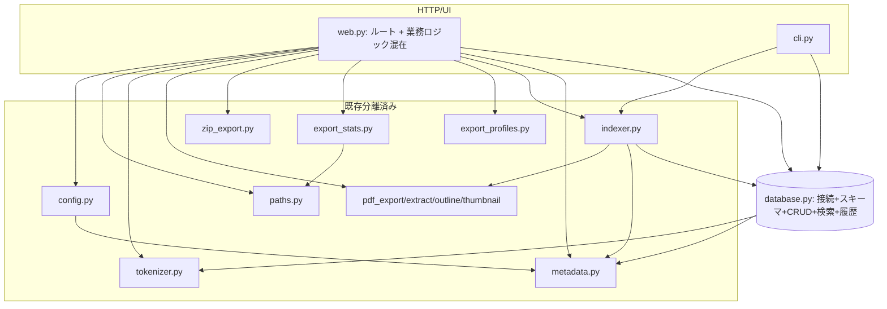
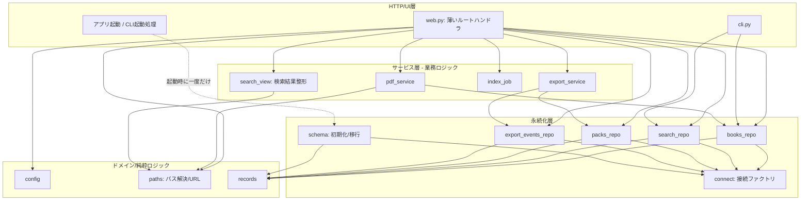

# 中心ファイルの責務棚卸しと段階的分割設計

対象: `src/tsundokensaku/web.py`（1743行、R2・R3・R4・R6分離後）・`src/tsundokensaku/database.py`（1922行、責務分離は未着手）
位置づけ: ROADMAP「Phase 5着手前: 構造改善と回帰保証」の「構造と依存関係の棚卸し」の成果物
状態: `web.py`系列はR2（`config.py`）・R3（`paths.py`）・R4（`search_view.py`）・R6（`index_job.py`）が完了。R1・R9はHTTP層として分離不要、R5・R7・R8は未実装。`database.py`系列（D1〜D7）は未実装。現在状態は2026-08-01、`develop`のコミット `87c890ca5ba4162053e8af9a8030de251bc026a1`で確認した。

### 番号体系とROADMAPとの対応

- R番号は`web.py`の**責務識別子**、D番号は`database.py`の**責務識別子**であり、実施順を表さない。
- §8の「段階」は策定当時の移行計画上の順序である。`web.py`系列と`database.py`系列は別系列で技術的に独立しているため、段階番号どおりに実施する必要はなく、実際の完了順とも一致しない。
- 技術的な責務境界・依存関係は本文書を正本とし、ROADMAP「Phase 5着手前: 構造改善と回帰保証」には次の進捗要約を載せる。

| 識別子 | 正式名称 | 分離先・配置 | 状態 | ROADMAPの対応 |
|---|---|---|---|---|
| R1 | アプリ初期化・静的資産 | `web.py`に維持 | 分離不要 | `web.py`の責務分離 |
| R2 | 設定・環境変数の解決 | `config.py` | 完了 | `web.py`の責務分離 |
| R3 | パス解決・URL生成 | `paths.py` | 完了 | `web.py`の責務分離 |
| R4 | 表示整形中心の責務（検索結果整形） | `search_view.py` | 完了 | `web.py`の責務分離 |
| R5 | ライブラリ/統計の集計 | `books_repo.py`側へ寄せる候補（`database.py`系列へ合流） | 候補のみ | `web.py`の責務分離 |
| R6 | インデックスジョブ | `index_job.py` | 完了 | `web.py`の責務分離 |
| R7 | ファイル入出力・取り込み（4子責務、§3参照） | 単一モジュールへ集約せず子責務ごとに分割。R7-1（PDFアップロード保存）は`pdf_import_service.py`候補として設計済み、R7-2〜R7-4は未設計 | 一部設計済み・未実装 | `web.py`の責務分離 |
| R8 | エクスポート業務ロジック | `export_service.py`候補 | 設計済み・未実装 | `web.py`の責務分離 |
| R9 | ルートハンドラ | `web.py`に維持 | 分離不要 | `web.py`の責務分離 |
| D1 | レコード定義 | `records.py`候補 | 設計済み・未実装 | `database.py`の責務分離 |
| D2 | 接続管理 | 分離先未定 | 候補のみ | `database.py`の責務分離 |
| D3 | スキーマ初期化・保証・移行 | `schema.py`候補 | 設計済み・未実装 | `database.py`の責務分離 |
| D4 | 書籍・ページ・メモ・ノートの永続化 | `books_repo.py`候補 | 候補のみ | `database.py`の責務分離 |
| D5 | 検索 | `search_repo.py`候補 | 候補のみ | `database.py`の責務分離 |
| D6 | 資料（pack）と資料項目 | `packs_repo.py`候補 | 候補のみ | `database.py`の責務分離 |
| D7 | エクスポート履歴 | `export_events_repo.py`候補 | 設計済み・未実装 | `database.py`の責務分離 |

---

## 1. 目的と非目的

### 目的

- `web.py`・`database.py` に集中している責務を、変更理由の単位で一覧化する。
- 既存の振る舞い（公開URL・HTTP API・画面表示・DBスキーマ）を変えずに、段階的・可逆的に分割するための移行順を決める。
- 分割後の候補モジュールと依存方向を、現在の実装から無理なく到達できる形で示す。

### 非目的

- 一般的なレイヤードアーキテクチャの理想形を新規設計すること。
- ファイルの行数削減そのもの。行数は分割の動機ではなく、責務の混在が動機。
- この文書の時点でコードを分割・変更すること。
- 個人開発の規模に対して過剰な抽象化（リポジトリパターン・DIコンテナ・完全なドメイン層など）を導入すること。

### 前提（確認済み）

- 個人開発・ローカル利用が中心。SQLite単一ファイル、追加サーバープロセスなし。
- すでに多くの処理が専用モジュールへ分離済み: `export_profiles` / `export_stats` / `pdf_export` / `pdf_extract` / `pdf_outline` / `pdf_thumbnail` / `markdown_export` / `metadata` / `tokenizer` / `token_estimate` / `zip_export` / `indexer` / `paths`（R3）/ `config`（R2）/ `search_view`（R4）/ `index_job`（R6）。残る大物が `web.py` と `database.py` の2つ。
- 回帰の安全網は厚い: `tests/test_web.py`（4295行、FastAPI TestClient経由）・`tests/test_database.py`（1236行）・`tests/test_search_view.py`（88行）・`tests/test_index_job.py`（168行）。2026-08-01時点のテスト定義はPython 481件、Playwright 29件。
- CI（`.github/workflows/ci.yml`）は Python unittest と Playwright の両方を別jobで実行済み（ROADMAP Must「Playwright テストの CI 実行」は2026-07-26完了）。

---

## 2. 現在の構造

```
web.py (1743)  ── database から27個の関数/定数をimport
   │            ── metadata / export_profiles / export_stats / indexer
   │            ── markdown_export / pdf_export / pdf_outline / pdf_thumbnail
   │            ── token_estimate / tokenizer / zip_export
   │            ── paths / config / search_view / index_job
   │
   ├─ FastAPI app 初期化・テンプレート・静的配信
   ├─ 環境変数/設定の解決（books_dir, db_path, demo_mode ...）── 段階2で `config.py` へ実体移動済み。
   │  web.py側は `config.xxx()` を呼ぶだけの薄い委譲ラッパー（既存133箇所超のmonkeypatch互換のため関数として残置）
   ├─ 検索結果整形 ── R4で `search_view.py` へ実体移動済み。web.py側は薄い委譲ラッパー
   ├─ インデックスジョブ ── R6で `index_job.py` へ完全移動済み。互換ラッパーなし
   ├─ ファイル操作（アップロード保存, env書き込み, PDFエクスポート保存）
   ├─ 生SQL集計（get_db_stats, get_library_items 内で connection.execute）★
   ├─ エクスポートのプレビュー/アーカイブ組立（業務ロジック）
   └─ 約40本のルートハンドラ（HTTP層）

database.py (1922)
   ├─ dataclass レコード定義（BookRecord, PackRecord, ExportEventRecord ...）
   ├─ 接続（connect）
   ├─ スキーマ初期化 + 保証/移行（initialize, _ensure_*_schema, _migrate_*）★
   ├─ 書籍/ページ/メモ/ノート CRUD（upsert_book, replace_pages ...）
   ├─ 検索（search + FTS/trigram/like の内部関数群）
   ├─ 資料（pack）CRUD + アクティブpack管理
   ├─ 資料項目（pack items）の変換・置換・正規化
   └─ エクスポート履歴（record_export_event, list_export_events ...）

★ = 責務が混在している主要な箇所
```

ARCHITECTURE.md には `database.py` を「資料棚の永続化」と記載しているが、実際にはエクスポート履歴・移行処理まで抱えており、記述より責務が増えている。分割完了時に ARCHITECTURE.md も更新する。

---

## 3. web.py の責務一覧

分類は変更理由（＝いつ書き換わるか）で行う。各節の「主な定義」「テスト状況」と行番号は、特記のない限り2026-07-29のR2完了時点（develop / `590c96a`）に行った分離前調査の歴史的記録であり、現在の所在・件数を示すものではない。現在の完了状態と配置は冒頭の対応表を正とする。

### R1. アプリ初期化・静的資産（HTTP層に残す）

- 主な定義: `app = FastAPI(...)`（126）、`templates`、`STATIC_DIR` マウント、`_find_project_root`（92）。
- 依存: FastAPI, Jinja2。
- 判断: HTTP層に残す。分離不要。

### R2. 設定・環境変数の解決 — 完了（コミット `590c96a01dd12c70e2248c5e54dac6d6fddd2be9`、PR #12）

- 移動前の主な定義: `get_books_dir`（旧133）、`get_db_path`（旧137）、`get_pdf_export_save_dir`（旧142）、`is_demo_mode`（旧155）、`update_env_setting`（旧656）、定数群（`DEFAULT_BOOKS_DIR`・`DEFAULT_DB_PATH`・`PDF_EXPORT_SAVE_DIR_ENV`）。
- 依存: `os.environ`、ファイルシステム（`.env` 書き込み）、`tsundokensaku.metadata.ENV_FILE`。DB呼び出しなし。
- 実装内容: 上記5関数・3定数をロジック無変更のまま新規 `src/tsundokensaku/config.py`（52行）へ移動した。`config.py` は標準ライブラリと `metadata.ENV_FILE` のみに依存し、`web.py`・FastAPI・router・UI関連・index job・pdf_service・export_serviceのいずれもimportしない。
- 互換性維持: `web.py`（現在135・139・143・155・655行）には同名の薄い委譲関数（`return config.xxx(...)`）を残した。単純な `from ... import` エイリアスではなく明示的な関数定義にしたのは、既存の `patch("tsundokensaku.web.get_books_dir", ...)` 等133箇所超のmonkeypatchを維持するため（段階0bの`paths.py`と同じ理由）。`templates.env.globals["pdf_export_save_dir"]`・`["is_pdf_export_save_dir_configured"]`・`["is_demo_mode"]` の登録は元の位置のまま`web.py`に残置。`web.py`内部の各ルートハンドラ等の呼び出しは、今回`config.xxx()`へ直接置き換えず、従来通り`web.py`内のラッパー名経由のまま維持した（範囲を広げすぎない判断）。
- 追加したcharacterization test: `tests/test_web.py` の `ConfigResolutionTest`（15件）。`get_books_dir`/`get_db_path`の環境変数あり（絶対・相対）／デフォルト値、`get_pdf_export_save_dir`の未設定・空白・`~`展開・絶対パス、`update_env_setting`の既存キー更新・新規追記・ファイル新規作成・コメント化キー無視・値の空白/記号保持を固定した。`is_demo_mode`は既存の`DemoModeUploadTest`で大文字小文字・未設定判定が固定済みだったため重複追加していない。
- 結果: Python全件が396件→411件（新規15件）。全件成功。循環importなし（`python -c "import tsundokensaku.config; import tsundokensaku.web"`で確認）。**訂正**: 旧記述の「394件→411件」は誤り。394件は段階0a（コミット`7f7e6dd`）時点の件数であり、段階0bで`export_stats`重複解消テスト2件が加わった結果396件（コミット`20a0441`時点）がR2着手前の正しい基準値。396+15=411で一致する（`git worktree`で段階0bマージコミット`6965899`を検証し、当時`tests/test_web.py`が3531行・Python全件396件成功であることを再確認した）。

### R3. パス解決・URL生成 — 完了（段階0a・0b、§8参照。以下は分離当時の記述を歴史的記録として維持）

- 主な定義: `resolve_pdf_path`（472）、`pdf_url`（501）、`raw_pdf_url`（511）、`_resolve_pdf_file_or_404`（757）、`_unique_destination_path`（688）、`_unique_export_destination_path`（701）。
- 依存: ファイルシステム、`CONTAINER_BOOKS_DIRS`。
- 判断: `resolve_pdf_path` は `export_stats._resolve_pdf_path` と意図的に複製されている（web.py 469-471 の TODO(phase3b-path-resolution-dedup) が明記。循環import回避のため）。**この重複解消がパス層を切り出す主目的**。`paths.py`（仮）へ集約すれば export_stats からも参照でき、循環importも起きない。**リスク: 中**（パストラバーサル検証を含むため、切り出し時にセキュリティ回帰テストで固定する）。

### R4. 表示整形中心の責務（検索結果整形）— 完了（PR #14・#16）

PR #14（マージコミット `6b6527800af330aa98818de87aea5c8cbbe9964e`）で`search_view.py`へ分離し、PR #16（マージコミット `bd71d8284761a78ebdc928e60cc43412ac4c9547`）で残存する境界契約のテストを補完した。`web.py`には既存importとの互換性を保つ薄い委譲ラッパーを維持している。以下は分離前調査と実装時の設計記録である。

- 分離前の主な定義（2026-07-29時点）: `highlight_query`（166）、`format_indexed_at`（189）、`_now_jst`（198、複数責務から参照される横断的ユーティリティ。下記参照）、`_sanitize_scrapbox_title`（202、内部補助）、`build_scrapbox_page_url`（209）、`_scrapbox_page_label`（216、内部補助）、`build_search_result_rows`（223）、`finalize_search_result_rows`（269）、`normalize_search_group`（291）、`normalize_search_match`（309）、`build_search_result_rows_context`（326）、`build_search_scrapbox_body`（380）、`sort_results`（485）、`group_pdf_results`（495）。
- 依存: `tokenizer`（`query_highlight_terms`）、`metadata`（`get_scrapbox_project_url`・`metadata_for_pdf`・`BookMetadata`）、`paths`（`raw_pdf_url`経由。内部で`resolve_pdf_path`→ファイルの実存確認 `is_file()` を行う）、`datetime`/`zoneinfo`（`_now_jst`経由の現在時刻）。
- **訂正（旧記述の誤り、2回目の再調査で判明）**:
  1. `_page_snippet`（772）は本節の対象ではない。PDF内テキスト検索のスニペット生成専用で、`search_book_pages`（R7）からのみ呼ばれる。
  2. 「DB呼び出しなし」というR4全体の記述は不正確だった: `build_search_result_rows_context` のみ `database.connect`/`database.search`/`metadata.find_export_json`/`metadata.load_metadata_by_pdf_stem` を呼び、DB接続を伴う「検索実行のオーケストレーション」関数である。他の関数は真にDB非依存。
  3. **「純粋関数」「外部状態に依存しない」という記述はさらに不正確だった**。以下の依存が実装本文の精読で判明している。
     - `build_search_result_rows`・`finalize_search_result_rows`は`raw_pdf_url`経由で`paths.resolve_pdf_path`を呼び、`Path.is_file()`によるファイル実存確認を行う（filesystem読み込みではないが、filesystem結合度は「なし」ではなく「低〜中」）。
     - `build_scrapbox_page_url`は`metadata.get_scrapbox_project_url()`経由で`SCRAPBOX_BASE_URL`環境変数を参照する。「入力だけを処理する」という記述は誤りで、環境変数依存がある。
     - `build_search_scrapbox_body`は`_now_jst()`（現在時刻取得）に依存し、同じ入力でも実行時刻によって出力（`作成日時`行・ページタイトルの日時部分）が変わる。
     - `finalize_search_result_rows`は入力の`rendered_results`内の各dict要素を**破壊的に更新**する（`result["page_urls"] = [...]`で同一オブジェクトを書き換える。新しいリスト/辞書を作って返すわけではない）。
     - `group_pdf_results`はPDF種別の結果を新しい辞書（`{**result, ...}`）へまとめる一方、非PDF種別の結果は`grouped.append(result)`で**元のdictオブジェクト参照をそのまま保持**する。
     - `sort_results`は未知の`sort`値（`title`/`page`/`scrapbox`のいずれでもない場合、`None`や空文字も含む）では**入力リストをそのままidentity維持で返す**（`sorted()`を呼ばず、新しいリストを作らない）。
  - 上記の性質から、R4は「純粋関数群」ではなく「**DB更新・ファイル書込みは行わないが、環境変数参照・現在時刻・PDFファイル存在確認・入力辞書の破壊的更新を含む、副作用が比較的小さい表示整形中心の責務**」と再定義する。移動時はこれらの現在挙動をcharacterization testで固定したうえで行う（「純粋移動」「影響なし」と断定しない）。
- **依存クロージャの追加調査**: `build_search_scrapbox_body`は`_now_jst`と`_sanitize_scrapbox_title`（既存対象の`_scrapbox_page_label`とは別）にも依存しており、旧文書のR4対象11関数だけでは依存が閉じていなかった。
  - `_sanitize_scrapbox_title`（202行目）: `build_search_scrapbox_body`からのみ呼ばれるR4専用の内部補助関数（他の呼び出し元なし、grep確認済み）。実装は「連続空白を1個へ正規化→前後空白除去→改行(`\n`/`\r`)を半角空白へ置換→`/`を全角`／`へ置換→`max_length`（既定80文字）で切り詰め→結果が空文字なら`"検索結果"`を返す」。**`search_view.py`へ完全移動する対象に含める**。
  - `_now_jst`（198行目）: `build_search_scrapbox_body`（380行目）だけでなく、`render_markdown_export`（R7、835行目）、`_export_pack_json`（R8、1414行目）、`_export_pack_archive`（R8、1453行目）からも呼ばれる**横断的ユーティリティ**（JST基準の現在時刻取得）。R4専用に`search_view.py`へ完全移動すると、R7/R8が`search_view.py`に依存することになり、責務のまとまりを新たに壊す。**`web.py`に残し、`search_view.py`側には同一実装（`datetime.now(ZoneInfo("Asia/Tokyo"))`、1行）を複製する**方針とする（詳細は§8「段階3」）。将来的にR7/R8も含めた日時ユーティリティの一本化は今回の対象外とし、必要になった段階で別PRとして検討する。
- 判断: 上記の発見を踏まえ、`search_view.py`（仮）へ移す対象は**DB非依存の12関数**（旧11関数＋`_sanitize_scrapbox_title`、`_now_jst`は複製）に絞り、`build_search_result_rows_context`は`web.py`側に残す（§8「段階3」で詳細化）。**リスク: 低〜中**（副作用が完全にゼロではないため、characterization testでの固定が前提）。
- 分離前のテスト状況: 直接単体テストがある関数は `highlight_query`（5件）、`group_pdf_results`（1件）、`format_indexed_at`（1件）、`build_scrapbox_page_url`（1件）、`normalize_search_match`（3件）、`normalize_search_group`（2件）、`build_search_scrapbox_body`（3件）の**7関数**。`_now_jst`も`tests/test_web.py`から直接importされているが専用テストはなく、他関数のテスト内で暗黙に使われる程度。**直接単体テストがない関数**: `build_search_result_rows`、`finalize_search_result_rows`、`sort_results`、`_sanitize_scrapbox_title`、`_scrapbox_page_label`（いずれもHTTP経由の統合テストでのみ間接的に検証）。既存テストはいずれも`tests/test_web.py`の`HighlightQueryTest`クラス（75〜920行、PDF関連・ルートハンドラ系テストも同居する大きめのクラス）内に存在する。monkeypatch対象は0件（直接importして呼ぶため）。

### R5. ライブラリ/統計の集計（分離候補・生SQL漏れ）★

- 主な定義（2026-07-29調査時）: `get_pdf_stats`（480）、`get_db_stats`（541）、`get_library_items`（563）。
- 依存: `connect`、**web.py 内で生SQL `connection.execute("SELECT COUNT(*) ...")` を直接実行**、`metadata`。
- 判断: 集計SQLが HTTP 層に漏れている。生SQLは `database.py`（またはその後継の書籍ドメインモジュール）へ移し、web.py は集計済み値を受け取る形にする。**リスク: 中**（`get_library_items` は metadata と URL 生成も混ぜており、DB集計部分だけを先に押し出す）。

### R6. インデックスジョブ — 完了（PR #17・#18）

PR #17（マージコミット `2c45ed1a245c2cb6ef29a924e2e31b2c3e5db06e`）で既存挙動を固定し、PR #18（マージコミット `52e9f7540026efbef1228af315893818883fac40`）で`index_job.py`へ分離した。`web.py`に互換ラッパーは残していない。以下は分離前調査と実装時の設計記録である。

- 分離前の主な定義（2026-07-29調査時）: `_set_index_progress`（423）、`_get_index_progress`（436）、`_run_index_job`（441）、`INDEX_PROGRESS`/`INDEX_PROGRESS_LOCK`（モジュール変数、117-125）。
- 依存: `threading`、`indexer.index_books`、`config.get_books_dir`/`config.get_db_path`（`web.py`のラッパー経由）。
- 分離前のテスト状況: `_run_index_job`・`_set_index_progress`・`_get_index_progress`・`/settings/index`・`/settings/progress`はいずれも`tests/test_web.py`に直接テストがなかった。
- 分離前の判断: バックグラウンド実行の進捗をグローバル辞書＋ロックで保持していたため、HTTP層から切り離して`index_job.py`へ移す方針とした。**リスク: 中**（グローバル状態のライフサイクル。プロセス内シングルトン前提を崩さないこと）。当時はテストをゼロから追加する必要があり、R4より着手コストが高いと評価した（§8参照）。

### R7. ファイル入出力・取り込み（分離候補）

- 主な定義（2026-07-29調査時）: `import_pdfs_from_directory`（619）、`save_uploaded_pdf`（659）、`_resolve_pdf_file_or_404`（679）、`render_pdf_export`（687）、`save_pdf_export_to_configured_dir`（701）、`_get_indexed_book`（724）、`load_pages_text`（743）、`_page_snippet`（772、内部補助。旧記述ではR4に誤分類していたが本節が正しい所属）、`search_book_pages`（784）、`render_markdown_export`（815）、`resolve_pdf_scrapbox_url`（840）、`import_scrapbox_export_bytes`（863）。
- 依存: ファイルシステム、`pdf_export` / `markdown_export` / `pdf_extract`、`database`（`connect`・`get_book`・`sync_memos`・`sync_kindle_books`・`initialize`）、`config`（`web.py`のラッパー経由）。
- テスト状況: `save_uploaded_pdf`・`import_pdfs_from_directory`・`save_pdf_export_to_configured_dir`・`render_markdown_export`・`resolve_pdf_scrapbox_url`・`import_scrapbox_export_bytes`はHTTP経由の統合テストで間接的に参照されるが、`render_pdf_export`・`load_pages_text`・`search_book_pages`・`_get_indexed_book`は直接参照なし。monkeypatch対象は0件。
- 判断: 「PDFファイルに対する業務操作」。R3のパス層に依存する。`pdf_service.py`（仮）へ集約候補だが、粒度が大きいので後半の段階に回す。**リスク: 中〜高**（アップロード・保存の副作用。デモモード制御と絡む）。
- **R7の子責務分解（2026-08-01、今回のPRで確定）**: 上記「主な定義」12関数を単一の`pdf_service.py`へ集約する設計は採らない。副作用の性質（外部からの取り込み・既存ファイルの変換や検索オーケストレーション）が異なる処理を1モジュールに集約すると、`pdf_service.py`自体が「小さな`web.py`」になり、責務混在という今回の分割動機と矛盾するため。変更理由の単位で次の4子責務に分ける。
  1. **R7-1: PDFアップロード保存** — `POST /settings/pdf-upload`（`upload_pdf`）・`save_uploaded_pdf`。アップロード済みbyte列をBOOKS_DIR配下へ安全に配置する。**今回このPRで詳細設計する対象**（詳細は§8「R7-1」参照）。
  2. **R7-2: PDFディレクトリ取り込み** — `GET /settings/pdf-import`（`import_pdf_directory`）・`import_pdfs_from_directory`。指定ディレクトリ配下のPDFをBOOKS_DIRへ一括コピーする。未設計・未実装。
  3. **R7-3: Scrapbox JSON保存・同期** — `POST /settings/scrapbox-upload`（`upload_scrapbox_json`）・`import_scrapbox_export_bytes`。Scrapboxエクスポートの取り込みとDB同期。未設計・未実装。
  4. **R7-4: PDF閲覧・変換・本文検索のHTTPオーケストレーション** — `render_pdf_export`・`save_pdf_export_to_configured_dir`・`_get_indexed_book`・`_resolve_pdf_file_or_404`・`load_pages_text`・`_page_snippet`・`search_book_pages`・`render_markdown_export`・`resolve_pdf_scrapbox_url`。既存PDFに対する読み取り・変換系の業務操作。未設計・未実装。
  - 上記「主な定義」・「依存」・「テスト状況」・「判断」（157〜162行目）はR7全体を一括りにしていた2026-07-29時点の分離前調査であり、歴史的記録として維持する。今回はR7-1のみを対象に、依存・テスト状況・判断を現行コードに基づき再調査した（§8「R7-1」参照）。R7-2〜R7-4は着手時に個別に再調査する。
  - R7（親項目）は今回のPRで完了扱いにしない。R7-1の分離を実装しても、R7-2〜R7-4が残る限りR7は未完了のまま。

### R8. エクスポート業務ロジック（分離候補）

- 主な定義（2026-07-29調査時）: `_export_preview_warning`（1229）、`build_export_preview_warnings`（1233）、`_preview_base_stats`（1272）、`build_export_preview_payload`（1291）、`build_export_preview_payload_for_profile`（1300）、`_export_pack_json`（1396）、`_placeholder_item_stats_for_export`（1422）、`_export_pack_archive`（1442）、`_resolve_export_profile_or_400`（1539）。
- 依存: `export_profiles`, `export_stats`, `zip_export`, `database`（pack取得）。
- テスト状況: `build_export_preview_warnings`・`build_export_preview_payload`・`build_export_preview_payload_for_profile`は`BuildExportPreviewPayloadTest`等の専用クラスで直接検証されている（非常に厚い）。`_preview_base_stats`・`_export_pack_json`・`_export_pack_archive`・`_placeholder_item_stats_for_export`・`_resolve_export_profile_or_400`は直接単体テストがなく、`PackExportPreviewTest`等HTTP経由の統合テストでのみ検証される。monkeypatch対象は0件。
- 判断: HTTP層とプレゼンテーションの中間にある業務ロジック。`export_service.py`（仮）へ。ただし `_resolve_export_profile_or_400` は HTTPException を投げるため HTTP寄り。**リスク: 中**。

### R9. ルートハンドラ（HTTP層に残す）

- 主な定義（2026-07-29調査時）: 約40本の `@app.get/post/put/patch/delete`（886〜1993）。ページ表示（`home`, `search_page`, `workspace_page`, `pack_list_page`, `settings_page` ...）、pack API（`api_*`）、PDF系（`open_pdf`, `pdf_outline`, `pdf_thumbnails`, `export_pdf`, `export_markdown`, `view_pdf` ...）、設定系（`upload_pdf`, `run_index`, `settings_progress` ...）。
- 判断: ルーティング・入力検証・レスポンス生成は HTTP層に残す。ただし body に混ざった業務処理を R4〜R8 の各サービスへ委譲し、ハンドラを薄くする。将来的に `APIRouter` で機能別分割も可能だが、**今回の対象外**（後回し可）。

### 補助（デモモード制御）

- `is_demo_mode`（R2）を各書き込み系ハンドラが参照。横断的関心事。専用モジュール化はしない（設定R2の一部として扱う）。

---

## 4. database.py の責務一覧

### D1. レコード定義（dataclass）

- 主な定義: `BookRecord`（31）、`PdfTitleRefreshTarget`、`PageRecord`、`BookNoteRecord`、`PackRecord`（70）、`PackItemRecord`、`ExportEventRecord`（93）、`ExportEventItemRecord`、`SearchResult`（112）。
- 判断: 純粋なデータ構造。分割するなら `records.py`（仮）に集約でき、循環importの起点になりにくい。**リスク: 低**。ただし多くのモジュールが import するため、移すなら再エクスポートを残す。

### D2. 接続管理

- 主な定義: `connect`（127）。
- 判断: 単一の接続ファクトリ。`row_factory` 等の設定を含む。永続化層の基点。分離しても薄い。**リスク: 低**。

### D3. スキーマ初期化・保証・移行★

- 主な定義: `initialize`（148）、`ensure_pack_schema`（1443）、`_ensure_pack_schema`（1557）、`_ensure_books_schema`（1686）、`_ensure_pages_schema`（1760）、`_ensure_memo_schema`（1788）、`_ensure_book_notes_schema`（1816）、`_ensure_search_schema`（1839）、`_remove_empty_artifact_tables`（1600）、`_migrate_pack_items_drop_pdf_path_unique`（1629）、`_backfill_pages_trigram`（1875）、`_backfill_book_filenames`（1890）、`_replace_book_search_index`（1864）、`_table_columns`（1681）。
- 判断: 冪等な `CREATE TABLE IF NOT EXISTS` ＋ 列追加・データ移行相当。**これが CRUD と最も強く混ざっている**。`schema.py`（仮）へ切り出すのが database.py 分割の中核。**リスク: 中〜高**（スキーマ変更を伴う可能性があるものは、ROADMAP Must「データ保全とスキーマ管理の方針決定」の手順を前提とする。ただし「移動するだけ・SQL不変」なら Git＋回帰テストで可逆）。

### D4. 書籍・ページ・メモ・ノートの永続化

- 主な定義: `upsert_book`（161）、`get_book`（228）、`list_books`（257）、`delete_book`（286）、`replace_pages`（297）、`replace_book_notes`（346）、`replace_memos`（389）、`sync_memos`（420）、`sync_kindle_books`（450）、`list_pdf_title_refresh_targets`（467）、`refresh_pdf_titles`（514）。
- 呼び出し元: `indexer`, `cli`, `web`。
- 判断: 書籍ドメインの CRUD。`books_repo.py`（仮）候補。**リスク: 中**（`indexer` と `web` 両方が使う。互換のため公開名を維持）。

### D5. 検索

- 主な定義: 公開 `search`（549）、内部 `_search_title/_body/_memo/_book_notes` とその `_fts/_trigram/_like` 変種、`_build_fts_query` ほかクエリ組立、`_dedupe_rows`、`_build_search_snippet`。
- 判断: 検索は独立性が高く、内部関数が多い。`search_repo.py`（仮）候補。**リスク: 中**（FTS/trigram のSQLが密。挙動固定の回帰テストが既にある）。

### D6. 資料（pack）と資料項目

- 主な定義: `create_pack`/`get_pack`/`list_packs`/`update_pack`/`delete_pack`、アクティブpack（`get_active_pack_id`/`set_active_pack`/`clear_active_pack`/`resolve_active_pack_id`）、項目（`get_pack_items`/`replace_pack_item_entries`/`replace_pack_items`/`pack_items_as_items`/`pack_items_as_cart`/`normalize_pack_payload_to_items`/`import_cart_as_pack`/`validate_pages_syntax`）。
- 呼び出し元: 主に `web`（pack API）。
- 判断: 資料ドメインの CRUD ＋ ペイロード正規化。`packs_repo.py`（仮）候補。**リスク: 中**。`normalize_pack_payload_to_items`・`validate_pages_syntax` は純粋寄りで先に切り出しやすい。

### D7. エクスポート履歴

- 主な定義: `record_export_event`（1450）、`list_export_events`（1491）、`get_export_event`（1509）、`_export_event_record_from_row`、`_parse_export_event_items`。
- 判断: 独立性が高い小さめのドメイン。`export_events_repo.py`（仮）候補。**リスク: 低**。

### トランザクション境界（横断確認事項）

- 現状、多くの公開関数が内部で `connection.commit()` を呼ぶ（呼び出し側で connect → 関数実行 → 関数内 commit）。web.py 側は `_pack_connection()`（1092）で接続を作り、複数操作をまとめる箇所がある。
- **分割時の鉄則**: 「同一接続・同一トランザクションで実行する必要がある処理」を別モジュールへ散らさない。特に `replace_pack_item_entries` と関連する pack 更新は同一接続前提。切り出し単位はドメイン境界＝トランザクション境界に合わせる。

---

## 5. 現在の依存関係



確認済みの問題点:
- web.py が「HTTP層」でありながら、生SQL集計・インデックスジョブ・エクスポート業務ロジックまで抱える（パス解決は段階0で `paths.py` へ、設定解決は段階2で `config.py` へ分離済み）。
- ~~`export_stats` が `web.resolve_pdf_path` 相当を複製している~~ → 段階0bで解消済み。`export_stats.py` は `web.py` をimportせず `paths.py` を参照する形になり、循環import経路も発生していない。
- `database.py` が「接続＋スキーマ＋4ドメインCRUD＋検索＋履歴」を1ファイルに集約。

---

## 6. 目標とする依存方向

過剰な層を作らず、**現状から到達可能な最小限の層**にとどめる。参照は上から下への一方向のみ。



原則:
- L1（HTTP）は L2〜L4 を参照してよい。逆向き禁止。
- **通常の CRUD（books/search/packs/events）は `connect`（接続ファクトリ）と `records` にだけ依存する。`schema` は参照しない。** CRUD 側は「スキーマは既に初期化済み」を前提に動く。
- **`schema.initialize`（スキーマ作成・保証・移行）は、アプリ起動時や CLI 起動処理から一度だけ呼び出される、CRUD とは並列の責務。** CRUD リポジトリの各関数が毎回スキーマ保証を呼ぶ構造にはしない（＝ CRUD → schema の依存辺を作らない）。これにより「データ構造をどう作るか」と「データをどう読み書きするか」の変更理由が分離する。
- L4（永続化）内では、各リポジトリ同士の相互参照は避ける（トランザクション共有が必要な場合は同一モジュールに置く）。
- `paths`（L3）を独立させることで `export_stats` の複製を解消し、循環importを断つ。

補足（現状との差分・要確認）: 現在の `database.py` は起動時に `initialize` を呼ぶ経路のほか、一部の公開関数が内部で `ensure_pack_schema` 相当を呼んでいる箇所がある（例: `ensure_pack_schema`（1443）が pack 系から参照されうる）。目標構造では、この「関数内スキーマ保証」を起動時の一度きりの初期化へ寄せる。ただし呼び出し実態の確認と、寄せることによる副作用（新規DBに対する遅延初期化の可否）は段階4（schema分離）で個別に検証し、必要なら現状維持とする。**この点は推測を含む未決事項**（§10へ）。

**これは到達目標であり、一度に到達しない。** §8の移行順で段階的に近づける。実際にはL2/L3の一部だけ切り出した時点で十分な効果が出るため、L4の完全分割は費用対効果を見て判断する（後回し可）。

---

## 7. 分割候補モジュール

「同じ理由で変更される処理」を1単位にまとめる。ファイル数を増やしすぎない。★=効果が大きく先行すべきもの。

| 候補モジュール | 担当責務 | 移動元 | 主な対象 | 依存先 | 呼び出し元 | 先行/後回し |
|---|---|---|---|---|---|---|
| `paths.py` ★ | パス解決・PDF URL生成・一意保存先 | web R3 | `resolve_pdf_path`, `pdf_url`, `raw_pdf_url`, `_unique_*` | fs | web, export_stats | **完了**（コミット `7f7e6dd`・`20a0441`） |
| `config.py` | 環境変数・設定解決・.env書込 | web R2 | `get_books_dir`, `get_db_path`, `get_pdf_export_save_dir`, `is_demo_mode`, `update_env_setting` | os, fs, metadata | web | **完了**（コミット `590c96a`） |
| `search_view.py` | 表示整形中心の責務（検索結果整形） | web R4 | `build_search_result_rows*`, `highlight_query`, `group_pdf_results`, `normalize_*` | tokenizer, metadata, paths | web | **完了**（PR #14・#16） |
| `index_job.py` | インデックスジョブ | web R6 | `_run_index_job`, `_*_index_progress`, 進捗グローバル | threading, indexer, config | web | **完了**（PR #17・#18） |
| `export_service.py` | エクスポートのプレビュー/アーカイブ組立 | web R8 | `build_export_preview_*`, `_export_pack_archive`, `_export_pack_json` | export_profiles, export_stats, zip_export, packs_repo | web | 中盤 |
| `pdf_import_service.py` | PDFアップロード保存（R7-1）。将来のPDFディレクトリ取り込み（R7-2）も同居させる候補名（§3参照） | web R7-1 | `save_uploaded_pdf` | fs | web | 設計済み・未実装（§8「R7-1」参照） |
| `schema.py` ★ | スキーマ初期化・保証・移行 | db D3 | `initialize`, `_ensure_*_schema`, `_migrate_*`, `_backfill_*` | sqlite3, records | 各repo, cli | **中核**（DB分割の起点） |
| `records.py` | dataclass レコード定義 | db D1 | `BookRecord` ほか9個 | dataclasses | 全域 | 早期（低リスク、再エクスポート必須） |
| `books_repo.py` | 書籍・ページ・メモ・ノート CRUD | db D4 | `upsert_book`, `list_books`, `replace_pages` ほか | schema, records | web, cli, indexer | 後半 |
| `search_repo.py` | 検索クエリ組立・FTS/trigram/like | db D5 | `search` + 内部群 | schema, tokenizer | web, cli | 後半 |
| `packs_repo.py` | 資料・資料項目 CRUD・正規化 | db D6 | `*_pack*`, `*_items*`, `normalize_pack_payload_to_items` | schema, records | web | 後半 |
| `export_events_repo.py` | エクスポート履歴 | db D7 | `record_export_event`, `list_export_events` | schema, records | web | 後半（小さく独立、先行も可） |

補足:
- `database.py` は分割後も**互換の集約モジュールとして残す**（各repoを re-export）。既存の `from tsundokensaku.database import ...`（web.py の27個importなど）を壊さないため。呼び出し先の書き換えは段階的に。
- L4の完全分割（books/search/packs/events）は行数の割に呼び出し元が多く、リスクとコストが高い。**`schema.py` と `records.py` の切り出しだけでも「スキーマ関心事とCRUD/レコードの分離」という主目的は達成できる**。repo群への分割は効果を見て判断（後回し可）。

---

## 8. 段階的な移行計画（歴史的記録）

前提: 1 PR = 1 責務の移動。既存の公開URL・HTTP API・画面表示・DBスキーマは不変。移動元には**委譲ラッパーを残し**、`from tsundokensaku.database import X` 等の既存importを壊さない。各段階でロールバックは「その PR を revert」で完結する（スキーマ不変のため）。

本節の段階番号は策定当時の移行計画を参照するために維持する。R/D番号は責務識別子であり、段階番号とは別体系である。また、R6では設計判断により互換ラッパーを残さず、`web.py`系列を`database.py`系列より先行させたため、本節冒頭の共通方針や順序を現在の状態・次の着手順として読まないこと。現在状態は冒頭の対応表を正とする。

**着手前提（ROADMAP Must）**: Playwright の CI 実行・テスト戦略明文化を先に整える。ただし本移行の各段階は Python の TestClient テストが主な安全網であり、UI変更を伴わないため Playwright は「無変更の確認」用途。

### 段階0: パス解決の一元化 ★（完了）

**この段階は2つの PR に分けた。** テスト追加（挙動を固定するだけでコードは動かさない）と、責務移動（コードを動かすが挙動は変えない）を混在させないため。順序は 0a → 0b。

#### 段階0a: 既存挙動を固定する回帰テストの追加（コード移動なし）— 完了（コミット `7f7e6ddaa9089b75f0c07a2b11f92abcd9a55b3f`）

- 目的: パス解決・パストラバーサル検証の現在の挙動を、移動前にテストで固定する。
- 変更対象: `tests/test_web.py` のみ（`ResolvePdfPathTest`・`PdfUrlTest`・`UniqueDestinationPathTest`・`UniqueExportDestinationPathTest` の計23件）。`web.py`・`export_stats.py` の本体は変更していない。
- 追加したテスト: `resolve_pdf_path` の正常系（相対・絶対・コンテナパス・ファイル名フォールバック）と、境界外（`..` によるトラバーサル、books_dir 外の絶対パス、books_dir 外を指すsymlink）が `None` になること。`pdf_url`/`raw_pdf_url` のURL形式・ページ番号・特殊文字エンコード。保存先の一意化（`_unique_*`）の命名規則。
- 結果: Python全件（当時394件）成功。

#### 段階0b: paths.py への純粋移動と複製解消（挙動不変）— 完了（コミット `20a04417b8c58b4a828964e3199e9d51d4dd3643`）

- 移動した責務: R3（`resolve_pdf_path`, `pdf_url`, `raw_pdf_url`, `unique_destination_path`, `unique_export_destination_path`）→ 新規 `paths.py`。
- 変更対象: 新規 `paths.py`、`web.py`（同名の薄い委譲ラッパーに変更。`CONTAINER_BOOKS_DIRS` は `paths.CONTAINER_BOOKS_DIRS` への単純エイリアス）、`export_stats.py`（`_resolve_pdf_path`・`_CONTAINER_BOOKS_DIRS` と付随する重複説明コメントを削除し `paths.resolve_pdf_path` を参照）。
- 公開関数: web.py に同名ラッパー（`resolve_pdf_path` / `pdf_url` / `raw_pdf_url` / `_unique_destination_path` / `_unique_export_destination_path`）を維持。単純代入ではなくラッパー関数にした理由: `pdf_url`/`raw_pdf_url` が内部で `resolve_pdf_path` を呼ぶため、将来 `patch("tsundokensaku.web.resolve_pdf_path")` のようなpatchをしても意図通り効くようにするため（`paths.py` 内部の相互呼び出しに引きずられない）。
- 回帰テスト: 段階0aで追加したパス検証23件＋既存のPDF URL/thumbnail/export系TestClientテスト＋`export_stats`の重複解消を確認する新規2件（`tests/test_export_stats.py` の `ExportStatsUsesSharedPathsModuleTest`）。
- 結果: Python全件396件成功。循環importなし（`paths.py` は他のtsundokensakuモジュールに依存しない。`export_stats.py` は `web.py` をimportしない）。
- 次段階条件（達成済み）: `export_stats` のTODO(phase3b-path-resolution-dedup)が解消し、全テストが緑。

### R2完了時点での次責務の比較（2026-07-29の歴史的記録）

段階0・R2完了後、`web.py` に残る主要候補（R4・R6・R7・R8）を、現在のコード・テストの実態に基づいて再比較した。R2は完了済みのため比較対象から外す（実績は§8「段階2」参照）。R3も完了済み（段階0）。R5・R9は独立性が低い（R5はDB集計の切り出し先がdatabase.py寄りでweb.py側の切り出し効果が薄い、R9はHTTP層そのもので分離候補ではない）ため、現実的な次の候補として比較を広げすぎず、R4・R6・R7・R8の4件に絞った。

R4は当初「純粋関数群」と評価していたが、依存クロージャの再調査で環境変数・現在時刻・filesystem存在確認・入力辞書の破壊的更新への依存が判明したため（§3参照）、以下の比較表はその実態を反映して修正済み（過小評価しない）。

| 観点 | R4 search_view | R6 index_job | R7 pdf_service | R8 export_service |
|---|---|---|---|---|
| 責務の独立性 | 高（tokenizer/metadata/pathsのみ、DB非依存の12関数＋複製1関数） | 中（`INDEX_PROGRESS`グローバル辞書＋ロックのライフサイクルに注意） | 低（paths/pdf_*/database/configに複数依存） | 中（export_profiles/export_stats/zip_export/database packに依存） |
| FastAPI結合度 | 低（`templates.env.filters`登録2件をweb.py側に残すのみ） | 低（ルートから参照されるが自身はFastAPI非依存） | 中（`render_pdf_export`等がHTTPExceptionを直接投げる） | 中（`_resolve_export_profile_or_400`がHTTPExceptionを直接投げる） |
| DB結合度 | 低（対象12関数はDB非依存。ただし同じR4内の`build_search_result_rows_context`のみDB接続あり、§3参照） | 低（indexer経由の間接依存のみ） | 高（`connect`/`get_book`/`sync_memos`等を直接呼ぶ） | 中（pack取得でDB依存） |
| filesystem結合度 | **低〜中**（`build_search_result_rows`・`finalize_search_result_rows`が`raw_pdf_url`経由で`paths.resolve_pdf_path`の`is_file()`によるファイル実存確認を行う。読み込みではなく存在確認） | indexer経由で間接依存 | 高（アップロード保存・PDF書き出しの副作用大） | 中 |
| 環境変数依存 | **あり**（`build_scrapbox_page_url`が`metadata.get_scrapbox_project_url()`経由で`SCRAPBOX_BASE_URL`を参照） | なし（`config`経由の`web.py`ラッパーはR6自身の対象外） | なし直接ではない（`config`経由） | なし |
| 現在時刻依存 | **あり**（`build_search_scrapbox_body`が`_now_jst()`に依存。同一入力でも実行時刻で出力が変わるためテストで時刻固定が必要） | なし | なし直接ではない | あり（`_now_jst`をR4と共有。§3参照） |
| 入力の破壊的更新 | **あり**（`finalize_search_result_rows`が入力dictの`page_urls`を直接書き換える。`group_pdf_results`は非pdf結果の元オブジェクト参照を保持） | なし | 不明（未調査、次の段階で確認） | 不明（未調査、次の段階で確認） |
| template/UI結合度 | **中**（filter登録2件に加え、検索結果の表示内容そのものを整形するため画面表示への影響範囲は無視できない） | なし | なし | なし |
| monkeypatch影響 | なし（直接patchは0箇所） | なし（直接patchは0箇所） | なし（直接patchは0箇所） | なし（直接patchは0箇所） |
| 外部仕様変更リスク | 低 | 中（グローバル状態の前提を崩すと進捗表示が壊れる） | 中〜高（デモモード制御・副作用と絡む） | 中（HTTP例外とビジネスロジックの分担が未確定、§10参照） |
| characterization test追加難易度 | **中**（`build_search_result_rows`・`finalize_search_result_rows`・`sort_results`・`group_pdf_results`のidentity/破壊的更新の検証、`_scrapbox_page_label`・`_sanitize_scrapbox_title`の新規追加、`highlight_query`・`format_indexed_at`・`build_scrapbox_page_url`・`build_search_scrapbox_body`・`normalize_search_group`・`normalize_search_match`の境界値・時刻固定・空文字ケースの追加が必要。既存テストだけで4条件（境界値・identity・外部依存隔離・例外/fallback固定）を全面的に満たす関数は0件、§8参照） | 高（`_run_index_job`等・`/settings/index`・`/settings/progress`いずれも直接テストがゼロからの追加） | 中（一部関数は既存の統合テストで間接カバーあり、直接単体は薄い） | 低（`BuildExportPreviewPayloadTest`等の専用クラスが既に厚い。ただし`_export_pack_archive`等5関数は直接テストなし） |
| PRの小ささ | 中（移動対象12関数＋複製1関数。R2の5関数より多いが1関数あたりは小さい） | 小（3関数＋グローバル変数）だがテスト新規追加の労力が大きい | 大（対象12関数、依存モジュールも多い） | 中〜大（対象9関数、HTTP例外の扱い判断を要する） |
| レビューしやすさ | 高（副作用は小さいが明示的なため、差分と挙動の対応関係が追いやすい） | 中（グローバル状態の移動は読み手の注意力を要する） | 低（副作用・依存が多く差分が大きくなりがち） | 中 |
| revertしやすさ | 高（ラッパー方式・DB非依存で即座に可逆） | 中（グローバル状態の前提が絡む） | 中〜低（副作用が大きい） | 中 |
| 循環importリスク | **依存クロージャ（`_sanitize_scrapbox_title`・`_scrapbox_page_label`・`_now_jst`複製）を閉じれば低**（`build_search_result_rows_context`を含めるとdatabase依存が入るため対象から除外する設計とする） | 低 | 中（複数モジュールを跨ぐ） | 低〜中 |
| 将来の分離を容易にする効果 | 高（R5の生SQL集計切り出し時、整形と集計の境界が明確になる） | 中 | 中 | 中 |

**当時の選定: R4（検索結果整形）を次の実装PRで `search_view.py` へ切り出す。** この選定は実装済みであり、現在の次候補を示すものではない。

選定理由:

1. **R2完了によって何が簡単になったか**: R2で「web.py側に薄い委譲ラッパーを残し、`config.xxx()`へ内部呼び出しは置き換えない」という移行パターンが実績化された。R4でも同じパターン（`web.py`に同名ラッパーを残す）がそのまま適用でき、設計判断のコストが下がっている。
2. 外部仕様を変えずに移動できる: 対象12関数（`build_search_result_rows_context`除く、`_now_jst`は複製）はDBに依存しない。ただし「純粋関数」ではなく、環境変数参照・現在時刻・filesystem存在確認・入力辞書の破壊的更新を含む（§3参照）。これらの現在挙動をcharacterization testで固定したうえで単純な移動で完結する。
3. 既存テストで守れる: 対象12関数のうち7関数（`highlight_query`・`group_pdf_results`・`format_indexed_at`・`build_scrapbox_page_url`・`normalize_search_match`・`normalize_search_group`・`build_search_scrapbox_body`）にはすでに何らかの直接単体テストがある。ただし実装本文とテスト本文を精読・実行して確認した結果、この7関数を含め既存テストだけで境界値・identity・外部依存隔離・現在の例外/fallback挙動のすべてを固定できている関数は0件で、いずれも「一部保証」にとどまる（`normalize_search_group`・`normalize_search_match`も空文字・空白のみのケースが既存テストになく、実行確認で現在挙動を新たに特定した）。不足は`build_search_result_rows`・`finalize_search_result_rows`・`sort_results`・`_scrapbox_page_label`・`_sanitize_scrapbox_title`の新規5関数に加え、既存7関数それぞれの境界値・時刻固定・identity検証・空文字ケースの追加で、追加量は中程度（§8参照）。
4. FastAPIルートの大規模分割を伴わない: `templates.env.filters`登録2件をweb.py側に残すだけで済む（R2の`templates.env.globals`と同型）。
5. DBスキーマ変更を伴わない: 対象12関数はDBに一切依存しない。
6. UI変更を伴わない: 検索結果の内容・順序・表示は不変。
7. 1PRに収まる: 対象12関数＋複製1関数は規模として中程度だが、依存が少ないため差分は追いやすい。
8. 容易にrevertできる: ラッパー方式・DB非依存のため、問題があれば`search_view.py`とweb.py側の変更をまとめてrevertするだけで済む。

**他候補を見送る理由**:

- **R6（index_job）**: 独立性・循環importリスクは低いが、`_run_index_job`等への直接テストが現状ゼロで、グローバル状態（`INDEX_PROGRESS`辞書＋ロック）のライフサイクルというR4にはない固有の複雑さを抱える。characterization testをゼロから設計する必要があり、次善とする。
- **R7（pdf_service）**: DB結合度・filesystem結合度が高く、副作用（アップロード保存・PDF書き出し）が大きい。デモモード制御とも絡み、1PRの変更量が大きくなる。inventory自身が「副作用大」「後半」と位置づけている通り、今回の「安全に独立して実施できるか」という基準には合わない。
- **R8（export_service）**: 既存テストは非常に厚いが、`_resolve_export_profile_or_400`のHTTPException直接送出など「業務ロジックとHTTP関心事の混在」が未解決（§10未決事項）。この分担方針を決めてから着手する方が安全なため、方針確定を待つ。

「一番価値が高そう」ではなく「現在の段階で一番安全に独立したPRとして実施できるもの」という基準で選ぶと、DB非依存・FastAPI非依存・monkeypatch影響ゼロ・既存テスト充実度が高いR4が最も安全である。

### 段階1: レコード定義の切り出し（低リスク、計画時の候補・未実装）

- 責務: D1 → `records.py`。`database.py` は re-export。
- 回帰テスト: 全 Python（import経路の確認）。
- ロールバック: PR revert。
- 次段階条件: 全テスト緑、`from tsundokensaku.database import BookRecord` 等が従来通り動く。

### 段階2: 設定の切り出し — 完了（コミット `9bff8a0`・`7f72076`、マージコミット `590c96a01dd12c70e2248c5e54dac6d6fddd2be9`、PR #12）

- 目的: `web.py` に残る「環境変数・設定解決」責務を独立した `config.py` へ移動し、`web.py` を薄くする。`cli.py` 側の変更は今回のPRでは行わなかった（対象外のまま）。
- 移動した責務: R2（`get_books_dir` / `get_db_path` / `get_pdf_export_save_dir` / `is_demo_mode` / `update_env_setting` / `DEFAULT_BOOKS_DIR` / `DEFAULT_DB_PATH` / `PDF_EXPORT_SAVE_DIR_ENV`）→ 新規 `config.py`（52行）。`ENV_FILE` は当初計画通り `metadata.py` 由来のまま移動せず、`config.py` からは `tsundokensaku.metadata.ENV_FILE` を参照する。
- 変更対象: 新規 `config.py`、`web.py`（同名の薄い委譲ラッパーに変更）、`tests/test_web.py`（`ConfigResolutionTest`15件を追加）。
- 互換ラッパー: `web.py` に `get_books_dir` / `get_db_path` / `get_pdf_export_save_dir` / `is_demo_mode` / `update_env_setting` を同名の関数として残した（`return config.xxx(...)`）。単純な `from import` エイリアスにしなかった理由は段階0bと同じで、既存133箇所超のmonkeypatchを維持するため。`DEFAULT_BOOKS_DIR` / `DEFAULT_DB_PATH` / `PDF_EXPORT_SAVE_DIR_ENV` は `config.py` の値への単純代入。`templates.env.globals["pdf_export_save_dir"]` / `["is_pdf_export_save_dir_configured"]` / `["is_demo_mode"]` の登録は `web.py` 側にそのまま残した。
- 事前に追加したcharacterization test: `get_books_dir`（`BOOKS_DIR`環境変数の絶対・相対パス／デフォルト`data/books`）、`get_db_path`（`DB_DIR`環境変数の絶対・相対パス／デフォルト`data/index.db`）、`get_pdf_export_save_dir`（未設定・空白で`None`、`~`展開、絶対パスそのまま）、`update_env_setting`（既存キー更新・他行保持、新規キー追記、ファイル非存在時の新規作成、コメント化キーの無視、値の空白/記号保持）。`is_demo_mode`は既存の`DemoModeUploadTest`で固定済みのため重複追加しなかった。
- 結果: Python全件が396件→411件（新規15件）成功。循環importなし。既存133箇所超のmonkeypatchは無修正で成功。（旧記述の「394件→411件」は誤り。394件は段階0a時点、396件が段階0b完了＝R2着手前の正しい基準値。詳細は§3 R2参照）
- ロールバック: PR revert（ラッパー方式のため即座に可逆）。実際には未実施。
- 次段階条件（達成済み）: `tsundokensaku.web`から`get_books_dir`等が引き続きimportできる、`config.py`が`web.py`を含む他モジュールをimportしない。

### 段階3: 検索結果整形の切り出し — 完了（R4、PR #14・#16）

PR #14で`search_view.py`へ分離し、PR #16で残存する境界契約のテストを補完して完了した。以下は実装前に作成した設計記録であり、「予定」「次の実装PR」などの表現は当時の計画を示す。

- **PRの目的**: `web.py` に残る「検索結果の整形・ハイライト・並替」責務を独立した `search_view.py` へ移動し、`web.py` を薄くする。ただしR4は純粋関数群ではなく副作用が比較的小さい表示整形中心の責務であるため（§3参照）、依存と現在挙動をcharacterization testで固定したうえで移動する。
- **対象責務**: R4のうち、DB非依存の12関数（旧11関数＋依存クロージャを閉じるための`_sanitize_scrapbox_title`）。`_now_jst`は複製、`build_search_result_rows_context`は対象外（いずれも下記参照）。
- **新しく作る予定のモジュール**: `src/tsundokensaku/search_view.py`
- **移動する関数・定数（12関数、完全移動）**:
  - `highlight_query()`
  - `format_indexed_at()`
  - `_sanitize_scrapbox_title()`（内部補助。旧文書は対象から漏れていた。`build_search_scrapbox_body`専用のため今回追加）
  - `build_scrapbox_page_url()`
  - `_scrapbox_page_label()`（内部補助）
  - `build_search_result_rows()`
  - `finalize_search_result_rows()`
  - `normalize_search_group()`
  - `normalize_search_match()`
  - `build_search_scrapbox_body()`
  - `sort_results()`
  - `group_pdf_results()`
- **複製する関数（1関数、`web.py`からは移動しない）**:
  - `_now_jst()`: R7（`render_markdown_export`）・R8（`_export_pack_json`・`_export_pack_archive`）からも呼ばれる横断的ユーティリティのため、`web.py`側は変更せずそのまま残す。`search_view.py`側には同一の1行実装（`datetime.now(ZoneInfo("Asia/Tokyo"))`）を複製し、`build_search_scrapbox_body`から参照する。
    - **複製を選ぶ理由**: 今回のR4抽出だけのために新しい共通time utilityモジュールを作るとPR範囲が広がる（対象がR7/R8にもまたがる横断的ユーティリティの切り出しは、今回選定した「安全に独立して実施できる」という基準から外れ、段階6・7以降の対象にすべき）。`web.py`側ではR7/R8関連処理が引き続き`_now_jst`を使用し、`search_view.py`側では`build_search_scrapbox_body`だけが使用する。複製することで`search_view → web`という循環importを避けられる。実装が1行の単純なものであるため、今回に限り複製を許容する。
    - **ドリフト防止規則**: `web.py`側と`search_view.py`側の`_now_jst`は同一仕様として扱う。具体的には、(1) タイムゾーンは常に`Asia/Tokyo`、(2) timezone-awareな`datetime`を返す、(3) 片方だけを変更してはいけない（実装を変える場合は両方の実装と両方のテストを同時に更新する）。共通化（`config.py`や新設の時刻ユーティリティへの統合）は今回のPRの対象外とし、必要になった段階で別PRとして検討する。
    - **契約テスト**: 2つの`_now_jst`のドリフトを検知する契約テストを、`search_view.py`を新設する第2コミットに追加する（`search_view._now_jst()`が存在しない第1コミットの時点ではこのテストを書けないため。詳細は下記「推奨コミット分割」参照）。**両関数が互いに一致するだけでは、両方が同時に誤った実装（例: UTCのまま）に変わった場合を検知できないため不十分**。各関数を個別に期待値`ZoneInfo("Asia/Tokyo")`と比較する方式にする。具体的には次を検証する。
      1. `web._now_jst()`の戻り値がtimezone-awareであること（`tzinfo is not None`）。
      2. `web._now_jst()`の`tzinfo`が`ZoneInfo("Asia/Tokyo")`と等価であること（例: `datetime.now(ZoneInfo("Asia/Tokyo")).utcoffset() == web._now_jst().utcoffset()`、または固定日時での比較）。
      3. `search_view._now_jst()`についても1・2と同じ検証を個別に行う。
      4. 必要に応じて、夏時間のないJSTであることを前提に、固定日時でのUTCオフセットが`+09:00`であることも確認する（`ZoneInfo("Asia/Tokyo")`は夏時間を持たないため、任意の日時で常に`+09:00`となる）。
      5. 上記1〜4を満たしたうえで、必要なら両者の戻り値が同じ契約を満たすこと（外部から観測できる契約の等価性）も追加で確認してよいが、両者比較だけを契約の中心にはしない。
      - `datetime.now()`を直接同時実行して完全一致（同一マイクロ秒）を期待するテストは作らない（実行タイミングのズレでflakyになるため）。実装本文の文字列比較（`str(tzinfo)`の一致のみ）を契約の中心にしない。
- **対象外（`build_search_result_rows_context()`は移動しない）**: DB接続を伴うため、下記「`web.py`に残すもの」参照。
- **`web.py`に残すもの**:
  - `build_search_result_rows_context()` はそのまま`web.py`に残す。**内部の呼び出し経路はR2と同じ方針を踏襲し、`search_view.build_search_result_rows()`のような直接呼び出しへは変更しない**。`build_search_result_rows_context`内部の`build_search_result_rows(...)`・`finalize_search_result_rows(...)`という既存の呼び出しは、`web.py`内に残す同名の委譲ラッパー（下記）をそのまま呼び続ける形にする（関数本体は無変更）。これにより、将来`patch("tsundokensaku.web.build_search_result_rows", ...)`のようなmonkeypatchを行っても、`build_search_result_rows_context`経由の呼び出しに対して意図通り効く（`search_view`側を直接呼ぶ実装だとpatchが効かない可能性があるため、安全側に倒す）。
  - 上記12関数の同名の薄い委譲ラッパー（`return search_view.xxx(...)`）。R2・段階0bと同じ理由（monkeypatch互換。現状直接patchは0箇所だが、他候補との一貫した移行パターンを保つため踏襲する）。
  - `_now_jst()`（複製元。`web.py`側は無変更）。
  - `templates.env.filters["highlight_query"]`・`["format_indexed_at"]`の登録はそのまま`web.py`に残す。
- **`search_view.py`の依存関係**: `tokenizer`（`query_highlight_terms`）、`metadata`（`get_scrapbox_project_url`・`metadata_for_pdf`・`BookMetadata`）、`paths`（`raw_pdf_url`）、`datetime`/`zoneinfo`（`_now_jst`複製分）のみ。`database`・FastAPI・`web.py`はimportしない。
- **直接importしている既存テストとの互換性**: `tests/test_web.py`は`build_scrapbox_page_url`・`build_search_scrapbox_body`・`group_pdf_results`・`highlight_query`・`format_indexed_at`・`normalize_search_group`・`normalize_search_match`の**7関数**と`_now_jst`を`from tsundokensaku.web import (...)`で直接importしている（`_now_jst`はR4以外のテストからも参照される）。移動後もこれらは`web.py`側の委譲ラッパー（`_now_jst`は無変更の実体）経由で同じimport文が動作する。既存テストを一括で`search_view`直接importへ書き換えることはしない。新規に追加するcharacterization testは、`search_view.py`を直接テストしてよい範囲（新モジュールの単体テストとして`tests/test_search_view.py`等に置く案、または`tests/test_web.py`に`web.py`経由で追加する案のいずれか。次の実装PR着手時に既存ファイル構成を見て判断する）と、`web.py`側の互換入口が壊れていないことを確認する範囲を分けて考える。
- **「既存テストで充足」の判定基準**: 正常系だけでなく重要な境界値が固定されている、identityや破壊的更新など今回の移動で変わりやすい挙動が固定されている、外部状態依存（環境変数・時刻・filesystem）が隔離されている、現在の例外・fallback挙動が固定されている、の4条件をすべて満たす場合のみ「充足」と評価する。1つでも満たさない場合は「既存テストで一部保証。第1コミットで不足分を追加」と表記する。実装本文とテスト本文を実際に読んで再判定した結果、旧文書の「7関数は既存テストで充足」という評価は過大だった。**さらに`normalize_search_group`/`normalize_search_match`について実装を直接実行して確認したところ、空文字・空白のみ・大文字小文字のケースは既存テストに存在しないことが確定した（`normalize_search_group("")`→`"book"`、`normalize_search_match("")`→`"all"`、大文字化・前後空白付きの値も一致せずデフォルトへフォールバックする現在挙動を実行確認済み）。したがって対象12関数のうち、既存テストだけで4条件を全面的に満たす関数は0件である**（`normalize_search_group`・`normalize_search_match`も`None`・対応値・未知値は保証済みだが空文字等が未保証のため「一部保証」）。
- **事前に追加すべきcharacterization test**（コード移動前に追加。関数単位で既存テストの保証範囲と不足を整理）:
  - `highlight_query`（既存テストで一部保証。第1コミットで不足分を追加）: 既存5件は日本語マッチ・HTMLエスケープ・除外語スキップ・除外のみでマークなし・フレーズマッチをカバーするが、**空文字・クエリなしのケースがない**。追加候補: 空文字入力、クエリが空文字/空白のみ、複数語（除外語との組み合わせでない単純な複数マッチ）、戻り値が`Markup`型（またはそれと同等の安全な文字列型）であることの型検証、元の`text`引数を破壊しないこと（呼び出し前後で入力文字列が変化しないこと）。
  - `format_indexed_at`（既存テストで一部保証。第1コミットで不足分を追加）: 既存1件はUTC→JST変換の正常系のみ。**`None`・空文字・不正値・timezoneあり/なしのケースがない**。追加候補: `None`、空文字、不正な日時文字列での現在の例外またはfallback挙動、timezone情報を含む文字列、timezone情報を含まない文字列、表示フォーマット（`%Y/%m/%d %H:%M`）の固定。現在挙動を変更せず、例外が出るなら例外が出ることを固定する。
  - `build_scrapbox_page_url`（既存テストで一部保証。第1コミットで不足分を追加）: 既存1件は`SCRAPBOX_BASE_URL`設定ありのケースのみ。**未設定・空文字のケースがない**。追加候補: `SCRAPBOX_BASE_URL`あり、未設定（`monkeypatch.delenv`相当で戻り値`None`になること）、空文字設定、日本語ページ名・空白・`/`・`#`を含むタイトルのURLエンコード、戻り値が`None`になる条件の固定。
  - `_scrapbox_page_label`（既存テストなし。第1コミットで新規追加）: 正常なscrapbox URLからのページ名抽出、`None`/空文字時のfallback、日本語ページ名のURLデコード。
  - `build_search_result_rows`（既存テストなし。第1コミットで新規追加）: 通常結果、空入力、欠落キー、pdf種別・非pdf種別それぞれの辞書変換、`raw_pdf_url`なし、`raw_pdf_url`あり＋実ファイルあり、`raw_pdf_url`あり＋実ファイルなし（`resolve_pdf_path`が`None`を返し`page_urls`が空になるケース）、日本語タイトル、同一PDFの重複結果、不正値、入力の保持、出力順。filesystem依存部分の隔離方針は下記「filesystemテスト隔離」参照。
  - `finalize_search_result_rows`（既存テストなし。第1コミットで新規追加）: **入力辞書`page_urls`の破壊的更新**（同じdictオブジェクトの`id()`が呼び出し前後で変わらないことを確認）、戻り値の内容、**元dictのidentity**、`sort`/`group`指定、未知の`sort`/`group`値、空入力、pdf/非pdf混在、重複、**入力リスト自体のidentity**。
  - `normalize_search_group`（既存テストで主要挙動を一部保証。第1コミットで不足分を追加）: 既存2件は対応値（`book`/`none`）・未知値（`["bogus"]`）・`None`・チェックボックス併送パターンをカバーしているが、**空文字`""`・空白のみ`" "`のテストはない**（実行確認により`normalize_search_group("")`は`"book"`、`normalize_search_group(" ")`も`"book"`、`normalize_search_group(["BOOK"])`や`["book "]`も一致せず`"book"`へフォールバックする現在挙動を確認した）。追加候補: `""`、`" "`、`None`（既存で保証済みだが第1コミットのテスト一覧に含めて明記）、対応値、未知値、大文字小文字（`["BOOK"]`等が一致しないこと）、前後空白（`["book "]`等が一致しないこと）。現在の完全一致判定を改善せず、正規化しない現在挙動をそのまま固定する。
  - `normalize_search_match`（既存テストで主要挙動を一部保証。第1コミットで不足分を追加）: 既存3件は対応値（`all`/`any`）・未知値・`None`・チェックボックス併送パターンをカバーしているが、**空文字`""`・空白のみ`" "`のテストはない**（実行確認により`normalize_search_match("")`は`"all"`、`normalize_search_match(" ")`も`"all"`、`normalize_search_match(["ALL"])`も一致せず`"all"`へフォールバックする現在挙動を確認した）。追加候補: `""`、`" "`、`None`（既存で保証済み）、対応値、未知値、大文字小文字、前後空白。`normalize_search_group`と同じ理由で現在挙動を改善せず固定する。
  - `build_search_scrapbox_body`（既存テストで一部保証。第1コミットで不足分を追加）: 既存3件は`match`モード表示・結果内容・21件までの結果保持を検証するが、**`_now_jst`をmonkeypatchせず実行時刻のまま検証しており、「作成日時」行・日時を含むページタイトルの具体的な値は検証されていない**。追加候補: `_now_jst`を固定した日時でのJST表記・ページタイトルの日時部分、sanitize前後のタイトル、改行を含むsnippet、空結果、1件、複数件、日本語、長いタイトル、`/`を含むタイトル、空白だけのタイトル、本文の改行・区切り形式、入力順、Scrapbox本文の現在形式。時刻固定の方法は下記「`_now_jst`複製する関数」のドリフト防止規則を参照。
  - `_sanitize_scrapbox_title`（既存テストなし。第1コミットで新規追加）: 前後空白、連続空白、改行（`\n`/`\r`）、タブ、`/`、日本語、80文字以内、80文字超、空文字、空白だけ、fallbackの`"検索結果"`が返る条件。**`None`・非文字列入力の現在挙動を実装本文の実行で確認済み**: 内部で`re.sub(r"\s+", " ", value)`を呼んでおり、`value`が`None`・`int`（例: `123`）・`list`（例: `["a"]`）・`dict`（例: `{"a": 1}`）のいずれであっても`TypeError: expected string or bytes-like object, got '<型名>'`が発生する（暗黙の文字列変換は行われない）。空文字・空白のみの文字列は例外にならず`"検索結果"`にfallbackする。今回のリファクタでは暗黙の文字列変換を追加せず、`None`・非文字列入力では現在の`TypeError`をそのまま維持する。characterization testでは、空文字・空白のみでは`"検索結果"`が返ること、`None`・`int`・`list`・`dict`では`TypeError`が送出されることの両方を固定する。入力型の寛容化（`None`や非文字列を安全に扱うような変更）は今回の対象外とし、必要になれば別PRで検討する。
  - `sort_results`（既存テストなし。第1コミットで新規追加）: `title`/`page`/`scrapbox`の対応済みsort値、未知のsort値（`None`・空文字・任意の文字列）で**入力リストがidentity維持（同一オブジェクト）のまま返ること**、入力順の維持、同値要素の安定順序、空入力。
  - `group_pdf_results`（既存テストで一部保証。第1コミットで不足分を追加）: 既存1件（`test_group_pdf_results_combines_pages_by_title`）はpdf結果の集約を検証するが、**非pdf結果の参照関係・入力リスト自体のidentity・空入力は未検証**。追加候補: pdfのみ、非pdfのみ、混在、空入力、pdf結果は新規dict生成、**非pdf結果は元dict参照が保持されること**（`id()`比較）、入力リスト自体を変更しないこと、順序、重複、欠落キー、page情報。
  - `_now_jst`（複製元は`web.py`側で無変更のため個別テスト追加は不要。ドリフト防止契約テストは上記「複製する関数」参照）。
- **filesystemテスト隔離方針**（`build_search_result_rows`・`finalize_search_result_rows`の`raw_pdf_url`経由の実存確認テスト向け）:
  - 一時ディレクトリ（`tempfile.TemporaryDirectory()`等）を使用し、`BOOKS_DIR`相当の`books_dir`引数をテスト用一時ディレクトリへ固定する。
  - 一時PDFファイルはテスト内で作成する。実ファイル内容を読む必要はないため、空ファイルまたは最小サイズのダミーファイルで「存在確認だけ」を満たせばよい（`paths.resolve_pdf_path`は`is_file()`のみ見るため）。
  - 「実ファイルが存在するケース」と「存在しないケース」を分けたテストケースを用意する。
  - テスト終了後に一時ディレクトリが自動削除されることを確認する（`with tempfile.TemporaryDirectory()`のコンテキスト終了で自動的に満たされる）。
  - ユーザーの蔵書ディレクトリ（実際の`BOOKS_DIR`）・実PDFは使用・読み書きしない。
  - OS依存の絶対パス文字列（`/home/...`や`C:\...`等）をテストへ直書きしない。一時ディレクトリのパスは`tempfile`が返すオブジェクトから取得する。
  - `paths.resolve_pdf_path`自体の現在挙動（境界外パス・シンボリックリンク検証等）は段階0で既に固定済みのため、今回はそれを再検証せず、`build_search_result_rows`等が`raw_pdf_url`の戻り値（URLまたは`None`）をどう`page_urls`へ反映するかだけを検証する。
- **環境変数テスト隔離方針**（`build_scrapbox_page_url`等の`SCRAPBOX_BASE_URL`依存テスト向け）:
  - `unittest.mock.patch.dict("os.environ", {...})`（`pytest`の`monkeypatch.setenv`に相当）を使用し、テスト終了後に自動復元されるコンテキストマネージャ形式で環境変数を設定する。
  - 未設定ケースの検証では、既存の環境変数を明示的に除去する（`patch.dict("os.environ", {}, clear=True)`、または対象キーだけを除去する形。`pytest`であれば`monkeypatch.delenv("SCRAPBOX_BASE_URL", raising=False)`に相当）。
  - ユーザーの`.env`ファイルは編集しない。ユーザーのシェル環境（実行プロセス外）を永続変更しない。
  - `SCRAPBOX_BASE_URL`の「あり」「なし」「空文字」の3ケースを区別してテストする。
  - `metadata.get_scrapbox_project_url()`を直接`patch`するか、環境変数側を`patch.dict`するかは、今回は環境変数側への`patch.dict`で統一する（既存の`test_build_scrapbox_page_url_includes_prefilled_body`が`patch.dict("os.environ", ...)`を使っており、既存方針と一致させるため）。
  - `.env`ファイルの読込み自体（`metadata.load_env_file`）のテストと、`build_scrapbox_page_url`のURL生成テストを混同しない。後者は環境変数がすでにプロセスへ反映された状態からの挙動のみを検証する。
- **変更してはいけない外部契約**:
  - 検索結果のJSON/HTML表示内容・順序・ハイライト規則
  - `sort`/`group`/`match`パラメータの正規化規則
  - scrapbox書き出し本文の形式・日時フォーマット・タイムゾーン（JST基準を維持）
  - `finalize_search_result_rows`の入力辞書破壊的更新という現在挙動（良し悪しに関わらず、今回のPRで非破壊化しない。改善は別PR）
  - `sort_results`の未知sort値でのidentity維持という現在挙動
  - HTTP API・URL・画面表示
- **対象外**（このPRではやらない）:
  - `build_search_result_rows_context()`本体の移動（DB接続を伴うため対象外。内部呼び出しは`web.py`の委譲ラッパー経由のまま）
  - `_page_snippet()`（R7所属。誤ってR4と混同しない）
  - `finalize_search_result_rows`の非破壊化、`sort_results`の未知sort値挙動の変更など、現在挙動の改善
  - 他の分割候補（R5生SQL集計・R6 index_job・R7 pdf_service・R8 export_service）
- **完了条件**:
  - Python全件テストが成功する
  - `tsundokensaku.web`から移動対象12関数（委譲ラッパー経由）と複製元の`_now_jst`（無変更のまま）が引き続きimportできる
  - `search_view.py`が`web.py`を含む他のtsundokensakuモジュールをimportしない
- **推奨ブランチ名**: `refactor/extract-search-view-module`
- **推奨コミット分割（2コミット、各コミット単体でPython全件成功が前提）**:
  1. `test: 検索結果整形の回帰挙動を固定` — **この時点では`search_view.py`はまだ存在しない**。`web.py`に既存する関数だけを対象にcharacterization testを`tests/test_web.py`へ追加する。本体コード（`web.py`含む）は無変更。対象: 新規5関数`build_search_result_rows`・`finalize_search_result_rows`・`sort_results`・`_scrapbox_page_label`・`_sanitize_scrapbox_title`（`None`・非文字列での`TypeError`固定を含む）、および既存関数の不足分`highlight_query`・`format_indexed_at`・`build_scrapbox_page_url`・`build_search_scrapbox_body`（`web._now_jst`を固定した時刻での検証）・`group_pdf_results`・`normalize_search_group`・`normalize_search_match`（空文字・空白のみのケースを追加）。**`search_view._now_jst()`を参照するテストはこの時点で存在しないモジュールをimportすることになるため、このコミットには含めない**。このコミット単体でPython全件が成功することを完了条件とする。
  2. `refactor: 検索結果整形をsearch_viewモジュールへ分離` — `search_view.py`を新規作成し12関数を移動、`_now_jst`を`search_view.py`へ複製、`web.py`に同名委譲ラッパーを残す（`web.py`内部の既存呼び出し経路は維持）。**このコミットで`search_view._now_jst()`のドリフト防止契約テストを新規追加する**（`web._now_jst()`と`search_view._now_jst()`がそれぞれ個別に`Asia/Tokyo`契約を満たすことを確認し、必要に応じて両者の外部契約が等価であることも確認する。詳細は上記「複製する関数」の契約テスト参照）。このコミット単体でもPython全件が成功することを完了条件とする。テストを先に書く原則は維持しつつ、まだ存在しないモジュールを第1コミットからimportしない構成にする。
- **想定リスクと確認方法**:
  - `finalize_search_result_rows`の破壊的更新・`sort_results`のidentity維持・`group_pdf_results`の参照関係を、移動時にうっかり新しいオブジェクトを返す実装へ書き換えてしまうリスク。→ characterization testの`id()`比較アサーションが成功することで確認する。
  - `build_search_scrapbox_body`の時刻依存により、テストが実行時刻でflakyになるリスク。→ `_now_jst`をmonkeypatchして固定時刻で検証する。
  - `_scrapbox_page_label`・`_sanitize_scrapbox_title`が`build_search_scrapbox_body`以外から呼ばれていないことを実装時に再確認する（呼ばれていれば移動先で参照が壊れないよう合わせて確認する）。
  - `search_view.py`が`database`をimportしないことをコード上確認し、循環importが生じないことを`python -c "import tsundokensaku.search_view; import tsundokensaku.web"`で確認する。
  - `build_search_result_rows_context`が`web.py`の委譲ラッパー経由で呼ぶことを維持し、`search_view`を直接importして直呼びしないことをコードレビューで確認する。
- ロールバック: PR revert（ラッパー方式のため即座に可逆）。

#### 段階3の停止条件（次の実装PR担当者向け）

次の場合は実装を止め、設計を再検討してから進める。

- 対象関数と補助関数（`_sanitize_scrapbox_title`・`_scrapbox_page_label`・`_now_jst`）の依存クロージャが閉じない（新たな未列挙の依存が見つかった場合）
- `search_view.py`から`web.py`をimportする必要が生じる（循環importが発生する）
- `raw_pdf_url`のfilesystem挙動（実ファイルあり／なしでの`page_urls`生成結果）をcharacterization testで固定できない
- `build_search_scrapbox_body`の時刻依存をテストで固定できない（`_now_jst`のmonkeypatchが効かない等）
- `finalize_search_result_rows`の入力辞書identity、`group_pdf_results`の非pdf結果の参照関係、`sort_results`の未知sort値でのidentityのいずれかが移動前後で変わる
- `web.py`互換ラッパー経由の既存importが壊れる、または既存の直接importテスト（7関数＋`_now_jst`）が失敗する
- 既存133箇所超のmonkeypatchのうち、R4対象関数へのpatchが新たに見つかり、かつラッパー方式では維持できない
- `search_view.py`がFastAPIオブジェクト（`Request`・`Response`・`Jinja2Templates`等）を必要とする、あるいは`database`への依存なしに実装できない
- 検索結果の表示内容・URL・HTTP APIの仕様変更が必要になる
- 対象12関数の移動が1PRに収まらない（依存関係の見落としで対象が想定より大きく広がった場合）
- Python全件またはPlaywright全件が失敗する（Playwrightの`.ws-book`関連flaky testについては下記「Playwright flaky testとの関係」を参照し、同一パターンの一度きりの失敗で即座に回帰と断定しない）

### 段階4: スキーマ関心事の切り出し ★（DB分割の中核、計画時の候補・未実装）

- 責務: D3 → `schema.py`。`initialize` などは `database.py` から re-export。
- 変更対象: `schema.py`、`database.py`（移動＋re-export）。**SQLは1文字も変えない（純粋な移動）**。
- 回帰テスト: `test_database.py` 全件（スキーマ初期化・移行の冪等性を含む）、`test_web.py`（新規DB起点のフロー）。
- スキーマ変更を伴うか: **伴わない**。よって Git＋回帰テストで可逆。Must「データ保全」の完了は待たない。
- ロールバック: PR revert。
- 次段階条件: 新規DB作成・既存DB起動の双方でスキーマ保証が従来通り。

### 段階5: エクスポート履歴 repo の切り出し（小さく独立、計画時の候補・未実装）

- 責務: D7 → `export_events_repo.py`。database.py は re-export。
- 回帰テスト: エクスポート履歴の TestClient / DB テスト。
- ロールバック: PR revert。

### 段階6: インデックスジョブの切り出し — 完了（PR #17・#18、マージコミット `52e9f7540026efbef1228af315893818883fac40`）

PR #17でインデックス進捗管理の既存挙動をcharacterization testとして固定し、PR #18で進捗状態・排他制御・バックグラウンド実行を新設の`index_job.py`へ分離した。`web.py`から対象の状態・内部関数を互換ラッパーなしで除去し、`index_job.py`の公開APIを`get_progress()`・`is_running()`・`start(force_paths)`とした。TOCTOUを含む既存挙動を維持したまま、Python 481件・Playwright 29件とCIの成功を確認して完了した。以下は実装時の設計記録として維持する。

#### なぜ段階4・5を先行させず段階6へ進むか

- 段階4（`schema.py`）・段階5（`export_events_repo.py`）は`database.py`側の責務分離であり、段階6（`index_job.py`）は`web.py`側の責務分離である。両系列は互いに技術的な依存を持たない別系統として扱ってきた。実際、`database.py`側の段階1（`records.py`、D1）は未着手のまま、`web.py`側の段階2（R2、`config.py`）・段階3（R4、`search_view.py`）を先行させた実績がある。
- `index_job.py`が依存するのは`threading`・`tsundokensaku.indexer`（`index_books`はDB接続を伴うが、`index_job.py`自身が`database`を直接importするわけではない）・`tsundokensaku.config`のみで、`schema.py`にも`export_events_repo.py`にも技術的に依存しない。
- 本節（§8）冒頭の段階番号は実施順の強制ではなく、リスク・独立性に基づく候補整理の順序であり、段階1の先送りが既にこの前提を裏付けている。
- `web.py`側の残り候補のうち、R5（生SQL集計）は独立性が低く後回し（本節「段階8以降」参照）、R7（`pdf_service`）は副作用が大きく後回し（§3参照）、R8（`export_service`）は`_resolve_export_profile_or_400`のHTTPException混在という分担方針が未決のまま（§10未決事項）である。したがって`web.py`側の残り候補の中では境界とリスクが相対的に明確なR6が次点として妥当である（§3「他候補を見送る理由」参照）。

#### 目的

- インデックス進捗状態（`INDEX_PROGRESS`）・排他制御（`INDEX_PROGRESS_LOCK`）・バックグラウンド実行（`threading.Thread`によるジョブ起動）を`web.py`から独立した`index_job.py`へ移動し、FastAPIルートをHTTP入力の受け取りとレスポンス生成中心の薄い層に整理する。
- 公開URL・HTTPメソッド・redirect先・status code・JSONレスポンス形式・画面表示（進捗snapshotの内容）は変更しない。
- 今回はTOCTOU競合・マルチworker制約・進捗の永続化方式など、既存の制約を改善しない（詳細は「非目標」参照）。

#### 対象責務（現在の行番号、`develop` HEAD `a2ffa2dd`時点で確認済み）

- `INDEX_PROGRESS`（117-125行）: 進捗状態を保持するモジュールレベルのグローバル辞書。初期値は`{"running": False, "current": 0, "total": 0, "title": "", "message": "", "updated_at": ""}`。
- `INDEX_PROGRESS_LOCK`（117行）: `threading.Lock()`。
- `_set_index_progress`（278-288行）: `running`/`current`/`total`/`title`/`message`をlock内で`INDEX_PROGRESS.update(...)`により**in-place更新**する。`updated_at`は現在いずれの呼び出しでも更新されない。
- `_get_index_progress`（291-293行）: lock内で`dict(INDEX_PROGRESS)`によるshallow copyを返す。
- `_run_index_job`（296-320行）: `config`経由で解決した`books_dir`/`db_path`を使い、`indexer.index_books`を`progress_callback=_set_index_progress`付きで呼ぶ。成功時・例外時それぞれで`_set_index_progress`により終了状態を反映する。
- `run_index`（`POST /settings/index`、1597-1611行）内の進捗初期化（`_set_index_progress(True, 0, 0, "", "準備中")`）とスレッド生成・起動（`threading.Thread(target=_run_index_job, args=(force_paths,), daemon=True)`）。

#### `web.py`に残すもの

- `POST /settings/index`（`run_index`）・`GET /settings/progress`（`settings_progress`）のFastAPIルート定義そのもの。
- `Form`入力の受け取り（`force: list[str] = Form(default=[])`）。
- `running`中の判定と分岐（実行中なら新しいジョブを起動せず、日本語メッセージ付きでredirectする）。
- 日本語メッセージ文言（「インデックス実行中です」「インデックスを開始しました」「選択した{n}件の強制再インデックスを開始しました」）。
- redirect先（`/settings?message=...`）・status code（303）。
- `JSONResponse`によるレスポンス生成。
- `templates`へ渡す`"index_progress"`（home/search/settings、715・772・1461行）は、呼び出し先が`index_job.get_progress()`相当に変わるだけで、渡し方自体は変更しない。

**`force`の重複除去・空リストから`None`への変換の配置**: 現在`run_index`内で`force_paths = set(force) if force else None`として行われている。この変換は`web.py`に残す。
1. 変換元の`force`はFastAPIの`Form(default=[])`が返す`list[str]`であり、HTTPフォーム送信の性質（同名キー複数送信でリストになる）に起因するHTTP層特有の入力形式である。
2. `index_job`側の公開APIを「既に正規化された`set[str] | None`を受け取る」形にすることで、`index_job.py`は`Form`・FastAPI型に一切依存しないクリーンな境界を保てる。
3. 変換の実体（`list`→`set`、空→`None`）をハンドラ内で完結させることで、`index_job.py`の依存を`config`・`indexer`だけに保てる。

#### 依存方向

```
web.py
  ↓
index_job.py
  ↓
config.py（books_dir/db_path解決）
indexer.py（index_books実行）
```

禁止する依存: `index_job.py → web.py`。`index_job.py`は`web.py`をimportしない。`books_dir`/`db_path`の解決は`web.py`の委譲ラッパー経由ではなく`config.get_books_dir()`/`config.get_db_path()`を直接呼ぶ（`web.py`を経由せず`config.py`を直接参照する初めての呼び出し元になる）。

#### 公開API案

```python
def get_progress() -> dict[str, object]:
    """進捗状態の独立したコピーを返す。"""

def is_running() -> bool:
    """現在ジョブが実行中かどうかを返す。"""

def start(force_paths: set[str] | None = None) -> None:
    """進捗状態をrunning=Trueへ更新し、バックグラウンドスレッドでindex_booksを実行する。"""
```

- `get_progress()`
  - 引数: なし。戻り値: `dict[str, object]`（`INDEX_PROGRESS`のshallow copy。現在の`_get_index_progress`と同じ）。副作用: なし（読み取りのみ）。lock取得範囲: 辞書読み取り中のみ。例外方針: 例外を送出しない。呼び出し側の責務: なし。
- `is_running()`
  - 引数: なし。戻り値: `bool`（`get_progress()["running"]`相当）。副作用: なし。lock取得範囲: `get_progress()`経由。例外方針: 例外を送出しない。呼び出し側の責務: この結果を見て「実行中なら拒否してredirectする」という分岐は`web.py`側（`run_index`）の責務とする。
- `start(force_paths)`
  - 引数: `force_paths: set[str] | None`（正規化済み）。戻り値: `None`。副作用: `INDEX_PROGRESS`を`running=True`へ更新し、新規デーモンスレッドを起動する。lock取得範囲: 状態更新時のみ（現在の`_set_index_progress`と同じ範囲）。例外方針: バックグラウンドスレッド内部の例外は捕捉し`running=False`・`message=f"Error: {exc}"`へ変換する（現状維持）。`start()`自体（スレッド起動前まで）で例外が発生した場合の挙動は現状のまま未定義とし、今回変更しない。呼び出し側の責務: `start()`を呼ぶ前に`is_running()`で判定するのは呼び出し側（`web.py`）の責務。`start()`自体はrunning判定を行わない。

**重要な設計制約**:
- `is_running()`の判定と`start()`の実行を1つの原子的操作（例: `try_start() -> bool`）へまとめない。現在の`run_index()`は「`_get_index_progress()`で読む→判定→`_set_index_progress`で書く」という2段階構造であり、今回のリファクタではこの構造をそのまま維持する。
- 上記の分離により、現在存在するTOCTOU競合（2つのリクエストがほぼ同時に来た場合、両方が`running=False`を読んでどちらも実行に進みうる）は今回解消しない。「移動」の副産物として偶然この競合が変化しないよう注意する。
- `thread.start()`自体が失敗した場合の挙動も現状維持とする（明示的なハンドリングを追加しない）。

#### 互換ラッパー方針

`web.INDEX_PROGRESS`・`web._set_index_progress`・`web._get_index_progress`・`web._run_index_job`について、`tests/test_web.py`・`tests/playwright/`・`docs/`（本設計書を除く）・`src/`配下の他モジュールを検索したが、直接参照は存在しない（2026-07-30時点で確認済み）。`tsundokensaku.web.`へのmonkeypatch対象（R2/R4時点で140箇所超と確認済み、§10付録参照）にも、これら4つのシンボルへの直接patchは含まれない。

**方針: B（内部実装であり外部参照がないため、`web.py`から除去する）を採用する。**

R2（`config.py`）・R4（`search_view.py`）ではA（委譲ラッパーを残す）を採用したが、その理由は「既存133箇所超のmonkeypatchを維持するため」であり、今回はこの前提が成立しない。private関数・グローバル変数まで一律に委譲ラッパーとして残すと、外部参照がないにもかかわらず`web.py`に間接層が増えるだけでなく、`index_job.py`分離後も`web.py`がこれらのシンボルを再エクスポートし続ける形骸化した依存が残る。

ただし次の2つはFastAPIルートハンドラそのものであり、「private実装の委譲ラッパー」ではなく「HTTP層の公開API」として`web.py`に残る（移動対象ではない、上記「`web.py`に残すもの」参照）。
- `run_index`（`POST /settings/index`）
- `settings_progress`（`GET /settings/progress`）

#### `index_job.py`の依存関係

`tsundokensaku.config`（`get_books_dir`・`get_db_path`）、`tsundokensaku.indexer`（`index_books`）、`threading`のみ。`database`・FastAPI・`web.py`はimportしない。

#### 変更してはいけない現在契約

- 進捗辞書の初期キーと初期値: `{"running": False, "current": 0, "total": 0, "title": "", "message": "", "updated_at": ""}`。
- `get_progress()`（現`_get_index_progress`）は呼び出しごとに新しい`dict`を返し、返り値を変更してもグローバル状態へ波及しない。
- 状態更新は同じ共有辞書（`INDEX_PROGRESS`）への**in-place更新**であり、新しい辞書オブジェクトを作らない。
- `updated_at`は現在いかなる更新でも変化しない（初期値`""`のまま）。この現在挙動を「不足」として今回のPRで実装しない。
- `running`中は新しい実行を開始せず、303 + `/settings?message=インデックス実行中です`（URLエンコード済み）へredirectする。
- `force`パラメータの重複除去（`set()`化）。
- 空の`force`（`[]`）は`None`（＝全件対象）に変換される。
- 実行開始前（スレッド起動前）に`running=True`へ更新される（メインスレッド側で同期的に行われる）。
- バックグラウンドジョブ内部の例外はHTTPリクエストへ伝播しない（`_run_index_job`内で`try/except Exception`により捕捉）。
- 例外発生時、`message`は`f"Error: {exc}"`形式になる。
- 例外発生時、`current`/`total`は例外発生直前の値が保持されたまま`running=False`になる。
- 成功時、`message`は`f"Indexed books under {books_dir}"`形式になる。
- `GET /settings/progress`は`_get_index_progress()`の内容をそのままJSON化して返す。
- home・search・settings画面のtemplate contextへ`"index_progress"`キーで進捗snapshotが渡る。

#### 非目標（今回行わないこと）

TOCTOU競合（running確認からthread開始までの競合）の解消、atomicな`try_start()`のような原子的操作の導入、複数FastAPI worker間での進捗共有、進捗のDB・ファイルへの永続化、task queue・thread pool・asyncio化・WebSocket/SSE化の導入、`updated_at`の実装、メッセージ文言・redirect先・status codeの変更、FastAPI API仕様の変更、インデックス処理自体（`indexer.index_books`）の最適化。これらは将来の改善候補であり、必要になった段階で個別に検討する。

#### characterization test計画

**既存テストによる保証**: `tests/test_web.py`に`INDEX_PROGRESS`・`_set_index_progress`・`_get_index_progress`・`_run_index_job`・`run_index`・`settings_progress`への直接テストは現状ゼロ（2026-07-30時点で確認済み、§3・§10でも既述の通り）。既存の統合テストによる間接カバーもない。したがって対象は全て「PR1で新規追加」となる。

**PR1（characterization test、コード移動なし）で固定する必須候補**:
- 進捗辞書の初期状態（`running`/`current`/`total`/`title`/`message`/`updated_at`の初期値）
- `get_progress()`が呼び出しごとに独立した`dict`を返すこと（返り値変更が共有状態に影響しないこと）
- 状態更新が共有辞書へのin-place更新であること
- `updated_at`がいかなる更新でも変化しないこと
- running中に`/settings/index`を叩くと303・`/settings?message=インデックス実行中です`へredirectされ、新しい実行が開始されないこと
- `force`の重複除去
- 空の`force`が`None`（全件対象）へ変換されること
- 成功時の状態（`running=False`・`message`形式）
- 例外時の状態（`running=False`・`message=f"Error: {exc}"`形式）
- 失敗時に`current`/`total`が直前の値のまま保持されること
- `GET /settings/progress`のJSON構造

**実threadを起動しない方法**:
- `_run_index_job`相当の関数は同期関数のままテストできるため、直接呼び出して`index_books`をstub/mockし、進捗状態への反映のみを検証する。
- `run_index`（ルートハンドラ）のテストでは、`threading.Thread`をmonkeypatchして`start()`をno-op化する、またはThreadクラス自体をテスト用の同期実行スタブへ差し替え、実際のバックグラウンド実行を発生させない。
- 各テストの前後で共有状態（`INDEX_PROGRESS`相当）を初期値へ明示的にリセットする（`setUp`/`tearDown`等）。モジュールレベルのグローバル変数は複数テスト間で状態が漏れうるため、テスト順序に依存しない設計にする。

**PR2（`index_job.py`への分離）**:
- PR1で追加した契約テストを、内容を変えずに全て通過させることを完了条件とする。
- 進捗状態・排他制御・スレッド実行・成功失敗状態更新に関するテストは、新規`tests/test_index_job.py`へ移し、`tsundokensaku.index_job`を直接importする形に書き換える（互換ラッパーを残さない方針のため、PR1時点で`tsundokensaku.web`からimportしていたテストのimport元を、PR2のコミットで`tsundokensaku.index_job`へ付け替える）。
- `POST /settings/index`・`GET /settings/progress`のHTTP契約（TestClient経由、redirect・status code・JSON形式・running中の分岐）は`tests/test_web.py`に残す。
- Python全件・Playwright全件の成功を完了条件とする。

**過剰固定として避ける項目**: thread targetのprivate関数名の直接assert、`daemon`属性の直接assert（`thread.daemon is True`のような検証）、private関数の呼び出し回数、実装都合だけのlock取得回数、`index_books`の呼び出し回数だけを目的とするテスト。

`daemon=True`はアプリケーション終了時にジョブスレッドがプロセスをブロックしないという重要な契約だが、直接assertするのではなく、設計上の維持条件として本設計書に明記し、実装時にコードレビューで確認する運用とする（`Thread(..., daemon=True)`という記述をコード上で維持することが条件）。

#### PR構成

**PR1: characterization test**
- 目的: `index_job.py`分離前に、現在のインデックスジョブ状態管理・実行に関する挙動をテストで固定する。
- 変更予定ファイル: `tests/test_web.py`のみ。
- 変更しないファイル: `src/`配下すべて。
- 完了条件: 上記「必須候補」のテストが全て追加され、Python全件が成功する。
- 停止条件: 対象の現在挙動が本設計書の記述と一致しない、またはテストで固定できない（例: threadを起動せずに`run_index`を検証できない）場合は、実装を止めて設計を再検討する。
- 想定コミット: `test: インデックス進捗管理の回帰挙動を固定`（1コミット）。
- レビュー観点: 現在挙動の記述のみを固定しているか（改善を混ぜていないか）、実threadを起動しない設計になっているか、テスト間で状態が漏れない設計になっているか。

**PR2: `index_job.py`への分離**
- 目的: `INDEX_PROGRESS`・`INDEX_PROGRESS_LOCK`・`_set_index_progress`・`_get_index_progress`・`_run_index_job`・スレッド起動処理を`index_job.py`へ移動し、`web.py`のルートハンドラを薄くする。
- 変更予定ファイル: 新規`src/tsundokensaku/index_job.py`、`src/tsundokensaku/web.py`（該当関数・変数の削除とルートハンドラからの呼び出し変更）、`tests/test_web.py`（該当テストの移動・import変更）、新規`tests/test_index_job.py`。
- 変更しないファイル: `src/tsundokensaku/indexer.py`・`src/tsundokensaku/config.py`・その他の`web.py`内の責務（R5/R7/R8関連）。
- 完了条件: PR1の契約テストが（import元の変更を除き）内容を変えず全て通過する、Python全件成功、Playwright全件成功、`index_job.py`が`web.py`をimportしない。
- 停止条件: `is_running()`と`start()`の分離を保てない、`index_job.py`が`web.py`または`database`への依存を必要とする、既存URL・HTTP契約・画面挙動の変更が必要になる、のいずれかに該当する場合は実装を止め設計を再検討する。
- 想定コミット: `refactor: インデックスジョブをindex_jobモジュールへ分離`（1コミット）。
- レビュー観点: `web.py`に残るのがHTTP入力・レスポンス生成・running判定の分岐のみになっているか、TOCTOU挙動が変わっていないか、`daemon=True`が維持されているか。

#### R6全体の完了条件

- `index_job.py`が進捗状態・lock・バックグラウンド実行を所有する。
- `web.py`がFastAPI入力の受け取りとレスポンス生成中心の薄い層になる。
- `index_job.py`が`web.py`をimportしない（`python -c "import tsundokensaku.index_job; import tsundokensaku.web"`で循環importがないことを確認する）。
- 既存の公開URL・HTTPメソッド・redirect先・status code・JSON形式・画面表示が変更されていない。
- PR1で固定した契約が全て維持されている。
- Python全件成功。
- Playwright全件成功。
- 本設計書の記述と実装が一致している。
- ROADMAPでは「`web.py`の責務分離」の子項目としてR6相当の完了だけを記録し、親項目（`web.py`の責務分離）自体は未完了のまま維持する（R5/R7/R8が残るため）。

- ロールバック: PR revert（互換ラッパーを残さないためA案より復元範囲は広いが、2PR構成のうちPR2のみのrevertで完結する。PR1のテスト追加は移動と独立して残しても害はない）。

### R6完了後の未実装責務（現在）

`web.py`系列ではR5（ライブラリ/統計の集計）・R7（ファイル入出力・取り込み）・R8（エクスポート業務ロジック）が未実装である。`database.py`系列のD1〜D7も未実装で、両系列は実施順に依存しない。策定当時は下記の段階7・8以降を候補としていたが、R6完了後の次の実装対象は再評価しておらず、着手順は未確定とする。

R7については2026-08-01に子責務分解（R7-1〜R7-4、§3参照）を確定し、最初の子責務であるR7-1（PDFアップロード保存）のみ以下で詳細設計した。R7-1はまだ設計段階であり、本体コードは未変更。R7-2〜R7-4は未設計のまま。

### R7-1: PDFアップロード保存の切り出し（設計のみ・未実装）

#### 目的

- `web.py`からPDFアップロードのファイル配置責務（保存先解決・境界検証・衝突回避・書き込み）を分離する。
- HTTP入力の受け取り・レスポンス生成・demo mode判定は`web.py`に残す。
- 公開URL・HTTPメソッド・status code・レスポンス本文・保存位置・既存ファイル非上書きを変更しない。
- セキュリティ改善と責務分離を混在させない。今回は現状挙動の固定と移動のみを行い、新しい防御は追加しない。

#### 対象（現在の行番号、`develop` HEAD `c720f1f`時点で確認済み）

- `POST /settings/pdf-upload`（`upload_pdf`、web.py 1520-1539行）。
- `save_uploaded_pdf`（web.py 411-428行）。

#### `pdf_import_service.py`へ移す候補（`save_uploaded_pdf`本体、ロジック無変更で移動）

- BOOKS_DIRを基準とした保存先解決（`books_dir.expanduser().resolve()`）。
- BOOKS_DIRの自動作成（`books_root.mkdir(parents=True, exist_ok=True)`）。
- `relative_path`優先・`filename`フォールバックによる保存先の構築（`base_name = Path(relative_path or filename)`。`relative_path`が指定されていれば`filename`は拡張子チェック・パス構築のいずれにも使われない、という現在挙動を含む）。
- `.pdf`拡張子検証（大文字小文字を無視。`.lower().endswith(".pdf")`）。
- 解決後パスがBOOKS_DIR配下であることの確認（`destination.relative_to(books_root)`）。
- 保存先の親ディレクトリ作成（`destination.parent.mkdir(parents=True, exist_ok=True)`）。
- 同名衝突時の一意な保存先選択（`paths.unique_destination_path`経由、既存の`_unique_destination_path`ラッパーはR3で委譲済み）。
- byte列の書き込み（`destination.write_bytes(content)`）。
- 保存先Pathの返却。

#### `web.py`に残すもの

- `POST /settings/pdf-upload`のルート定義そのもの（`upload_pdf`）。
- demo mode判定（`is_demo_mode()`。bodyを読む前に早期returnする現在の順序を維持する）。
- `filename`のクエリパラメータ受け取りと空判定（`filename.strip()`）。
- `relative_path`のクエリパラメータ受け取りと空文字→`None`変換（`relative_path or None`）。
- raw bodyの読み取り（`await request.body()`）。
- body空判定。
- `%PDF`マジックバイト判定。
- serviceの例外（`ValueError`等）からHTTP 400への変換（`except Exception as exc: return PlainTextResponse(str(exc), status_code=400)`。現状は`Exception`を包括的に捕捉しており、これを維持する）。
- HTTP 201のレスポンス生成（`PlainTextResponse(str(saved), status_code=201)`）。

#### HTTP入力正規化とservice入力契約の境界（判断とその理由）

- `filename`の空判定（`.strip()`）と`relative_path`の空文字→`None`変換は、HTTPクエリパラメータ特有の「送信されたが空文字列」という入力形式に起因するため`web.py`に残す。R2（`config.py`）・R6（`index_job.py`）で踏襲してきた「HTTPフォーム/クエリ特有の入力形式変換はハンドラ側に残す」というパターン（§8「段階6」の`force`パラメータ変換と同様）を踏襲する。
- 一方、`base_name = Path(relative_path or filename)`という「`relative_path`が`filename`より優先される」という判断は、実際の保存先パス決定ロジックの一部であり、service側（移動後は`pdf_import_service.save_uploaded_pdf`）の内部に残す。これは「HTTPパラメータの正規化」ではなく「2つの入力候補からどちらを保存先の基準にするか」という業務判断であり、既存の公開シグネチャ（`filename`・`relative_path`を両方受け取る）を維持したまま移動すれば自然にservice側へ移る。web.py側で事前に1つの値へ畳み込む変更は、公開APIの形を変えることになり「単純な移動」の範囲を超えるため今回は行わない。

#### 分離先モジュール: `pdf_import_service.py`

R7-1（PDFアップロード保存）とR7-2（PDFディレクトリ取り込み、未設計）はいずれも「外部からPDFをBOOKS_DIRへ新規に持ち込む」という点で変更理由が近く、"import"という語で束ねられる。一方R7-3（Scrapbox JSON）はPDF以外のフォーマットの取り込みであり、R7-4（既存PDFの閲覧・変換・検索）は「取り込み」ではなく「既存ファイルへの操作」であるため、いずれも`pdf_import_service.py`には混在させない。したがって`pdf_import_service.py`は、今回のR7-1と将来のR7-2を同居させる名称として妥当と判断する。R7全体を指す`pdf_service.py`という名前は不採用とする（§3参照）。

#### 依存方向: `books_dir`引数渡しを採用（`config.get_books_dir()`直接呼び出しとの比較）

現行の`save_uploaded_pdf`は既に`books_dir: Path`を呼び出し側から受け取る設計であり、この形をそのまま維持する。`pdf_import_service.py`は`config`を直接importしない。

理由:
- **依存方向**: `pdf_import_service.py`の依存を`fs`のみに保てる。「どのBOOKS_DIRを使うか」（R2の責務）と「どこに保存するか」（R7-1の責務）を混在させない。
- **テスト容易性**: 呼び出し側が任意の`books_dir`（`tempfile.TemporaryDirectory()`等）を直接渡せるため、`os.environ`のmonkeypatchなしにテストできる。既存の`test_save_uploaded_pdf_writes_unique_file`も`books_dir`を直接渡す形で書かれており、この形を崩さない。
- **R2の責務境界**: R2完了時点で「`config.py`は...`web.py`・...のいずれもimportしない」という一方向の依存が確立している（§3 R2「実装内容」）。今回は既存シグネチャを変えない方が影響範囲が小さく、`upload_pdf`ハンドラが`get_books_dir()`を呼んでから`save_uploaded_pdf`へ渡す既存の流れとも一致する。
- **対比**: R6（`index_job.py`）は`config.get_books_dir()`を直接呼ぶ設計を採用したが、これは`index_job.start()`がバックグラウンドスレッド内で非同期に実行され、リクエストハンドラから都度`books_dir`を明示的に受け渡す経路がなかったためである（§8「段階6」）。R7-1は同期的にHTTPハンドラから直接呼ばれ、既存シグネチャが`books_dir`を引数に持つため、この理由はR7-1には当てはまらない。

#### 公開API案

既存シグネチャをそのまま維持する（ロジック無変更の純粋移動）。

```python
def save_uploaded_pdf(
    filename: str,
    content: bytes,
    books_dir: Path,
    *,
    relative_path: str | None = None,
) -> Path:
    ...
```

- `filename: str`（必須、位置引数）: `web.py`側で`.strip()`による空判定済みだが、値自体はstrip前の生の文字列のまま渡される（呼び出し元は正規化しない）。`relative_path`が指定されている場合、この値は保存先の決定に使われない。
- `content: bytes`（必須、位置引数）: `web.py`側でempty判定・`%PDF`判定済みのbytesがそのまま渡される。service側は内容を検証しない。
- `books_dir: Path`（必須、位置引数）: `config.get_books_dir()`の戻り値を呼び出し元が渡す。`expanduser().resolve()`はservice内部で行う（既存通り）。
- `relative_path: str | None`（キーワード専用、任意、デフォルト`None`）: `web.py`側で空文字列を`None`に変換してから渡す契約とする（既存通り）。空文字列がそのままservice層に渡ることは呼び出し元の変換により発生しない。path separatorとして扱われるのは`/`のみ（現在の実行環境=Linux/Dockerでは`\`はファイル名の一部として扱われ、ディレクトリ区切りとして機能しない。現在挙動として記録し、Windows環境での挙動保証はしない）。
- 戻り値: `Path`（保存先の絶対パス。`_unique_destination_path`による一意化後の実際の保存先）。
- 例外: 下記「例外方針」参照。
- ファイル副作用: BOOKS_DIR配下（存在しなければ作成）・保存先の親ディレクトリ（存在しなければ作成）・保存先ファイルへの書き込み。BOOKS_DIR外への副作用は境界検証により発生しない（現状契約、下記セキュリティ契約参照）。

#### 例外方針

service層（`pdf_import_service.save_uploaded_pdf`）は`HTTPException`を送出しない。現状も送出していない（`ValueError`のみ）。

現在の失敗条件と対応する例外（現状のまま維持、メッセージ文言も変更しない）:

- `.pdf`以外（`relative_path`または`filename`の末尾）: `ValueError("PDF ファイルのみ受け付けます")`。
- 解決後パスがBOOKS_DIR外（`../`・絶対パス・symlink経由を含む）: `ValueError("保存先が不正です")`。
- 一意名選択の試行上限超過（`stem (2)`〜`stem (9999)`が全て衝突）: `FileExistsError`（`paths.unique_destination_path`が送出、透過。メッセージなし、`destination`のPathオブジェクトのみ）。
- 書き込み失敗（権限・ディスク容量等）: `OSError`系（透過、未捕捉）。
- 不正なfilename/relative_path（NUL文字等、ファイルシステムが拒否する文字）: `OSError`系（透過、未捕捉）。

`web.py`側は現在`except Exception as exc: return PlainTextResponse(str(exc), status_code=400)`という包括的な捕捉で、上記いずれの例外も一律400に変換している。これは意味的には`OSError`系を500として扱う方が適切に見えるが、**今回はstatus code・レスポンス本文を変更しないため、この`except Exception`による一律400変換をそのまま維持する**。専用例外クラスへの置き換えは、`except Exception`が全ての例外を捕捉する現状では外部観測される挙動を変えないが、今回は最小差分を優先し導入しない。必要になれば別PRで検討する。

#### 互換ラッパー方針

`web.save_uploaded_pdf`について、既存コード・テスト・文書を調査した。

- `tests/test_web.py`が`from tsundokensaku.web import (..., save_uploaded_pdf, ...)`で直接importし、`test_save_uploaded_pdf_writes_unique_file`で直接呼び出している（68行目・172-182行目）。
- `tsundokensaku.web.save_uploaded_pdf`への`monkeypatch`（`patch("tsundokensaku.web.save_uploaded_pdf", ...)`）は0件（既存143箇所超のmonkeypatchの中に含まれない）。
- `upload_pdf`ハンドラ内部からの呼び出しが1箇所（web.py 1535行目）。

**方針: B（内部実装であり外部からの直接patchがないため、`web.py`から除去する）を採用する。**

R2・R4がA案（委譲ラッパーを残す）を採用した理由は「既存133箇所超のmonkeypatchを維持するため」であり、`save_uploaded_pdf`にはこの前提が成立しない（monkeypatch 0件）。R6（`index_job.py`）と同じ状況であり、同じ判断基準を適用する。`tests/test_web.py`の直接import（テストコードのみ）は、PR2で新設する`tests/test_pdf_import_service.py`へテストを移動し、importを`tsundokensaku.pdf_import_service`へ切り替えることで解消する（R6のPR2と同じ手法）。テストの都合だけで本番コードにラッパーを残さない。

`upload_pdf`ハンドラ内部の呼び出しも、`save_uploaded_pdf(...)`から`pdf_import_service.save_uploaded_pdf(...)`への直接呼び出しに書き換える（`index_job.start()`と同じパターン）。

#### HTTP契約（現状記録、`develop` HEAD `c720f1f`時点で確認済み）

- URL・method: `POST /settings/pdf-upload`。
- query parameter: `filename: str = ""`（デフォルト空文字）、`relative_path: str = ""`（デフォルト空文字）。
- body形式: raw bytes（`Content-Type`検証なし、`await request.body()`で読み取り）。
- demo mode時: `status_code=403`、body=`"Upload is disabled in demo mode."`（`DEMO_MODE_UPLOAD_MESSAGE`、web.py 140行目）。**bodyを読む前に早期returnする**（`is_demo_mode()`判定が`await request.body()`より前にある）。
- `filename`なし・空白のみ: `status_code=400`、body=`"filename が必要です"`。
- body空: `status_code=400`、body=`"empty body"`。
- `%PDF`で始まらないbody: `status_code=400`、body=`"PDF 以外は受け付けません"`。
- `.pdf`以外の拡張子: `status_code=400`、body=`"PDF ファイルのみ受け付けます"`。
- traversal等の境界外: `status_code=400`、body=`"保存先が不正です"`。
- 正常時: `status_code=201`、body=保存先パスの文字列表現（`str(saved)`）。
- 衝突時: `status_code=201`のまま、一意化された別名（例: `sample (2).pdf`）で保存され、bodyはその新しいパス文字列。

日本語・英語のレスポンス文言は上記の通り現物を引用した（`web.py`411-428行目・1520-1539行目・140行目を直接確認済み、推測ではない）。

#### セキュリティ契約（現状固定。新しい防御は今回追加しない）

**path traversal**（`(books_root / base_name).resolve()` → `destination.relative_to(books_root)`という現在の実装パターンで検証済み。`pathlib`単体動作で確認済み）:

- `../../etc/passwd.pdf`のような相対traversal: `resolve()`後にBOOKS_DIR外となり、`relative_to`が`ValueError`を送出 → 現在は拒否される。
- `sub/../../escape.pdf`のような多段traversal: 同様に`resolve()`で正規化された結果がBOOKS_DIR外になれば拒否される。
- URL decode後の`../`: `filename`・`relative_path`はFastAPIのクエリパラメータとして受け取る時点で既にURLデコード済みの文字列がPythonの`str`として渡ってくる。service層はデコード処理を行わない・関与しない。デコード後の文字列に対して上記traversal検証が働く。
- 絶対パス（例: `/etc/passwd.pdf`）: `Path("/etc/passwd.pdf").is_absolute()`は`True`となり、`books_root / base_name`は`pathlib`の仕様上`base_name`（絶対パス）がそのまま返る（`books_root`部分は無視される）。この結果も`resolve()`後に`relative_to(books_root)`で拒否される。
- Windows形式区切り文字（`\`）: 現在のデプロイ環境（Linux/Docker）では`\`はパス区切り文字として機能せず、単一のファイル名コンポーネントの一部として扱われる。したがって`sub\evil.pdf`のような入力は`books_root`直下の1階層のファイル名として扱われ、traversalベクタにならない（現在の実行環境における現在挙動として記録。Windows環境での挙動保証はしない）。
- BOOKS_DIR自身やその外部を指すパス: 上記`relative_to`検証で一律拒否される。

**symlink**（`resolve()`のsymlink解決特性により、以下は現在すべて拒否されることを`pathlib`単体動作で確認済み）:

- BOOKS_DIR内の中間ディレクトリが外部を指すsymlinkの場合: `(books_root / base_name).resolve()`がsymlinkを辿って実体パス（BOOKS_DIR外）に解決され、`relative_to`チェックで拒否される。
- 保存先ファイル自体が既存のsymlinkであり、その実体がBOOKS_DIR外を指す場合: 同じ`.resolve()`呼び出しの時点でsymlinkが実体パスに解決され、`relative_to`チェックで拒否される（＝アップロード先ファイル名が既存の外部symlinkと衝突しても、実体パスとして境界検証を通過するため安全）。
- `resolve()`前後の確認: 現在の実装は境界検証を`resolve()`**後**の1回のみ行う（`resolve()`前のパスに対しては検証しない）。これは意図的な多層防御ではなく、`resolve()`がsymlink解決を含むためにpre-resolve検証が不要になっている、という現在の実装の結果である。
- **TOCTOUの可能性**: `destination = (books_root / base_name).resolve()`で境界検証を行った**後**、`destination.parent.mkdir(...)`・`_unique_destination_path(destination)`（`exists()`確認）・`destination.write_bytes(content)`という複数ステップが続く。この間に外部プロセスが`destination`パス（またはその親ディレクトリ）にsymlinkを追加・変更した場合、境界検証をすり抜けて書き込みが行われる可能性は理論上排除されていない。**これは現在から存在する制約であり、今回の移動で悪化させないことを条件とするが、新しい対策（atomic操作・O_NOFOLLOW等）は今回のPRの対象外とする。** 別途セキュリティ課題として扱う（ROADMAP Should「セキュリティ検証の体系化」参照）。

**上書き・競合**:

- 既存ファイルを上書きしない: `paths.unique_destination_path`が`destination.exists()`を確認し、存在すれば`" (2)"`, `" (3)"`, ...という命名規則で衝突を避ける（`stem`+`" ("+index+")"`+`suffix`、`paths.py` 60-70行目）。
- 一意名生成規則: 2から始まり9999まで試行、全て衝突なら`FileExistsError`を送出（現状維持）。
- 一意名選択と書き込みがatomicでない現在制約: `exists()`確認と`write_bytes()`の間に別プロセスが同名で書き込む競合が理論上ありうる（TOCTOU）。今回改善しない。
- 同時upload競合: 今回改善しない（非目標、下記参照）。

#### characterization test計画

**既存テストによる保証**:

- `test_save_uploaded_pdf_writes_unique_file`（tests/test_web.py 172-182行目）: `save_uploaded_pdf`の直接テスト。一意名生成・内容の正しい書き分けのみを検証。拡張子検証・境界検証・symlink検証は含まれない。
- `test_pdf_upload_returns_403_in_demo_mode`（3993-3999行目）: demo mode時の403とメッセージを検証。
- `test_pdf_upload_succeeds_when_demo_mode_disabled`（4007-4016行目）: 正常系201とファイル存在のみ検証。レスポンス本文の内容（`str(saved)`形式）は未検証。`patch("tsundokensaku.web.get_books_dir", ...)`を使用（`get_books_dir`へのmonkeypatchであり、`save_uploaded_pdf`自体へのpatchではない）。
- 上記いずれも、demo modeが「bodyを読む前に早期returnする」ことを直接assertしていない（`request=None`を渡して「読まれたら例外になるはず」という間接的な保証にとどまる）。**「一部保証」と評価する。**

**PR1で新規追加する必須候補**（既存テストで保証されていない項目）:

- 通常PDFの保存内容と保存位置（`upload_pdf`ハンドラ経由、正常時201とレスポンス本文の形式）。
- nested `relative_path`（例: `sub/dir/book.pdf`）での保存位置。
- 同名ファイル非上書き（`upload_pdf`ハンドラ経由での確認。`save_uploaded_pdf`レベルでは既存テストあり）。
- `.pdf`以外の拒否（`save_uploaded_pdf`レベルでの`ValueError`とメッセージ、および`upload_pdf`ハンドラ経由での400）。
- `../`traversalの拒否（`save_uploaded_pdf`レベル。一時ディレクトリを使い、BOOKS_DIR外への書き込みが発生しないことを確認）。
- 絶対パスでの外部書き込み拒否。
- symlink経由での外部書き込み拒否（中間ディレクトリsymlink・保存先ファイル自体のsymlinkの両方。`os.symlink`で一時ディレクトリ内に作成して検証する。実行環境がsymlink作成をサポートしない場合はスキップ条件を設ける）。
- `filename`空（`upload_pdf`ハンドラ経由、400とメッセージ）。
- body空（同上）。
- `%PDF`以外（同上）。
- demo mode 403（既存テストで固定済み、変更不要）。
- **demo modeではbodyを読まないことの直接検証**（`_FakeUploadRequest`に呼び出しカウンタを追加する等で`request.body()`が呼ばれないことを直接assertする。現状は間接保証のみのため新規追加）。
- 正常時201とレスポンス本文の形式（`str(saved)`と一致すること）。
- 失敗時400とレスポンス本文（各失敗条件のメッセージ文言を個別に固定）。

**実装と同時でよい**:

- 大文字`.PDF`拡張子（現在`.lower()`で吸収されるため許可される想定。境界値確認）。
- BOOKS_DIR自動作成（既存動作の確認のみ）。
- 複数階層の親ディレクトリ作成。
- Unicode filename。
- 空白を含むfilename。

**不要・過剰固定として除外**:

- `Path.resolve()`・`mkdir()`・`write_bytes()`の呼び出し回数。
- private helper名（`_unique_destination_path`等の内部実装詳細）。
- 一時変数。
- PDF内部構造の完全妥当性（`%PDF`マジックバイトの確認のみが現在契約であり、それ以上のPDF構造検証は行っていないため、それを新たに要求するテストは書かない）。
- 巨大PDF fixture。
- file descriptorやOS内部挙動。

#### PR構成

**PR1: characterization test**

- 想定ブランチ: `test/r7-pdf-upload-storage-characterization`。
- 目的: `pdf_import_service.py`分離前に、現在のHTTP契約・保存位置・path境界・symlink境界・非上書き契約をテストで固定する。
- 変更予定ファイル: `tests/test_web.py`のみ。
- 変更しないファイル: `src/`配下すべて。
- 完了条件: 上記「必須候補」のテストが全て追加され、Python全件が成功する。
- 停止条件: symlink境界の現在挙動が安全に再現できない、またはtraversal拒否が本設計書の記述と一致しない場合は、実装を止めて設計を再検討する。
- レビュー観点: 現在挙動の記述のみを固定しているか（改善を混ぜていないか）、symlinkテストが一時ディレクトリ内で完結しているか（ユーザーの蔵書ディレクトリ・実PDFを使っていないか）。
- Pythonテスト: 新規テストを含め全件成功。
- Playwrightテスト: 変更なし（対象外、UI変更を伴わない）。

**PR2: 責務分離**

- 想定ブランチ: `refactor/extract-pdf-upload-storage`。
- 目的: `save_uploaded_pdf`を`pdf_import_service.py`へ移動し、`upload_pdf`ハンドラを薄くする。
- 変更予定ファイル: 新規`src/tsundokensaku/pdf_import_service.py`、`src/tsundokensaku/web.py`（`save_uploaded_pdf`本体の削除、`upload_pdf`内の呼び出しを`pdf_import_service.save_uploaded_pdf(...)`へ変更）、`tests/test_web.py`（該当テストの移動・import変更）、新規`tests/test_pdf_import_service.py`。
- 変更しないファイル: `src/tsundokensaku/paths.py`・`src/tsundokensaku/config.py`・その他の`web.py`内の責務（R7-2〜R7-4・R5・R8関連）。
- 完了条件: PR1の契約テストが（import元の変更を除き）内容を変えず全て通過する、Python全件成功、Playwright全件成功、`pdf_import_service.py`が`web.py`をimportしない（`python -c "import tsundokensaku.pdf_import_service; import tsundokensaku.web"`で確認）。
- 停止条件: 既存URL・HTTP契約・レスポンス本文・保存位置の変更が必要になる、`pdf_import_service.py`が`web.py`または`database`への依存を必要とする、のいずれかに該当する場合は実装を止め設計を再検討する。
- レビュー観点: `web.py`に残るのがHTTP入力・レスポンス生成・demo mode判定のみになっているか、境界検証・symlink拒否の挙動が変わっていないか、一意名生成規則が変わっていないか。
- Pythonテスト: 全件成功（移動後のimport切り替えを含む）。
- Playwrightテスト: 全件成功（UI変更を伴わないため無変更確認用途）。

#### 非目標（今回行わないこと）

PDF内容の完全検証、ファイルサイズ上限、streaming upload、atomic write、同時upload競合の解消、自動インデックス作成、ウイルススキャン、demo mode全体のセキュリティ見直し、`POST /export-pdf/save`のdemo mode対応、PDFディレクトリ取り込み（R7-2）、Scrapbox取り込み（R7-3）、サムネイル・アウトライン・PDF変換の再設計（R7-4）、URL・HTTP status・レスポンス本文の変更、UI変更、R5・R8・D系列の変更。これらは将来の改善候補であり、必要になった段階で個別に検討する。

#### 停止条件（実装着手時点で再確認すること）

- 現行の保存境界がコードから一意に読み取れない。
- symlinkの現在挙動を安全に再現できない。
- path検証とHTTP検証の境界が確定できない。
- `pdf_import_service.py`の所有範囲がR7-1（PDFアップロード保存）を超えて広がる。
- 実装にAPI変更（公開シグネチャ・HTTP契約の変更）が必要になる。
- 現在のレスポンス契約がテストから確認できない。
- 明確なセキュリティ脆弱性があり、単純移動で悪化する。

#### R7-1全体の完了条件

- `pdf_import_service.py`が保存先解決・境界検証・衝突回避・書き込みを所有する。
- `web.py`がHTTP入力の受け取り・demo mode判定・レスポンス生成中心の薄い層になる。
- `pdf_import_service.py`が`web.py`をimportしない。
- 既存の公開URL・HTTPメソッド・status code・レスポンス本文・保存位置・既存ファイル非上書きが変更されていない。
- PR1で固定した契約が全て維持されている。
- Python全件成功。
- Playwright全件成功。
- 本設計書の記述と実装が一致している。
- ROADMAPでは「`web.py`の責務分離」の子項目としてR7-1相当の完了だけを記録し、R7親項目・`web.py`の責務分離親項目は未完了のまま維持する（R7-2〜R7-4・R5・R8が残るため。今回のPRではROADMAPを変更しない）。

#### 残るR7子責務

R7-2（PDFディレクトリ取り込み）・R7-3（Scrapbox JSON保存・同期）・R7-4（PDF閲覧・変換・本文検索のHTTPオーケストレーション）は未設計・未実装のまま。着手順は未確定（§3「R7の子責務分解」参照）。

### 段階7: エクスポート業務ロジックの切り出し（計画時の候補・未実装）

- 責務: R8 → `export_service.py`。`_resolve_export_profile_or_400` の HTTPException はハンドラ側に残す（HTTP関心事）。
- 回帰テスト: pack export preview / zip / markdown の TestClient テスト（既存が厚い）。
- ロールバック: PR revert。

### 段階8以降（計画時の候補・未実装）

- R5（生SQL集計）→ 集計SQLを `books_repo` へ寄せ、web.py は値を受け取る。
- R7（`pdf_service`）→ 副作用が大きいので最後。**この記述は策定当時の一括り判断の歴史的記録。R7はその後子責務分解され、最初の子責務R7-1（PDFアップロード保存）のみ個別に設計済み（未実装）。詳細は§3「R7の子責務分解」・本節冒頭「R7-1」参照。R7-2〜R7-4は未設計のまま。**
- D4/D5/D6（books/search/packs repo）→ 完全分割はコスト高。`schema`＋`records` 分離で主目的達成済みなら、必要になるまで保留。

各段階の完了条件は共通: **Python 全件緑＋（CI化後は）Playwright 全件緑＋主要フロー手動確認**。1段階ずつマージし、次に進む。

---

## 9. テスト戦略との関係

- 本移行は「振る舞いを変えずに移動する」ため、**新規テストより既存回帰テストの通過が主目的**。`test_web.py`（TestClient）が公開HTTP契約を、`test_database.py` がDB挙動を固定している。
- 段階0（paths）だけは、パストラバーサル検証を明示的に固定する単体テストがあると安全。ROADMAP Must「テスト戦略の明文化」「セキュリティ検証の体系化」と接続する。
- Playwright は本移行では「UI無変更の確認」用途。CI化（ROADMAP Must）が済んでいれば各段階で自動確認できる。未了なら段階ごとにローカル実行。
- テストコードの移動・改名は本移行に含めない（挙動を変えない移動に集中）。

### Playwright flaky testに関する注意事項（R4実装時の歴史的記録）

`.ws-book`セレクタの表示待機（`toHaveCount`）と`pack-store.js`の非同期保存処理（`pushToServer`）が競合する既存のflaky挙動が確認されている（R2のPR #12で`ai_export_flow.spec.js`が1件timeout、developの過去コミットでも`search_multiple_adds.spec.js`が同一のエラーシグネチャ・同一の「28 passed / 1 failed」で失敗した実績があり、次のpushでは成功に戻っている）。これは資料机（workspace）画面のクライアント側状態管理に起因し、段階3（検索結果整形）を含むいずれの`web.py`責務分離作業とも直接の関係はない。

- 段階3（検索結果整形）のPlaywright依存specは`ai_export_flow.spec.js`・`pdf_modal_overlay.spec.js`・`workspace_add_pdf.spec.js`・`search_multiple_adds.spec.js`が検索画面を経由するが、これらは検索結果の内容そのものではなく`.ws-book`表示待機・PDFモーダル・保存競合を検証するテストであり、R4の整形ロジック移動とは独立している。
- R4実装PR（段階3）では、このflaky testの修正を同時に行わず、別PRで扱う方針とした。
- R4実装PRでPlaywrightが`.ws-book`関連の同一パターンで一度だけ失敗した場合は、即座に回帰と断定せず、develop上の過去の同型失敗（同一セレクタ・同一`toHaveCount`タイムアウト・異なるテストファイル間での再現）を踏まえてログを調査する方針とした。

---

## 10. リスクと未決事項

### リスク（確認済み事実に基づく）

- **R3/段階0**: パストラバーサル対策のコードを移動するため、切り出しミスがセキュリティ回帰に直結。単体テストで固定してから移動する。
- **R4/段階3**: `build_search_result_rows_context`のみR4の他12関数と異なりDB接続（`database.connect`/`database.search`）を伴う。「R4はDB非依存」という前提のまま`search_view.py`へ丸ごと移すと、`search_view.py`が`database`に依存し、目標依存図（§6、`searchv --> paths`のみ）と矛盾する。この関数は`web.py`側に残し、内部呼び出しは`search_view`を直接importせず`web.py`内の委譲ラッパー経由のまま維持する設計にすることで、循環importと将来のmonkeypatch非互換の両方のリスクを避ける（§8「段階3」に反映済み）。
- **R4/段階3（依存クロージャ、完了時の記録）**: `build_search_scrapbox_body`が`_now_jst`（R7/R8からも呼ばれる横断的ユーティリティ）と`_sanitize_scrapbox_title`（R4専用の内部補助）に依存しており、独立レビューの指摘まで対象関数リストから漏れていた。`_sanitize_scrapbox_title`は`search_view.py`へ完全移動し、`_now_jst`は`web.py`に残して`search_view.py`側に複製した（§3・§8参照）。
- **R6/段階6**: インデックス進捗はグローバル辞書＋ロック。プロセス内シングルトン前提を崩すと進捗表示が壊れる。
- **D3/段階4**: スキーマ保証・移行は起動時に毎回走る冪等処理。移動時にSQLや実行順を変えないこと。実行順を変えると既存DBの移行が壊れる恐れ。
- **D4-D6/後半**: 同一トランザクションで実行される pack 操作を別モジュールへ散らすと、部分コミットのリスク。トランザクション境界＝モジュール境界を守る。
- **委譲ラッパーの残存**: 互換のため各所にラッパーを残すと、一時的にファイル数と間接層が増える。移行完了後にラッパー撤去の掃除PRを1本入れる想定。

### 未決事項（推測を含む・要判断）

- L4の repo 群（books/search/packs）を最後まで分割するか、`schema`＋`records` の分離で止めるか。**推測**: 個人開発の規模では後者で十分な可能性が高い。段階4完了後に再評価する。
- 「関数内スキーマ保証」（`ensure_pack_schema` 相当）を起動時の一度きり初期化へ寄せられるか。**推測・要確認**: 目標構造では CRUD → schema の依存を作らないため寄せたいが、新規DBに対する遅延初期化の挙動を壊さないか、呼び出し実態を段階4で確認してから判断する。寄せられない場合は現状維持（CRUD 側からの保証呼び出しを残す）。
- ルートハンドラを `APIRouter` で機能別ファイルに分けるか。今回は対象外。web.py が薄くなった後に判断。
- `_resolve_export_profile_or_400` のような「業務＋HTTP例外」関数の置き場所。**方針案**: 業務判定は service、HTTPException 変換はハンドラ、という分担。段階7で確定する。
- ARCHITECTURE.md の更新タイミング。各段階では追記程度にとどめ、段階4（schema分離）と最終段階でまとめて反映するのが現実的。

---

## 付録: 確認済み事実と推測の区別（2026-07-29再調査時の記録）

- **確認済み**（コード・grep・テスト実行・git で確認、2026-07-29の独立レビュー指摘を受けた再々調査分を含む）: 行番号と定義の所在、web.py の27 database import、生SQLの web.py 内実行（`get_db_stats`/`get_library_items`）、`_ensure_*`/`_migrate_*` の存在、test_web.py **3647行**（実測。段階0時点3531行から段階2で`ConfigResolutionTest`15件分増加）・test_database.py 1236行、Playwright 5spec・29テスト、CI が Python unittest と Playwright の両方を別jobで実行済み、段階0完了後は `paths.py` が新設され `export_stats` の path解決複製TODOは解消済み（段階0bマージコミット`6965899`時点でtest_web.py 3531行・Python全件**396件**成功をgit worktreeで再検証済み）、R2完了後は `config.py`（52行）が新設され `web.py` は1994行、Pythonテストは**396件→411件（新規15件）**成功（旧文書の「394件→411件」は誤りで訂正済み。394件は段階0a時点の件数）、`tsundokensaku.web.`へのmonkeypatch総数140箇所、R4〜R8対象関数への直接patchはいずれも0箇所、R4対象のうち直接単体テストがあるのは`highlight_query`/`group_pdf_results`/`format_indexed_at`/`build_scrapbox_page_url`/`normalize_search_match`/`normalize_search_group`/`build_search_scrapbox_body`の7関数（`tests/test_web.py`が`_now_jst`も含め直接importしている）で`build_search_result_rows`/`finalize_search_result_rows`/`sort_results`/`_scrapbox_page_label`/`_sanitize_scrapbox_title`は直接テストなし、`build_search_result_rows_context`のみR4内で唯一DB接続（`connect`/`search`）を伴うこと、`build_search_scrapbox_body`が`_now_jst`（R7/R8からも呼ばれる横断的ユーティリティ）と`_sanitize_scrapbox_title`（R4専用の内部補助）に依存し旧文書の対象11関数だけでは依存クロージャが閉じていなかったこと、`build_search_result_rows`/`finalize_search_result_rows`が`raw_pdf_url`経由で`paths.resolve_pdf_path`の`is_file()`によるファイル実存確認を行うこと（filesystem依存が「なし」ではなかったこと）、`build_scrapbox_page_url`が`metadata.get_scrapbox_project_url()`経由で`SCRAPBOX_BASE_URL`環境変数に依存すること、`finalize_search_result_rows`が入力dictの`page_urls`を破壊的に更新すること、`group_pdf_results`が非pdf結果の元dictオブジェクト参照を保持すること、`sort_results`が未知sort値で入力リストをidentity維持のまま返すこと、`_page_snippet`は旧記述のR4分類が誤りでR7所属が正しいこと、`test_web.py`に`/settings/index`・`/settings/progress`・`_run_index_job`への直接テストが存在しないこと、`database.py`は1922行のまま変化なし、Playwrightは5spec・29件（`grep test(`で件数確認）でCI実測と一致、R2のPR #12で`ai_export_flow.spec.js`が`.ws-book`関連のflaky failureを1件起こし、developの過去コミットでも`search_multiple_adds.spec.js`が同一エラーシグネチャで失敗後、次のpushで成功に戻った実績があること。
- **推測**（設計判断・要レビュー）: 各モジュールの最終的な粒度、L4を完全分割すべきか、移行順の細部（段階5〜8の順序は入れ替え可能）、ラッパー撤去のタイミング、`build_search_result_rows_context`を`web.py`に残す設計が段階5（R5生SQL集計）以降の切り出しでも一貫して踏襲できるか、`_now_jst`をR4/R7/R8で複製したまま進めるか将来一本化するかの判断時期。
