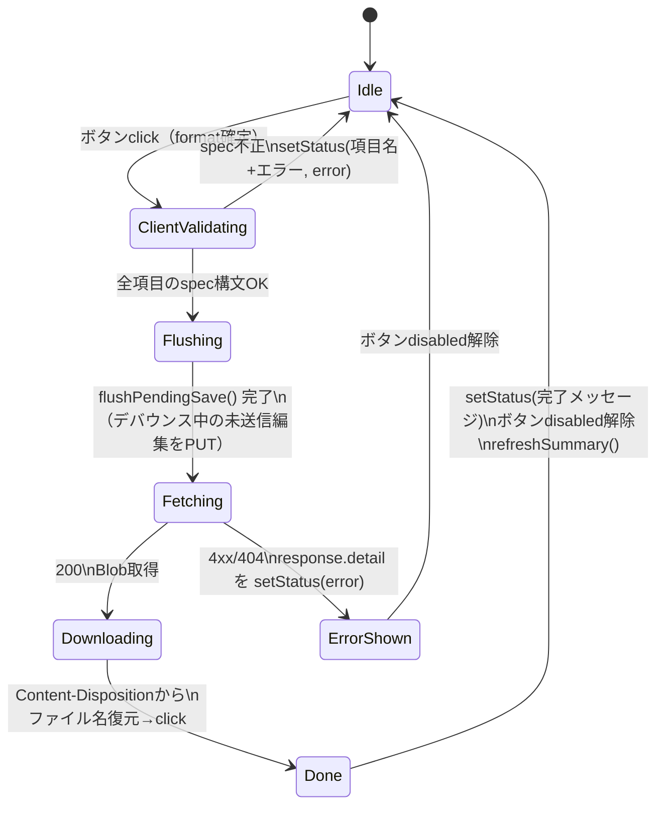
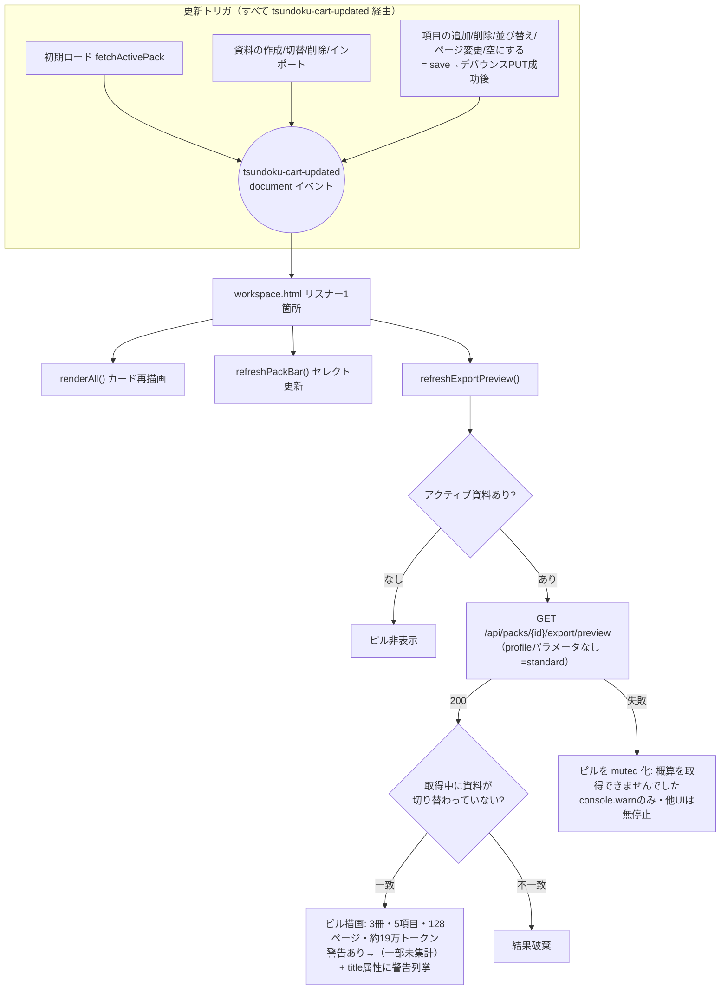

# Phase 3C C-5 実装前 エクスポートUI構造レビュー

作成: 2026-07-12
状態: 構造レビュー（実装なし）。C-5（AI向けエクスポートモーダル）実装の指針資料
前提: [ai-export-optimization-design.md](ai-export-optimization-design.md) §11・§12 / [phase3c-3d-design-review.md](phase3c-3d-design-review.md) §3.4
対象コード: `templates/workspace.html` / `templates/base.html` / `static/pack-store.js` / `static/pdf-modal.js` / `static/pages-spec.js`

対象時点: C-4 コミット（`5c888b9` エクスポートプレビューのプロファイル対応）まで実装済みの状態。

## 1. UIフロー分析

### 1.1 エクスポートに関わるUIは3系統ある

| 系統 | 入口 | API | 実装場所 |
|---|---|---|---|
| A. 資料一式エクスポート | 資料棚ツールバーの3ボタン（PDF一式 / MD一式 / 資料データJSON） | `GET /api/packs/{id}/export?format=` | workspace.html インラインscript `exportPackZip(format)` |
| B. 概算プレビュー常時表示 | 自動（資料棚表示・資料操作のたび） | `GET /api/packs/{id}/export/preview` | workspace.html インラインscript `refreshExportPreview()` |
| C. 単体切り出し | PDFプレビューモーダルの切り出しリンク | `GET /export-pdf` / `GET /export-md`（資料と無関係） | base.html の DOM + `static/pdf-modal.js` |

C-5 が触るのは A・B のみ。C は資料（パック）と独立した機能で、今回のスコープ外。

### 1.2 系統A: 資料一式エクスポートの状態遷移



各段階の責務と発生場所（すべて workspace.html インラインscript 内）:

| 段階 | 何が起きるか | 責務の所在 |
|---|---|---|
| click | `ws-export-pdf/md/json` のリスナーが `exportPackZip('pdf'\|'md'\|'json')` を呼ぶ | workspace.html（formatはボタンにハードコード） |
| クライアント検証 | 全項目の `pages` を `TsundokuPages.validatePageSpec` で構文チェック（json時は構文のみ、pdf/md時は outlineCache にページ数があれば範囲もチェック） | pages-spec.js（文法）+ workspace.html（ループと表示） |
| ローディング | エクスポート系4ボタンを `disabled=true`、`setStatus('...書き出し中...')` | workspace.html |
| flush | `TsundokuCart.flushPendingSave()` — デバウンス中の編集をサーバへ確定させ、サーバの最新内容でエクスポートさせる | pack-store.js |
| fetch | `GET /api/packs/{pack.id}/export?format=`。エラー時は `errorMessageFromResponse` が JSON の `detail` を抽出 | workspace.html |
| ダウンロード | `filenameFromContentDisposition` → `downloadBlob`（`<a download>` を生成してclick） | workspace.html |
| 後処理 | finally でボタン復帰 + `refreshSummary()` | workspace.html |

注意点: **profile はまだ送っていない**（サーバは C-3/C-4 で対応済みだがUIは format のみ）。

### 1.3 系統B: 概算プレビューの更新フロー



責務: イベント発火は pack-store.js（`notifyUpdated()`）、購読と描画は workspace.html。**更新起点が1箇所に集約されている**のがこのUIの構造上の要点で、C-5 のモーダルもこの構造を壊さないこと。

### 1.4 系統C: 単体切り出し（参考・C-5対象外）

pdf-modal.js は `pagesInput` の変化ごとに `setExportLink()` で `/export-pdf?pdf_path=&pages=` の `<a>` href を組み立てる（fetch ではなくリンク遷移が基本、保存ボタンのみ fetch）。資料の概念を持たず、profile とも無関係。

## 2. コンポーネント責務分析

### 2.1 コンポーネント一覧と責務

| コンポーネント | 行数目安 | 責務 | 状態管理 | API担当 | DOM担当 |
|---|---|---|---|---|---|
| `pack-store.js`（`window.TsundokuCart`） | 477 | 資料の同期ストア。メモリキャッシュ・楽観更新・デバウンスPUT・切替時のレース対策・`tsundoku-cart-updated` 発火 | cache / activePack / dirty / saveTimer | `/api/packs` 系 CRUD・items のみ（**エクスポートAPIは知らない**） | ナビバッジのみ |
| `pages-spec.js`（`window.TsundokuPages`） | 195 | spec文法の純粋ユーティリティ（parse/validate/merge/subtract/count） | なし | なし | なし |
| workspace.html インラインscript | ~1,000 | 資料棚の全UI: カード描画・並び替え・チップ編集・章選択・追加モーダル・pack bar・**エクスポート実行・概算ピル** | outlineCache のみ（他は TsundokuCart 経由） | `/api/packs/{id}/export`・`/export/preview`・`/pdf-outline`・`/search-pages`・`/api/packs/import` | 資料棚の全DOM |
| `pdf-modal.js` | 1,110 | PDFプレビューモーダル（全ページ共通）。単体切り出しリンク・サムネイル・資料に追加 | currentPdfPath / currentPackItemKey 等 | `/pdf-outline`・`/pdf-thumbnails`・`/export-pdf`（保存） | base.html の `#pdf-modal` 配下 |
| base.html | ~900(CSS+DOM) | 共通レイアウト・`.modal` 系CSS・`#pdf-modal` のDOM定義 | なし | なし | 共通枠 |

### 2.2 依存関係

```mermaid
flowchart LR
    WS[workspace.html<br>インラインscript] --> PS[pack-store.js<br>TsundokuCart]
    WS --> PG[pages-spec.js<br>TsundokuPages]
    WS -->|fetch| API1["/api/packs/{id}/export"]
    WS -->|fetch| API2["/api/packs/{id}/export/preview"]
    PS -->|fetch| API3["/api/packs 系 CRUD"]
    PS -.->|tsundoku-cart-updated| WS
    PM[pdf-modal.js] --> PG
    PM --> PS
    PM -->|href/fetch| API4["/export-pdf /export-md"]
    BASE[base.html] -.CSS/.modal DOM.-> WS
    BASE -.-> PM
```

循環なし。イベント（`tsundoku-cart-updated`）による疎結合が機能している。

### 2.3 レビュー: 責務が大きすぎる箇所

1. **workspace.html インラインscript の肥大**（約1,000行）: カード描画・エクスポート・追加モーダル・pack bar が同居。ただし内部は関数単位で分かれており、グローバル状態は `outlineCache` のみ。「読みにくいが壊れにくい」状態
2. **`downloadBlob` / `filenameFromContentDisposition` の重複**: workspace.html と pdf-modal.js にほぼ同一の実装が2つある（既存の負債。挙動は同一）
3. **format のハードコード**: エクスポートボタン3つが format 文字列を直接持ち、UI側に「profile」の概念が存在しない

### 2.4 profile追加時の影響範囲（現状のまま C-5 を素朴に足した場合）

- サーバ側: `PROFILES` 登録のみで済む（C-3/C-4 で確認済み）
- UI側: モーダルの宛先選択肢に1件追加するだけ、に**できるかどうかは C-5 の作り方次第**。プレビュー拡張レスポンス（`chunks`/`warnings`/`file_count`）は profile 非依存の共通形式なので、描画関数を profile 分岐なしで書けば notebooklm 追加（D-3）は選択肢1行の追加で済む

### 2.5 C-5実装後も保守しやすいか

条件付きで Yes。守るべき不変条件:

- エクスポートAPIの呼び出しは workspace.html に集約したまま（pack-store.js に持ち込まない）
- 概算の更新起点は `tsundoku-cart-updated` リスナー1箇所のまま（モーダル内プレビューは「モーダルを開く/宛先を変える」という別トリガであり、常時表示の更新経路と混ぜない）
- 宛先の定義はデータ（配列定数）にし、描画・実行ロジックに profile 名の分岐を書かない

## 3. API整合性レビュー（UI視点）

### 3.1 実装済みAPIのUI適合性

| フィールド/仕様 | UIから自然に扱えるか | 備考 |
|---|---|---|
| `profile` パラメータ（export/preview 共通） | ○ | 未指定=standard の後方互換により、既存3ボタンは無変更で共存できる |
| `format` 省略時の解決（profile の primary_format） | ○ | モーダルは `profile` だけ送ればよく、UIが format を知る必要がない |
| `warnings[]`（code + message） | ○ | `message` は表示可能な日本語文で、UI側の文言組み立て不要。`code` で UI 判断（`empty_pack` は「一部未集計」に数えない等、A-4 で実績あり） |
| `chunks[].filename` | ○ | サーバ命名がそのまま表示できる。**実エクスポートのZIP内ファイル名と一致することがテストで保証済み**（C-4） |
| `chunks[].estimated_tokens` / `pages` / `items[]` | ○ | 分冊一覧の描画に必要な粒度が揃っている。items の `title`/`pages` で出典も出せる |
| `file_count` / `archive` | ○ | 「出力予定: 4ファイル（ZIP）」がそのまま組める |
| エラー仕様（不明profile 400・pack 404） | ○ | export と preview で detail 文言・検証順序が一致しており、`errorMessageFromResponse` を共用できる |

### 3.2 UI再計算 vs サーバ責務の境界

| 項目 | 持ち場 | 理由 |
|---|---|---|
| トークン概算・分冊計算・ファイル名 | サーバ | 実エクスポートと同じ `plan()`/`chunk_filename()` を通すことで「プレビューと実物のズレゼロ」が保証されている。UIで再計算してはならない |
| 概算の日本語整形（「約19万トークン」等） | UI | 表示ロケールの問題。A-4 の `formatApproxTokenCount` が既にこの位置 |
| spec の構文チェック（送信前の即時フィードバック） | UI（pages-spec.js） | 入力中のリアルタイム検証はサーバ往復させない。最終検証はサーバが常に行う二重構え（現行どおり） |
| ボタンの活性制御（資料なし・0件） | UI（TsundokuCart のキャッシュ） | プレビューAPI応答を待たずに判断できる情報のため |

境界の逸脱は現状なし。**唯一の注意**: モーダル内で「宛先変更のたびに preview を叩く」設計にするので、UI側でのキャッシュや差分計算は不要（応答は数十ms・操作頻度も低い）。

### 3.3 ギャップ（C-5実装で埋めるもの）

- `exportPackZip(format)` は profile を送れない → 引数の一般化が必要（§5）
- `refreshExportPreview()` は profile なし固定 → fetch部の共通化が必要（§5）
- standard プレビュー応答には `file_count`/`chunks` が**ない**（後方互換のため意図的）。モーダルが standard も選択肢に含める場合は応答形式の差を吸収する分岐が要る → **C-5では宛先を chat（将来+notebooklm）のみにし、standard はモーダルに含めない**ことを推奨。既存3ボタンが standard の動線であり、モーダルは「AI向け」に徹する（設計書§11の思想どおり）

## 4. C-5 実装方針（推奨構成）

### 4.1 配置

| 対象 | 推奨 | 理由 |
|---|---|---|
| モーダルDOM | workspace.html に静的HTML（`ws-export-modal`） | 資料棚専用機能。全ページ共通の base.html を汚さない。`ws-add-modal` と同型で、`.modal`/`.modal-panel` 等のCSSは base.html の既存クラスをそのまま使う |
| JS | workspace.html インラインscript へ追記 | 設計書§11.2 の方針（新規JSファイルなし）。`ws-add-modal` の open/close/Escape ハンドリングと同じパターンを踏襲 |
| 起動ボタン | ツールバーに「AI向けに書き出す」1つ追加 | 既存3ボタン無変更。`refreshSummary()` のボタン配列に追加して活性制御を相乗り |

### 4.2 モーダル内部構成

```
[宛先] (●) ChatGPT / Claude     ← EXPORT_DESTINATIONS 配列定数から生成
        （3Dで NotebookLM を配列に1件追加するだけ）
[概算]  file_count・estimated_tokens・分冊一覧（chunks[].filename + items）
[警告]  warnings[].message の列挙（空なら非表示）
[操作]  [キャンセル] [書き出す]
[状態]  モーダル内専用の status 行（ws-status とは分離）
```

- **宛先定義はデータ駆動**: `const EXPORT_DESTINATIONS = [{ profile: 'chat', label: 'ChatGPT / Claude', note: '…' }]`。描画・実行コードに profile 名の if を書かない
- **preview取得**: モーダル open 時と宛先 change 時に `GET /export/preview?profile=`。レスポンスの `chunks`/`warnings`/`file_count` を汎用描画（profile 分岐なし）。資料切替との競合ガードは `refreshExportPreview` と同じ「fetch 前後で activePack.id 一致確認」パターン
- **export呼び出し**: 既存 `exportPackZip` の流れ（クライアント構文検証 → `flushPendingSave()` → fetch → Blob DL）を再利用し、クエリに `profile` を渡す。format は送らない（サーバが primary_format で解決）
- **「書き出す」の無効化条件**: preview の `warnings` に `empty_pack`/`missing_pdf`/`missing_pages`/`invalid_pages` が含まれる場合は disabled（`item_exceeds_limit`/`unindexed_pages` は警告表示のみで実行可）

### 4.3 共通化候補（C-5内で実施）

1. `exportPackZip(format)` → `exportPack({ format, profile })`: URLSearchParams の組み立てを一般化。既存3ボタンは `{format: 'pdf'}` 等を渡す（挙動不変）、モーダルは `{profile: 'chat'}`
2. `fetchExportPreview(profile)`: fetch + activePack 一致ガードを関数化し、常時表示（profile なし）とモーダル（profile あり）の2箇所から呼ぶ
3. モーダル open/close ヘルパ: `ws-add-modal` の open/close/Escape 処理と同じ形をもう1セット書く（共通化は§5参照）

## 5. リファクタ提案

### 5.1 今回（C-5と同時に）やってよい最小限のリファクタ

| 提案 | 理由 |
|---|---|
| `exportPackZip(format)` の引数一般化（§4.3-1） | C-5 の実装に直接必要。既存呼び出し3箇所の変更のみで挙動不変。分けてコミットする粒度でもない |
| プレビューfetchの関数抽出（§4.3-2） | 同上。放置すると fetch+ガードのコピーが2つできる |
| 概算常時表示（A-4のピル）の縮小 | 設計書§11.1「モーダル導入後、常時表示は要約（1行）に縮小」の実施タイミングがまさに C-5。ただし現状すでに1行ピルなので、実際は「そのまま維持」で足りる可能性が高い。触らない判断でも設計書と矛盾しない |

### 5.2 今回やらない方がよいリファクタ

| 見送り対象 | 理由 |
|---|---|
| workspace.html インラインscript の外部ファイル分割 | 効果は可読性のみで挙動が変わらない一方、差分が全行移動になり C-5 のレビューを埋没させる。分割するなら「資料棚JS全体」を独立コミットで（Phase 3E 以降の整理課題） |
| `downloadBlob`/`filenameFromContentDisposition` の重複解消（workspace ⇔ pdf-modal） | 共通化には共有JSファイルの新設が必要で、設計書§11.2「新規JSファイルなし」方針と衝突する。既存の負債であり C-5 が悪化させるものでもない |
| `ws-add-modal` とのモーダル open/close 処理の共通化 | 2つ目の重複が生まれるが、共通化の抽象（フォーカス管理・Escape・背景クリック）を今設計するのは時期尚早。3つ目（もし現れたら）で括るのが妥当 |
| 宛先一覧のAPI化（`GET /api/export-profiles` 的なもの） | profile は当面 2 件（chat, notebooklm）で、配列定数の1行追加で足りる。動的化はサーバ・UI双方に面積を増やすだけ |
| pack-store.js へのエクスポート機能追加 | 責務境界（ストア=資料の状態、エクスポート=画面の操作）が崩れる。現状の分離を維持する |

## 6. まとめ（Codex実装者向けチェックリスト）

- [ ] ツールバーに「AI向けに書き出す」ボタン追加（`refreshSummary()` の disabled 配列に登録）
- [ ] `ws-export-modal` を `ws-add-modal` と同型で workspace.html に追加（CSS新設不要）
- [ ] `EXPORT_DESTINATIONS` 配列定数（初期は chat のみ）
- [ ] `fetchExportPreview(profile)` 抽出 → 常時表示とモーダルで共用
- [ ] `exportPackZip` を `{format, profile}` 対応に一般化（既存3ボタンの挙動はバイト単位で不変）
- [ ] モーダル: open/宛先変更で preview 取得 → `file_count`/`chunks`/`warnings` を profile 分岐なしで描画
- [ ] 「書き出す」は blocking 警告（empty_pack/missing_pdf/missing_pages/invalid_pages）で disabled
- [ ] 実行は `profile` のみ送信（format 省略）。ダウンロード・エラー表示は既存パターン
- [ ] 既存3ボタン・概算ピル・`tsundoku-cart-updated` 経路に変更を加えない
- [ ] 手動確認: 資料切替中の競合（モーダル表示中に資料が変わるケース）で古いプレビューが残らないこと
- [ ] §7〜§9 の「C-5で必須」項目（フォーカス管理・aria-live・リクエストトークン・二重実行防止・回帰確認）

## 7. アクセシビリティレビュー（追加）

### 7.1 既存実装の現状

コードベースには**a11y実装レベルが異なる2つのモーダル前例**がある。

| 観点 | `ws-add-modal`（資料棚） | pdf-modal のサムネイル拡大オーバーレイ |
|---|---|---|
| `role="dialog"` / `aria-modal` / `aria-labelledby` | あり | あり |
| `aria-hidden` の開閉トグル | あり | あり（hidden属性） |
| Escで閉じる | あり（documentレベルのkeydown） | あり（`stopImmediatePropagation` 付き） |
| 開時の初期フォーカス | あり（検索入力へ） | あり（閉じるボタンへ） |
| **閉時のフォーカス復元**（起動ボタンへ戻す） | **なし** | あり（`thumbDetailReturnFocus`） |
| **フォーカストラップ**（Tab循環） | **なし** | あり（`handleThumbDetailKeydown` の Tab 処理） |
| ステータスの `aria-live` | **なし**（`ws-status`/`ws-add-status` は素のspan） | あり（`aria-live="polite"`） |

つまり**完全実装の前例（サムネイル拡大）がプロジェクト内にあり、コピーすべきパターンが確定している**。新規の設計判断は不要。

### 7.2 現状のリスク / C-5必須 / 見送り

| 観点 | 現状のリスク | C-5で必須 | 見送ってよい |
|---|---|---|---|
| 開時フォーカス | — | モーダル open 時に宛先ラジオ（または閉じるボタン）へ `focus()`。`ws-add-modal` と同等 | — |
| 閉時フォーカス復元 | `ws-add-modal` は復元しない（背景に取り残される） | 「AI向けに書き出す」ボタンへ復元（サムネイル拡大の `returnFocus` パターンを踏襲） | `ws-add-modal` 側への遡及適用（別修正。C-5の差分を汚さない） |
| Esc | — | documentレベル keydown で close（既存2前例と同じ）。**ダウンロード実行中のEscは実行を中断しない**（fetch中断はスコープ外）ことを仕様として明記 | fetch の Abort 連動 |
| Tab移動 | `ws-add-modal` はトラップなし（Tabで背景へ抜ける） | `handleThumbDetailKeydown` の Tab 循環をコピーして適用。要素数が少なく（ラジオ・キャンセル・書き出す・閉じる）実装コストは小さい | 汎用フォーカストラップの共通関数化（前例2+新規1=3箇所になるが、共通化は§5.2の方針どおり別機会） |
| aria属性 | — | `role="dialog"` / `aria-modal="true"` / `aria-labelledby` / `aria-hidden` トグル（既存と同一パターン） | — |
| ローディング・エラー通知 | 既存の `setStatus` は視覚のみで、スクリーンリーダーに通知されない | モーダル内status行に `aria-live="polite"` を付ける（「プレビュー取得中」「書き出し中」「エラー」が読み上げられる）。警告一覧の領域にも `aria-live="polite"` | `ws-status`（ツールバー側）への遡及適用 |
| キーボード完結 | 既存3ボタンはbutton要素なのでキーボード可 | ラジオ選択（矢印キー）→Tab→Enter実行→Escキャンセル、の一連をキーボードのみで確認する手動テスト項目化 | — |

## 8. 非同期処理と競合状態レビュー（追加）

### 8.1 既存の防御パターン（再利用できるもの）

1. **activePack一致ガード**: `refreshExportPreview()` が fetch 前に pack.id を控え、応答後に `TsundokuCart.getActivePack()` と比較して不一致なら破棄（A-4実装済み）
2. **リクエストトークン**: pdf-modal.js の `chaptersRequestToken`（発行番号を採番し、応答時に最新番号と一致しなければ破棄）— 同一対象への連打で古い応答が新しい応答を上書きする問題への前例
3. **実行中のボタンdisabled**: `exportPackZip` がエクスポート系ボタンを try/finally で disabled にし二重実行を防止
4. **書込み先固定**: pack-store.js の `saveTargetPackId`（参考。プレビューには不要）

### 8.2 シナリオ別: 現状リスク / C-5必須 / 見送り

| シナリオ | 現状のリスク | C-5で必須 | 見送ってよい |
|---|---|---|---|
| pack切替中のpreview応答 | 常時表示ピルはガード済み。モーダルは新規実装なので未防御 | モーダル内fetchにも activePack 一致ガードを適用（`fetchExportPreview(profile)` 共通関数に内蔵すれば1回書くだけ） | — |
| 同一packで宛先を連打→古いfetch応答が後着 | 常時表示ピルにも理論上あるが profile 1種のため実害なし。モーダルは宛先changeごとにfetchするため**後着上書きが現実に起きる** | `chaptersRequestToken` 方式のトークンを `fetchExportPreview` に内蔵（採番→応答時比較） | AbortController による中断（トークン破棄で表示上は同等。中断は通信量最適化にすぎない） |
| モーダルを閉じた後の応答着弾 | 新規実装 | 応答描画前に「モーダルがopenか」を確認（またはトークンをclose時に無効化）。閉じたモーダルへの描画自体は不可視だが、次回openで一瞬古い内容が見える事故を防ぐ。**open時に前回内容をクリアしてローディング表示から始める**方が確実 | — |
| export二重実行 | 既存3ボタンはdisabledで防御済み。モーダルの「書き出す」は新規 | 実行中は「書き出す」「キャンセル」「宛先ラジオ」をdisabled（既存 `exportPackZip` の try/finally パターンを踏襲）。既存3ボタンとモーダルの同時実行は、既存側のdisabledリストにモーダル起動ボタンを加えることで相互排他にする | fetch レベルの排他ロック（ボタンdisabledで実用上十分） |
| 空資料・資料不存在・API失敗 | preview APIは空資料でも200+警告（設計済み）。404/400/ネットワーク断はモーダルとして新規 | 404/失敗時: モーダル内status行にエラー表示し「書き出す」をdisabled（画面全体は壊さない — 常時表示ピルの `muted` パターンと同思想）。blocking警告（empty_pack等）でのdisabledは§4.2で定義済み | リトライボタン（宛先を選び直せば再fetchされるため不要） |
| 資料更新とpreview表示の不整合 | モーダル表示中に別タブ・検索画面から項目追加されると `tsundoku-cart-updated` が来るが、モーダル内プレビューは古いまま | **モーダルopen中に `tsundoku-cart-updated` を受けたら preview を再取得**（activePackが変わっていた場合は閉じる）。リスナーは既存1箇所に「モーダルがopenなら」の1分岐を足すだけ | 楽観的な差分更新（全再取得で十分軽い） |
| flushPendingSave失敗時の実行 | 既存 `exportPackZip` は flush 失敗を握りつぶさず catch でエラー表示（保存失敗時は dirty が残り再試行される設計） | 同じ経路を再利用するため追加対応不要（確認のみ） | — |

## 9. テスト戦略レビュー（追加）

### 9.1 テスト基盤の現状

- サーバ側: unittest 277件。C-3/C-4 で chat の plan・分冊・manifest・preview 整合はカバー済み。**C-5 はサーバ変更ゼロの想定**なので、サーバテストの追加は原則不要
- UI自動テスト: JSユニットテスト基盤なし。Playwright は `tests/playwright/` に spec 3本（workers=1 制約、CI外の手動起動）。**本格E2Eは設計書上 Phase 3E（E-3）のスコープ**
- 手動確認: A-4 で「実データ + Playwright MCP 操作によるチェックリスト消化」の実績あり

### 9.2 対象の仕分け

| 層 | 対象 | 位置づけ |
|---|---|---|
| 自動（サーバunittest・既存） | preview/export APIの全動作（分冊・警告・エラー・profile解決） | **実施済み**。C-5では既存277件が無修正で通ることだけ確認（サーバを触らない証明） |
| 自動（サーバunittest・追加） | なし | C-5はUIのみのため。もしworkspace.htmlのテンプレート変数を増やす場合のみ `test_workspace_page_renders` に要素IDのassertion追加（A-4の前例） |
| E2E（Playwright spec） | モーダルopen→宛先選択→preview表示→書き出し→ダウンロードの1本 | **Phase 3E（E-3）へ**。C-5時点では書かない（設計書のステップ分割どおり）。ただしC-5の手動確認をPlaywright MCPで行い、その操作手順をE-3のspec設計メモとして残すと3Eが楽になる |
| 手動（C-5完了条件） | 下記チェックリスト | C-5のマージ判断に使う |

### 9.3 手動確認チェックリスト（C-5用）

**standard動線の回帰（最重要 — 変えていないことの確認）**:
- [ ] 既存3ボタン（PDF/MD/JSON）が従来どおり動作、ZIP名・エントリ名不変
- [ ] 概算ピルの表示・更新（資料切替・項目編集）が従来どおり
- [ ] `tsundoku-cart-updated` 由来の再描画にモーダル追加の副作用がない（モーダル非表示時）

**chat動線・正常系**:
- [ ] モーダルopen→preview表示（file_count・分冊一覧・ファイル名）
- [ ] 書き出し→ZIPダウンロード、中身がpreviewのファイル名と一致
- [ ] 複数分冊になる資料での分冊一覧表示
- [ ] 同一PDF複数項目の資料で出典が正しく列挙される

**chat動線・異常系**:
- [ ] 空資料: 警告表示+「書き出す」disabled
- [ ] PDF欠損項目: 警告表示+disabled
- [ ] 1項目トークン超過: 警告表示だが実行は可能
- [ ] preview API失敗（サーバ停止等）: モーダル内エラー表示、他UI無事
- [ ] エクスポート実行中の二重クリック無効

**競合系（§8）**:
- [ ] モーダル表示中に資料切替（別タブ含む）→ 古いプレビューが残らない
- [ ] 宛先の高速切替→ 最後に選んだ宛先の結果が表示される
- [ ] モーダル閉→即再開→ 前回の残骸が見えない

**アクセシビリティ（§7）**:
- [ ] キーボードのみで open→選択→実行→close が完結
- [ ] Escで閉じてフォーカスが起動ボタンへ戻る
- [ ] Tabがモーダル外へ抜けない

### 9.4 リスクと見送りのまとめ

| 項目 | 現状のリスク | C-5で必須 | 見送ってよい |
|---|---|---|---|
| standard回帰 | UIは同一ファイル（workspace.html）を触るため、無関係な行の破壊リスクが常にある | 既存277件無修正通過 + §9.3 の回帰チェック | — |
| chat異常系の自動化 | サーバ側は自動化済み。UI層の異常系は手動のみ | 手動チェックリスト実施 | UI異常系のPlaywright自動化（3EのE-3でまとめて） |
| JSロジックの単体テスト | `fetchExportPreview` のトークン破棄などはテスト基盤がなく検証は手動 | 手動確認 + コードレビューで担保 | JSテスト基盤（Vitest等）の導入 — 依存追加を避ける方針（設計書の制約）と衝突するため Phase 3 では扱わない |
